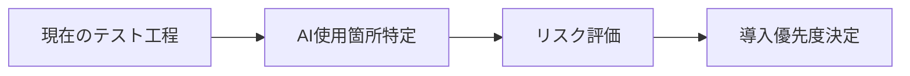
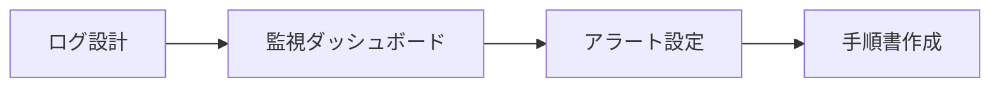
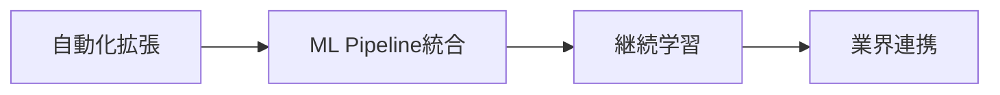

# AI TRiSM (AI Trust, Risk and Security Management) - 技術動向分析

### **AI TRiSMフレームワークの3つの柱**

#### **🛡️ Trust（信頼性管理）**
**目的**: AIの判断が信頼できることを保証  
**実装例**：
```python
# 説明可能AI（XAI）の実装
import shap
explainer = shap.Explainer(ai_model)
explanation = explainer(test_sample)
# → 「電圧値が主な判定根拠です」

# 不確実性の定量化
uncertainty = model.predict_uncertainty(test_data)
if uncertainty > threshold:
    flag_for_human_review = True
```

**あなたの業務での活用**：
- テスト結果にAIの「判断根拠」を表示
- 不確実な判定は人間のダブルチェック対象に

#### **⚠️ Risk（リスク管理）**
**目的**: AI使用に伴うリスクを特定・評価・軽減  
**実装例**：
```python
# リスク評価マトリックス
risk_matrix = {
    "false_positive": {"probability": 0.05, "impact": "中"},
    "false_negative": {"probability": 0.02, "impact": "高"},
    "model_drift": {"probability": 0.15, "impact": "中"}
}

# 自動リスク監視
def monitor_model_performance():
    current_accuracy = evaluate_model(current_data)
    if current_accuracy < baseline_accuracy * 0.95:
        alert("モデル性能劣化を検知")
```

**あなたの業務での活用**：
- 既存のFMEA（故障モード影響解析）にAI特有リスクを追加
- テスト工程でのAI判定ミス影響度評価

#### **🔒 Security（セキュリティ管理）**
**目的**: AIシステムへの攻撃から保護  
**実装例**：
```python
# 敵対的攻撃検知
import cleverhans
adversarial_detector = cleverhans.DetectorModule()
if adversarial_detector.is_adversarial(input_data):
    reject_input_and_alert()

# データポイズニング検知
def detect_poisoned_data(training_data):
    outlier_scores = isolation_forest.decision_function(training_data)
    suspicious_samples = training_data[outlier_scores < threshold]
    return suspicious_samples
```

**あなたの業務での活用**：
- テストデータの異常検知システム
- AIモデルの改ざん検知

### **従来手法 vs AI TRiSM アプローチ比較**

| 管理項目 | 従来の品質管理 | AI TRiSM |
|---------|---------------|----------|
| **判定基準** | 固定閾値（3.3V以上等） | 学習により変化する基準 |
| **検証方法** | 全数テスト可能 | サンプルベース統計検証 |
| **故障解析** | 物理的原因特定 | AIブラックボックス解析 |
| **継続監視** | 定期校正 | リアルタイム性能監視 |
| **セキュリティ** | 物理的保護 | サイバー攻撃対策 |

### **実装レベル別AI TRiSMアプローチ**

#### **🥉 ベーシックレベル（最低限の実装）**
```python
# 基本的な監視とログ
import logging
ai_logger = logging.getLogger('ai_trism')

def ai_test_with_basic_trism(test_data):
    # 1. 入力データの妥当性チェック
    if not validate_input(test_data):
        ai_logger.warning("異常な入力データを検知")
        return "MANUAL_REVIEW"
    
    # 2. AI判定実行
    prediction = ai_model.predict(test_data)
    confidence = ai_model.predict_proba(test_data).max()
    
    # 3. 信頼度チェック
    if confidence < 0.8:
        ai_logger.info(f"低信頼度判定: {confidence}")
        return "LOW_CONFIDENCE"
    
    # 4. 結果ログ記録
    ai_logger.info(f"判定: {prediction}, 信頼度: {confidence}")
    return prediction
```

#### **🥈 中級レベル（統合的な管理）**
```python
# AI TRiSMダッシュボード統合
class AITRiSMManager:
    def __init__(self):
        self.trust_monitor = TrustMonitor()
        self.risk_assessor = RiskAssessor()
        self.security_scanner = SecurityScanner()
    
    def comprehensive_check(self, test_data):
        # Trust: 説明可能性チェック
        explanation = self.trust_monitor.explain(test_data)
        
        # Risk: リスク評価
        risk_score = self.risk_assessor.evaluate(test_data)
        
        # Security: セキュリティスキャン
        security_status = self.security_scanner.scan(test_data)
        
        return {
            "prediction": ai_model.predict(test_data),
            "explanation": explanation,
            "risk_score": risk_score,
            "security_status": security_status
        }
```

#### **🥇 上級レベル（自動化・最適化）**
```python
# 自動学習・改善システム統合
class AdvancedAITRiSM:
    def __init__(self):
        self.auto_retrainer = AutoRetrainer()
        self.bias_detector = BiasDetector()
        self.performance_optimizer = PerformanceOptimizer()
    
    def continuous_improvement(self):
        # 自動バイアス検出・修正
        if self.bias_detector.detect_bias():
            self.auto_retrainer.retrain_with_bias_mitigation()
        
        # 性能劣化自動対応
        if self.performance_optimizer.detect_degradation():
            self.performance_optimizer.optimize_model()
        
        # 新たな脅威への自動対応
        self.security_scanner.update_threat_database()
```

### **AI TRiSMが解決する「AIならではの問題」**

#### **❌ 従来システムにはない課題**：
1. **ブラックボックス問題**: なぜその判定をしたか分からない
2. **データドリフト**: 時間とともにAI性能が劣化
3. **敵対的攻撃**: 意図的にAIを騙す攻撃
4. **バイアス**: 学習データの偏りによる不公平な判定
5. **確率的判定**: 同じ入力でも結果が変わる可能性

#### **✅ AI TRiSMによる解決アプローチ**：
1. **説明可能AI技術**: SHAP、LIME等で判定根拠を可視化
2. **継続監視**: リアルタイムでAI性能を監視
3. **堅牢性テスト**: 攻撃に対する耐性を定期検証
4. **公平性監査**: バイアス検出・修正の自動化
5. **不確実性定量化**: 判定の信頼度を数値化

## 🔰 AI TRiSM基本概念 - 初心者向け解説

### **AI TRiSMとは何か？**
AI TRiSMは、従来の製品品質管理を「AIシステム」に適用した新しいフレームワークです。あなたが半導体テストで行っている品質保証を、AIにも適用するイメージです。

**従来の製品 vs AIシステム の品質管理比較**：
```
【従来の半導体テスト】          【AI TRiSMでのAIテスト】
├─ 電気特性テスト              ├─ 予測精度テスト
├─ 機能動作テスト              ├─ バイアス検出テスト  
├─ 環境耐性テスト              ├─ 攻撃耐性テスト
├─ 長期信頼性テスト            ├─ モデル劣化監視
└─ 品質証明書発行              └─ AI信頼性証明書発行
```

### **MLOps、DevSecOps、AI TRiSMの関係性**

#### **1. MLOps（Machine Learning Operations）**
**目的**: AIモデルの開発・デプロイ・運用を自動化  
**例**: Pythonでモデル学習 → 自動デプロイ → 性能監視  
**あなたの業務との類似**: ICテストの自動化システム構築

#### **2. DevSecOps（Development Security Operations）**
**目的**: ソフトウェア開発にセキュリティを組み込み  
**例**: コード脆弱性検査 → セキュアな開発プロセス  
**あなたの業務との類似**: 設計段階からのセキュリティ考慮

#### **3. AI TRiSM（AI Trust, Risk and Security Management）**
**目的**: AIシステム特有の信頼性・リスク・セキュリティを統合管理  
**特徴**: MLOps + DevSecOps + AI特有課題への対応  

**関係図**：
```
    AI TRiSM
   ┌─────────┐
   │ Trust   │ ← AIの判断は信頼できるか？
   │ Risk    │ ← AIが間違った時のリスクは？  
   │ Security│ ← AIは攻撃に耐えられるか？
   └─────────┘
        ↑
   ┌────┴────┐
MLOps      DevSecOps
(運用自動化) (セキュリティ)
```

### **具体例：ICテストでのAI TRiSM実装**

**シナリオ**: あなたがAIを使って不良チップを自動検出するシステムを導入する場合

#### **従来の検査方法**：
```python
# 電気特性の閾値判定（確定的）
if voltage > 3.3 and current < 100:
    result = "PASS"
else:
    result = "FAIL"
```

#### **AI使用の検査方法**：
```python
# AIモデルによる判定（確率的）
prediction = ai_model.predict(test_data)
confidence = ai_model.predict_proba(test_data)
# → 85%の確率で不良品と判定
```

#### **AI TRiSMが必要な理由**：
1. **Trust（信頼性）**: AIの85%判定は本当に正しいのか？
2. **Risk（リスク）**: 良品を不良と誤判定した場合の損失は？
3. **Security（セキュリティ）**: 悪意のあるデータでAIを騙せるか？

## Summary - 5つの要点

### 1. **技術概要と位置づけ**
AI TRiSMは、AI システムの信頼性（Trust）、リスク（Risk）、セキュリティ（Security）を統合的に管理するフレームワーク。Gartner 2025年ハイプサイクルでは「🔧 Innovation Trigger（技術革新の初期段階）」に位置し、2-5年での実用化が予測される重要新興技術。

### 2. **半導体・ICテスト分野への直接的影響**
- **AIテストツールの監査**: AI使用テストシステムの信頼性・透明性確保が急務
- **バイアス検出**: テストデータ学習におけるAIバイアス検出システムの必要性
- **規制対応**: EU AI Act等の国際規制への準拠要求の高まり
- **品質基準**: テストデータのAI学習用品質基準策定の重要性

### 3. **技術実装の核心要素**
- **信頼性工学の応用**: 従来の製造業品質保証ノウハウの AI領域への拡張
- **リスク評価プロセス**: AI判断の透明性・説明可能性の確保
- **セキュリティ統合**: AI システム固有の脆弱性対策
- **継続的監視**: AIモデルのドリフト検知・性能維持システム

### 4. **メカトロニクス・ロボティクス応用**
- **Physical AI統合**: 物理世界と相互作用するAIシステムの安全性確保
- **自律システム**: ロボット・自動化システムのAI判断信頼性管理
- **エッジAI**: IoTデバイス・組み込みシステムでのリアルタイム信頼性監視
- **人間-AI協働**: 製造現場での安全な人間-AI インタラクション設計

### 5. **Pythonベース実装アプローチ**
- **MLOps統合**: MLflow、Kubeflow等を活用したAI TRiSMパイプライン構築
- **監査ツール**: scikit-learn、TensorFlow等でのモデル説明可能性実装
- **データ品質管理**: pandas、Great Expectations等でのデータバリデーション
- **リスク可視化**: matplotlib、plotly等での AI決定プロセス可視化

## My Notes

<!-- あなたの分析・考察・実装計画をここに記載 -->

## Rating: ⭐⭐⭐⭐⭐ (5/5)

**評価理由**: 半導体・ICテスト・品質保証分野において即座に実装が必要な重要技術。既存の信頼性工学ノウハウを活かしながら、AI時代の品質保証パラダイムシフトに対応可能。

## 全体要約 - 技術特徴5要点

### 1. **パラダイムシフトの必然性**
従来の決定論的システムから確率的AIシステムへの移行に伴い、品質保証・テスト手法の根本的見直しが必要。AI TRiSMは、この移行期における信頼性確保の統合フレームワークとして機能。

### 2. **規制環境の急速な変化**
EU AI Act（2024年施行）、米国AI Executive Order等の国際規制により、AI TRiSMの実装が法的要件化。特に高リスクAIアプリケーション（医療機器、自動車等）では必須要件。

### 3. **既存品質管理との融合可能性**
ISO 9001、ISO/TS 16949等の既存品質管理システムとの統合により、段階的な AI TRiSM導入が可能。特に日本の製造業が持つ品質文化との親和性が高い。

### 4. **技術的実装の現実性**
MLOps、DevSecOps等の既存技術基盤を活用した段階的実装が可能。Pythonエコシステムでの豊富なツール群により、中小企業でも導入障壁が比較的低い。

### 5. **ROI（投資収益率）の明確性**
AI起因の品質問題・セキュリティ事故の未然防止により、直接的なコスト削減効果が期待。さらに、AI TRiSM導入企業の競争優位性確立による間接的価値も大きい。

## 日本の立ち位置分析 - 強み・弱み4要点

### 🟢 **強み1: 製造業品質管理基盤**
**詳細**: トヨタ生産システム（TPS）、品質工学（田口メソッド）等の世界トップレベルの品質管理ノウハウ。これらの既存資産をAI TRiSMに応用することで、欧米に対する差別化要因となる可能性。
**活用方針**: FMEA（故障モード影響解析）のAI版開発、カイゼン手法のAI継続改善への適用。

### 🟡 **弱み1: AI規制対応の遅れ**
**詳細**: EU AI Act等の国際規制への対応準備が欧州・米国比で遅延。特に、AIガバナンス体制の組織的整備が不十分。経産省ガイドライン（2024年）は存在するが、実装レベルでのベストプラクティス蓄積が不足。
**対応策**: 国際規格（ISO/IEC 23053等）の早期導入、海外AI TRiSM先進事例の積極的ベンチマーキング。

### 🟢 **強み2: ハードウェア・ソフトウェア統合力**
**詳細**: 半導体設計からロボティクスまでの垂直統合技術力により、Physical AIにおけるAI TRiSM実装で独自価値創出が可能。特に、リアルタイム制約下でのAI信頼性確保において優位性あり。
**活用方針**: エッジAI専用チップでのハードウェアレベル AI TRiSM機能実装、産業ロボットでの安全性保証技術開発。

### 🔴 **弱み2: AI人材・組織体制不足**
**詳細**: AI TRiSM実装に必要な「AI技術 × 品質保証 × セキュリティ」のトリプルスキル人材が圧倒的に不足。また、従来の縦割り組織では、横断的なAI TRiSM推進が困難。
**対応策**: 既存品質保証エンジニアのAI技術再教育、AI TRiSM専門チームの組織横断設置、大学・研究機関との産学連携強化。

---

### **あなたの業務環境での AI TRiSM 導入実践ロードマップ**

#### **Phase 1: 現状把握（1-2ヶ月）**


**具体的アクション**：
```python
# Step 1: 現在のAI使用状況監査
current_ai_tools = [
    {"tool": "画像検査AI", "risk_level": "中", "critical": True},
    {"tool": "パラメータ最適化AI", "risk_level": "低", "critical": False},
    # 他のAIツールをリストアップ
]

# Step 2: 各ツールのTRiSMギャップ分析
for tool in current_ai_tools:
    gap_analysis = assess_trism_readiness(tool)
    print(f"{tool['tool']}: Trust={gap_analysis['trust_score']}/10")
```

#### **Phase 2: 基本実装（3-6ヶ月）**


**実装例**：
```python
# ICテスト用AI TRiSMクラスの基本実装
class ICTestAITRiSM:
    def __init__(self, model_name):
        self.model = load_model(model_name)
        self.trust_threshold = 0.8
        self.risk_database = RiskDatabase()
        self.security_monitor = SecurityMonitor()
        
    def safe_predict(self, chip_data):
        """AI TRiSMを適用した安全な予測"""
        
        # Security Check: 入力データの検証
        if not self.security_monitor.validate_input(chip_data):
            return {"status": "SECURITY_ALERT", "action": "MANUAL_REVIEW"}
        
        # Trust Check: 予測と信頼度算出
        prediction = self.model.predict(chip_data)
        confidence = self.model.predict_proba(chip_data).max()
        
        if confidence < self.trust_threshold:
            return {"status": "LOW_CONFIDENCE", "action": "HUMAN_VERIFY"}
        
        # Risk Check: 予測リスク評価
        risk_score = self.risk_database.assess_prediction_risk(
            prediction, chip_data
        )
        
        return {
            "prediction": prediction,
            "confidence": confidence,
            "risk_score": risk_score,
            "status": "SAFE",
            "explanation": self.explain_decision(chip_data)
        }
```

#### **Phase 3: 高度化（6-12ヶ月）**


**メカトロニクス製品への展開**：
```python
# ロボット制御AI用のTRiSM実装例
class RoboticsAITRiSM:
    def __init__(self):
        self.safety_bounds = SafetyBounds()
        self.real_time_monitor = RealTimeMonitor()
        
    def safe_robot_control(self, sensor_data, control_command):
        """物理的安全性を保証するAI制御"""
        
        # Physical Safety Check
        if not self.safety_bounds.is_safe(control_command):
            return emergency_stop()
        
        # Real-time Trust Monitoring
        trust_score = self.real_time_monitor.assess_trust(
            sensor_data, control_command
        )
        
        if trust_score < SAFETY_THRESHOLD:
            return fallback_to_safe_mode()
        
        return execute_control(control_command)
```

### **実装コスト・効果試算（あなたの環境想定）**

#### **導入コスト**：
```
📊 AI TRiSM導入コスト試算
├─ 初期開発: 200-500万円（6ヶ月、エンジニア2名）
├─ システム統合: 100-300万円（既存システム改修）
├─ 教育・トレーニング: 50-150万円（チーム全体）
└─ 年間運用: 100-200万円（監視・メンテナンス）
```

#### **期待効果**：
```
💰 ROI試算（年間）
├─ AI起因品質問題回避: 1,000-5,000万円（1件重大事故回避）
├─ テスト効率向上: 500-1,500万円（自動化率向上）
├─ 規制対応コスト削減: 200-800万円（監査対応効率化）
└─ 競争優位性: 測定困難（新規受注・契約優位性）
```

### **よくある疑問 Q&A**

**Q1: 従来の品質管理で十分では？**  
**A1**: 従来手法は「決定論的システム」用。AIは「確率的システム」なので、新しいアプローチが必要です。
```
従来: if (voltage > 3.3V) → 確実にPASS
AI  : 85%の確率でPASS → 15%の不確実性をどう管理？
```

**Q2: 実装が複雑すぎませんか？**  
**A2**: 段階的導入で負担軽減可能。まずは「ログ記録」から開始。
```python
# 最小限のスタート例
def basic_ai_test_with_log(test_data):
    result = ai_model.predict(test_data)
    confidence = ai_model.predict_proba(test_data).max()
    
    # ログ記録（これだけでも価値あり）
    log_ai_decision(test_data, result, confidence, timestamp)
    return result
```

**Q3: ROIは本当に出ますか？**  
**A3**: 1件の重大AI事故回避で投資回収可能。さらに規制対応・競争優位性の価値も大きい。

**Q4: 小規模チームでも導入可能？**  
**A4**: Python + オープンソースツールで低コスト導入可能。既存スキルの延長で対応できます。

---

## 🏢 具体的プロダクト事例

### **🇯🇵 日本企業の先進事例**

#### **1. NEC - AI品質保証ソリューション**
**概要**: NECは「AI品質保証サービス」を提供し、AIモデルの信頼性・公平性・セキュリティを評価。
- **特徴**: バイアス検出、説明可能性評価、堅牢性テスト
- **対象業界**: 金融、製造、公共
- **AI TRiSM該当**: Trust（説明可能性）、Risk（バイアス検出）
- **URL**: https://www.nec.com/en/global/solutions/ai/index.html

#### **2. 富士通 - AI倫理・ガバナンスフレームワーク**
**概要**: 富士通は「AI倫理ガバナンス」を製品開発プロセスに統合。
- **特徴**: 開発段階からの倫理チェック、継続的監視
- **適用例**: FUJITSU AI Ethics Impact Assessment
- **AI TRiSM該当**: Trust（倫理）、Risk（影響評価）
- **URL**: https://www.fujitsu.com/global/about/research/technology/aiethics/

#### **3. 日立製作所 - Lumada AI品質管理**
**概要**: 産業用AIシステムでの品質管理・性能監視プラットフォーム。
- **特徴**: 製造現場での AI性能リアルタイム監視
- **適用例**: 予知保全AIの信頼性管理
- **AI TRiSM該当**: Trust（性能監視）、Risk（劣化検知）
- **URL**: https://www.hitachi.com/products/it/lumada/global/en/index.html

#### **4. ソニーグループ - AI倫理ガイドライン実装**
**概要**: ソニーは「AI倫理に関する行動規範」を策定し、製品開発に適用。
- **特徴**: 人間中心設計、透明性、安全性の確保
- **適用例**: 画像センサー、ロボティクス分野での実装
- **AI TRiSM該当**: Trust（透明性）、Risk（安全性）
- **URL**: https://www.sony.com/en/SonyInfo/csr/responsible_ai/

#### **5. トヨタ自動車 - 自動運転AI安全性検証**
**概要**: トヨタは自動運転システムのAI信頼性・安全性を多層的に検証。
- **特徴**: シミュレーション検証、実車テスト、セキュリティ評価
- **適用例**: Toyota Safety Sense、自動運転Level 2+システム
- **AI TRiSM該当**: Trust（性能検証）、Risk（安全性）、Security（サイバーセキュリティ）
- **URL**: https://global.toyota/en/mobility/automated-driving/

#### **6. パナソニック - FA機器AI品質管理**
**概要**: 製造装置・ロボット向けAI品質保証システム。
- **特徴**: 画像検査AIの継続的精度管理、異常検知
- **適用例**: 電子部品実装機、溶接ロボット
- **AI TRiSM該当**: Trust（精度管理）、Risk（誤検知削減）
- **URL**: https://industrial.panasonic.com/

### **🌐 グローバルスタンダード事例**

#### **1. IBM Watson OpenScale**
**概要**: エンタープライズ向けAI信頼性・ガバナンスプラットフォームの業界標準。
- **特徴**: マルチクラウド対応、自動バイアス検出、ドリフト監視
- **主要機能**: 
  - Explainability（説明可能性）
  - Fairness（公平性監視）
  - Model Monitoring（性能追跡）
- **AI TRiSM該当**: Trust、Risk、Securityの全領域カバー
- **採用企業**: HSBC、Bradesco銀行、European Space Agency
- **URL**: https://www.ibm.com/products/watson-openscale

#### **2. Microsoft Azure AI - Responsible AI Dashboard**
**概要**: Azureネイティブの責任あるAI実装ツール群。
- **特徴**: モデル解釈性、エラー分析、公平性評価の統合
- **主要機能**:
  - InterpretML（説明可能AI）
  - Fairlearn（公平性ツール）
  - Error Analysis（エラー診断）
- **AI TRiSM該当**: Trust（解釈性）、Risk（エラー分析）
- **採用企業**: 金融、医療、政府機関で広く採用
- **URL**: https://azure.microsoft.com/en-us/products/machine-learning/responsible-ai

#### **3. AWS SageMaker Model Monitor + Clarify**
**概要**: AWS上でのMLOps + AI TRiSM統合ソリューション。
- **特徴**: リアルタイムモデル監視、バイアス検出、説明可能性
- **主要機能**:
  - Model Monitor（ドリフト検知）
  - Clarify（バイアス・説明可能性）
  - SageMaker Pipelines（MLOps統合）
- **AI TRiSM該当**: Trust（説明可能性）、Risk（監視）、Security（AWS IAM統合）
- **採用企業**: Capital One、Intuit、Thomson Reuters
- **URL**: https://aws.amazon.com/sagemaker/

#### **4. Google Cloud Vertex AI - Model Monitoring**
**概要**: Google CloudのエンタープライズAIプラットフォーム。
- **特徴**: AutoML + MLOps + 責任あるAI機能の統合
- **主要機能**:
  - Vertex Explainable AI（説明可能性）
  - Model Monitoring（継続監視）
  - Vertex AI Workbench（開発環境）
- **AI TRiSM該当**: Trust（説明可能性）、Risk（監視）
- **採用企業**: Best Buy、HSBC、PayPal
- **URL**: https://cloud.google.com/vertex-ai

#### **5. Fiddler AI**
**概要**: AI監視・説明可能性に特化したスタートアップ製品（業界注目株）。
- **特徴**: モデル非依存の監視、ドリフト検知、ROOTカース分析
- **主要機能**:
  - Explainability Engine（説明エンジン）
  - Performance Monitoring（性能監視）
  - Fairness Analytics（公平性分析）
- **AI TRiSM該当**: Trust、Riskに特化
- **採用企業**: Wells Fargo、Charles Schwab、Upstart
- **URL**: https://www.fiddler.ai/

#### **6. Arize AI**
**概要**: MLOps観測性（Observability）プラットフォーム。
- **特徴**: リアルタイムモデル監視、異常検知、根本原因分析
- **主要機能**:
  - Model Tracing（トレーシング）
  - Drift Detection（ドリフト検知）
  - Performance Degradation Alert（性能劣化アラート）
- **AI TRiSM該当**: Risk（監視）、Trust（性能追跡）
- **採用企業**: Uber、Spotify、Chime
- **URL**: https://arize.com/

#### **7. DataRobot MLOps**
**概要**: AutoML + MLOps統合プラットフォーム（Fortune 500企業採用多数）。
- **特徴**: エンドツーエンドのML lifecycle管理
- **主要機能**:
  - Automated ML（自動機械学習）
  - Model Deployment（デプロイ自動化）
  - Compliance & Governance（コンプライアンス）
- **AI TRiSM該当**: Trust、Risk、Securityの統合管理
- **採用企業**: United Airlines、Lenovo、Deloitte
- **URL**: https://www.datarobot.com/

#### **8. WhyLabs (WhyLogs)**
**概要**: オープンソースベースの軽量AI監視ツール。
- **特徴**: データ品質監視に特化、プライバシー保護設計
- **主要機能**:
  - Data Quality Monitoring（データ品質監視）
  - Statistical Profiling（統計プロファイリング）
  - Drift Detection（ドリフト検知）
- **AI TRiSM該当**: Risk（データ品質）、Security（プライバシー）
- **採用企業**: Amazon、Walmart、Rolling Stone
- **URL**: https://whylabs.ai/

### **🔬 オープンソース・研究プロジェクト事例**

#### **1. Fairlearn (Microsoft)**
- **用途**: バイアス検出・緩和
- **GitHub**: https://github.com/fairlearn/fairlearn
- **Python実装**: `pip install fairlearn`

#### **2. SHAP (SHapley Additive exPlanations)**
- **用途**: モデル説明可能性（XAI）
- **GitHub**: https://github.com/slundberg/shap
- **Python実装**: `pip install shap`

#### **3. Alibi (Seldon)**
- **用途**: 説明可能性、異常検知、敵対的攻撃検知
- **GitHub**: https://github.com/SeldonIO/alibi
- **Python実装**: `pip install alibi`

#### **4. TensorFlow Model Analysis (TFMA)**
- **用途**: モデル評価・公平性分析
- **GitHub**: https://github.com/tensorflow/model-analysis
- **Python実装**: `pip install tensorflow-model-analysis`

### **📊 導入事例の業界別分布**

```
金融業界: IBM Watson OpenScale, Fiddler AI（規制対応重視）
製造業: 日立Lumada, パナソニックFA（品質管理統合）
自動車: トヨタ、Tesla（安全性検証）
医療: Microsoft Azure AI（説明責任・規制対応）
Eコマース: AWS SageMaker（大規模監視）
```

### **💡 あなたの分野への適用推奨**

**半導体・ICテスト分野での推奨ソリューション**：
1. **短期導入**: オープンソース組み合わせ（SHAP + WhyLogs）
2. **中期統合**: AWS SageMaker または Azure AI（既存クラウド環境に応じて）
3. **長期戦略**: 独自AI TRiSMプラットフォーム開発（NECモデル参考）

**メカトロニクス分野での推奨ソリューション**：
1. **ロボティクス**: 日立Lumada参考、リアルタイム監視重視
2. **品質管理**: パナソニックFA事例、製造現場統合
3. **安全性検証**: トヨタ手法参考、多層的検証アプローチ

## 実装推奨アクション（あなたの分野向け）

### 🚀 **短期（6ヶ月以内）**
1. **現在使用中のAIテストツールの監査実施**
2. **テストデータ品質基準の AI TRiSM観点での見直し**
3. **Python-basedのAIバイアス検出プロトタイプ開発**

### 🎯 **中期（1-2年）**
1. **メカトロニクス製品へのAI TRiSM統合設計**
2. **自動テストシステムの信頼性監視機能追加**
3. **ISO/IEC 23053（AI リスク管理）認証取得準備**

### 🌟 **長期（3-5年）**
1. **AI TRiSM専門チーム立ち上げ・運営**
2. **業界標準化活動への積極参画**
3. **次世代AIチップでのハードウェアAI TRiSM実装**