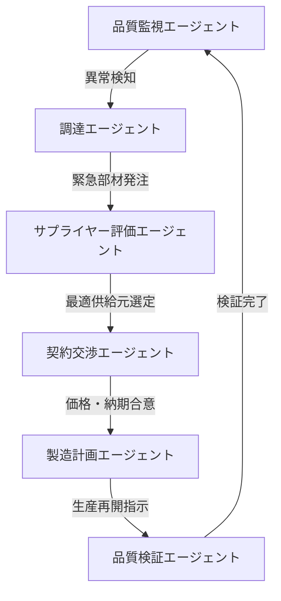
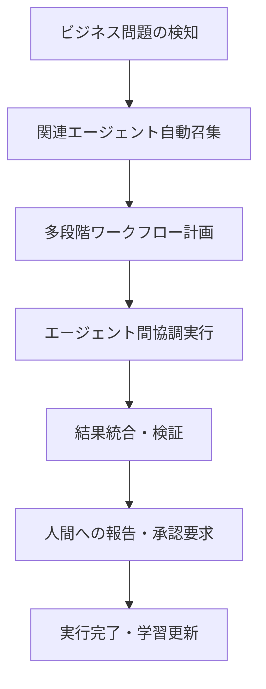

# SAP エージェント対応詳細分析
*半導体・品質保証・メカトロニクス分野での実装戦略*

## 1. **SAPエージェント戦略の全体像**

### 1.1 **Joule + エージェント統合アーキテクチャ**
SAPは従来のコパイロット型AI「Joule」を**エージェント・オーケストレーター**として進化させ、複数のAIエージェントを調整・管理する中央制御システムとして位置づけています。

### 1.2 **2025年のマイルストーン**
- **現在利用可能**: 34,000の顧客がSAP Business AIを利用、230のAIシナリオを提供
- **2025年末目標**: 1,600のJouleスキルに加えて400のAIシナリオを実現
- **エージェント数**: サプライチェーン、調達、財務の各分野で専門エージェントを配置

## 2. **Joule Studio - カスタムエージェント開発プラットフォーム**

### 2.1 **開発者向け機能強化**
SAP Build Code、SAP Build Process Automation、SAP Build Appsでの新しいJoule AI機能により、あらゆるスキルレベルの開発者が包括的なAI統合開発ツールを活用して効率的に構築可能

### 2.2 **半導体業界でのカスタムエージェント例**
```python
# ICテスト品質保証エージェント（概念実装）
class SemiconductorQualityAgent:
    def __init__(self, joule_studio_config):
        self.sap_integration = joule_studio_config
        self.quality_standards = {
            'automotive': 'AEC-Q100',
            'industrial': 'IEC 61508',
            'consumer': 'JEDEC'
        }
    
    def autonomous_quality_check(self, test_data):
        """Joule Studioで作成されるカスタムエージェント機能"""
        # テストデータの自動分析
        # 品質基準との自動照合
        # 不適合時の自動アラート・対応策提案
        pass
    
    def supplier_performance_monitoring(self):
        """SAP Knowledge Graphとの連携"""
        # サプライヤー品質履歴の分析
        # リスク予測とアラート生成
        # 代替サプライヤー自動提案
        pass
```

### 2.3 **ローコード/ノーコード開発**
低コード・ノーコード機能を使用してカスタムAIエージェントを作成する機能を2025年第4四半期に追加予定により、品質保証エンジニアでも独自エージェントの開発が可能となります。

## 3. **AI Foundation - AIオペレーティングシステム**

### 3.1 **統合AI基盤の構成要素**
AI FoundationはGenAIハブ、Joule Studio、SAP Knowledge Graph機能を統合し、開発者がカスタムAIソリューションとエージェントを大規模に構築、拡張、実行するためのツールを提供

### 3.2 **多様なLLMサポート**
GPT-4.1、Claude 3.7 Sonnet、Gemini 2.5 Proなどの最新AIモデルを提供。MistralAI、Cohere、Metaモデルファミリーなど、SAPのGPUインフラ上でセルフホスト型モデルも選択可能

### 3.3 **プロンプト最適化自動化**
任意のLLMや特定のユースケース要件に対してカスタマイズされたプロンプトを自動生成するプロンプト最適化機能を追加。プロンプトエンジニアリングの必要性を排除し、手動テストや変換なしに新しいモデルを即座に活用可能

## 4. **SAP Knowledge Graph - ビジネスプロセス基盤**

### 4.1 **プロセス・グラウンディング**
SAP Knowledge Graphは、SAPの50年以上のビジネスプロセス専門知識をJouleエージェントが利用できるよう急速に進歩。このプロセス・グラウンディングにより、Jouleエージェントは動作するコンテキストを認識し、サプライチェーン、調達、財務にまたがる複数ステップのプロセスを含むより困難な問題を解決可能

### 4.2 **半導体製造プロセスへの応用**
```yaml
# Knowledge Graph構造例（半導体品質保証）
semiconductor_knowledge_graph:
  entities:
    - wafer_lot: 
        properties: [batch_id, fab_location, process_node, yield_rate]
        relationships: [tested_by, manufactured_at, quality_approved_by]
    - test_equipment:
        properties: [model, calibration_date, accuracy_spec]
        relationships: [tests, maintained_by, validated_for]
    - quality_standard:
        properties: [standard_name, version, requirement_list]
        relationships: [applies_to, verified_by, updated_by]
  
  processes:
    - wafer_acceptance_test:
        steps: [incoming_inspection, electrical_test, visual_inspection, certification]
        decision_points: [pass_fail_criteria, rework_decision, reject_decision]
        automation_level: [manual, semi_auto, full_auto]
```

## 5. **マルチエージェント協調システム**

### 5.1 **エージェント間連携アーキテクチャ**
機能的に特化したJouleエージェントがJouleの協調エージェントアーキテクチャの一部となり、他のJouleエージェントと連携して部門横断プロセスの問題を解決。例：ケース分類エージェントが顧客請求紛争を特定すると、現金回収エージェントにルーティングし、紛争解決マルチエージェントワークフローを自律的に開始

### 5.2 **半導体製造での具体的連携例**


### 5.3 **現実世界との統合**
NEURA RoboticsとNVIDIAとの協力により、Jouleエージェントが企業データとプロセスをNEURAの高度な認知ロボット（AMRからヒューマノイドまで）と接続し、適応的製造、自律補充、コンプライアンス監視、予測保全などの現実世界のタスクを自動化

## 6. **Agent2Agent相互運用性**

### 6.1 **オープンスタンダード対応**
Google Cloudとの継続的パートナーシップの一環として、SAPは新しいAgent2Agent相互運用性プロトコルをサポート・貢献。このプロトコルはAIエージェントが異なるプラットフォーム間で安全に協力するための基盤を確立

### 6.2 **サードパーティ連携の可能性**
```python
# Agent2Agent Protocol実装例
class Agent2AgentConnector:
    def __init__(self, sap_joule_config, external_system_config):
        self.sap_agent = JouleAgent(sap_joule_config)
        self.external_agent = ExternalSystemAgent(external_system_config)
    
    def secure_collaboration(self, task_context):
        """異なるベンダーのエージェント間での安全な協力"""
        # コンテキスト共有
        # セキュアな通信
        # 結果の統合・検証
        pass
    
    def semiconductor_supply_chain_optimization(self):
        """半導体サプライチェーン最適化での具体例"""
        # SAPエージェント: 内部需要予測・在庫最適化
        # 外部エージェント: 市場価格分析・地政学リスク評価
        # 協調結果: 統合調達戦略の自動実行
        pass
```

## 7. **言語・インターフェース対応**

### 7.1 **多言語サポート**
JouleAIアシスタントは現在、英語、ドイツ語、フランス語、スペイン語、ポルトガル語、日本語、韓国語、中国語、ベトナム語、ギリシャ語、ポーランド語をサポート

### 7.2 **分析機能の強化**
Jouleは記述的質問（「Q1の総売上は？」）、比較分析（「2023年と2024年の売上比較」）、時系列分析（「月別売上表示」）、トップ/ボトムN分析（「売上上位5店舗表示」）など幅広いクエリに対応

## 8. **半導体・品質保証分野での戦略的実装**

### 8.1 **短期実装（6-12ヶ月）**

#### **品質監視エージェント開発**
```python
# Joule Studioでの実装例
@joule_agent_decorator
class QualityMonitoringAgent:
    def __init__(self):
        self.sap_integration = SAPIntegration()
        self.knowledge_graph = SAP_KnowledgeGraph()
    
    async def real_time_quality_monitoring(self, test_data_stream):
        """リアルタイム品質監視"""
        # ICテストデータのストリーミング解析
        # 統計的プロセス制御（SPC）の自動実行
        # 異常パターンの即座検出・アラート
        anomaly_detected = await self.detect_anomaly(test_data_stream)
        if anomaly_detected:
            await self.trigger_corrective_action()
    
    async def supplier_quality_assessment(self):
        """サプライヤー品質評価"""
        # 過去の品質データ分析
        # 認証状況の自動確認
        # リスクスコアの算出・更新
        pass
```

### 8.2 **中期展開（1-2年）**

#### **調達最適化エージェント統合**
- **需要予測エージェント**: 半導体市場の変動予測
- **サプライヤー評価エージェント**: 品質・納期・価格の総合評価
- **リスク管理エージェント**: 地政学リスク・自然災害影響の評価

### 8.3 **長期戦略（2-5年）**

#### **完全自律システムの実現**
- **予測保全**: 製造装置の故障予測と部品自動発注
- **適応的品質管理**: 製品要求に応じた品質基準の動的調整
- **サプライチェーン最適化**: 市場変動に対する自動対応システム

## 9. **導入における技術的考慮事項**

### 9.1 **データ統合要件**
- **既存システム連携**: MES、ERP、品質管理システムとの統合
- **リアルタイムデータ**: IoTセンサー、テスト機器からのデータストリーム
- **セキュリティ**: 機密性の高い製造データの保護

### 9.2 **コンプライアンス対応**
- **品質規格**: ISO 9001、IATF 16949、AEC-Q100等への自動対応
- **監査証跡**: 全ての意思決定プロセスの記録・追跡
- **規制遵守**: 国際的な半導体規制への自動チェック

## 10. **投資対効果分析**

### 10.1 **期待される効果**
- **品質向上**: AIによる継続的品質監視・改善
- **コスト削減**: 調達プロセスの最適化・自動化
- **リードタイム短縮**: 予測調達による在庫最適化
- **リスク軽減**: 多角的リスク評価・対策の自動実行

### 10.2 **実装コスト**
- **初期投資**: SAP BTP、Joule Studio、Knowledge Graph導入
- **開発コスト**: カスタムエージェント開発・テスト
- **運用コスト**: システム維持・AI学習データ更新
- **人材育成**: エージェント開発・運用スキルの習得

## 11. **競争優位の確立**

### 11.1 **日本企業の強み活用**
- **品質管理ノウハウ**: 既存の品質管理手法のAI化
- **製造技術**: メカトロニクス技術とAIの融合
- **サプライヤー関係**: 長期パートナーシップのデジタル化

### 11.2 **グローバル競争への対応**
- **標準化主導**: AI品質管理の国際標準策定への参画
- **技術差別化**: 独自の品質要求に対応するエージェント開発
- **エコシステム構築**: サプライヤー・顧客を含む統合AIシステム

## 12. **公式リンク・参考資料**

### 12.1 **SAP Joule 公式情報**
- **[Joule AI Copilot 公式ページ](https://www.sap.com/products/artificial-intelligence/ai-assistant.html)**
- **[SAP Community - Joule](https://pages.community.sap.com/topics/joule)**
- **SAP Joule Capabilities (484ページ PDF)**: SAP公式ドキュメント（2025年7月11日版）

### 12.2 **SAP Sapphire 2025 発表資料**
- **[SAP Business AI Innovation Guide](https://www.sap.com/events/sapphire/innovation-guide/ai.html)**
- **[Joule Agents 発表記事](https://news.sap.com/2025/02/joule-sap-uniquely-delivers-ai-agents/)**
- **[SAP Business AI 最新情報](https://news.sap.com/2025/06/sap-business-ai-business-value-innovation-partnerships/)**

### 12.3 **開発者向けリソース**
- **[Joule for Developers](https://news.sap.com/2025/03/joule-for-developers-ai-powered-capabilities/)**
- **[SAP UX Q3/2025 Update](https://community.sap.com/t5/technology-blog-posts-by-sap/sap-ux-q3-2025-update-part-1-ai-joule-sap-build-work-zone-sap-mobile-start/ba-p/14161847)**

### 12.4 **業界分析・解説記事**
- **[Technology Magazine - SAP 400 AI Use Cases](https://technologymagazine.com/articles/how-sap-aims-to-deliver-400-embedded-ai-use-cases-in-2025)**
- **[CIO Magazine - SAP Agentic AI](https://www.cio.com/article/3990312/sap-goes-all-in-on-agentic-ai-at-sap-sapphire.html)**

## 13. **Joule & Joule Agent 概略**

### 13.1 **Joule の基本概念**
**Joule**は、SAPが開発した生成AI搭載のコパイロットで、ビジネスデータに基づき、AIエージェントが注入されて、従業員が使用する全てのクラウドアプリケーションで複雑なプロセスを自動化しながら積極的に支援します。

#### **主要特徴**
- **自然言語インターフェース**: 複雑なSAPシステムを日常言語で操作可能
- **クロスアプリケーション対応**: SAP・非SAPシステム問わず統合動作
- **コンテキスト認識**: ユーザーの役割・権限・業務状況を理解して最適な支援を提供
- **1,600以上のスキル**: 2025年時点で組織全体の業務を網羅する機能群

### 13.2 **Joule Agent の革新性**
**Joule Agent**は、従来のコパイロット機能を超え、**自律的に計画・実行する多段階ワークフロー**を持つAIシステムです。部門を接続し、意思決定を加速し、プロセスを合理化するために協調動作します。

#### **エージェント動作の特徴**


### 13.3 **実用化されているエージェント例**

#### **財務・会計分野**
- **Cash Collection Agent**: 売掛金回収の自動化・最適化
- **Dispute Resolution Agent**: 請求紛争の自動解決

#### **営業・受注管理**
- **Quote Creation Agent**: メール見積要求を送信可能な見積書に自動変換
- **Catalog Optimization Agent**: 製品データの維持・最適化

#### **サプライチェーン・調達**
- **Autonomous Sourcing Agent**: 最適サプライヤー検索・価格交渉
- **Supply Planning Agent**: 需要・在庫・供給計画の知的分析

### 13.4 **半導体・メカトロニクス分野での応用可能性**

#### **品質保証エージェント**
```python
# 概念的実装例
class SemiconductorQualityAgent:
    capabilities = [
        "real_time_test_monitoring",    # リアルタイムテスト監視
        "statistical_process_control",  # 統計的プロセス制御
        "supplier_quality_assessment",  # サプライヤー品質評価
        "compliance_verification",      # 規格適合性自動検証
        "predictive_maintenance"        # 予測保全
    ]
    
    def autonomous_quality_management(self):
        # 品質データ分析 → 異常検知 → 対応策自動実行
        # サプライヤー評価 → リスク算出 → 調達戦略調整
        # 規格チェック → 非適合検出 → 是正措置開始
        pass
```

#### **調達最適化エージェント**
```python
class ComponentSourcingAgent:
    capabilities = [
        "demand_forecasting",           # 需要予測
        "supplier_risk_assessment",     # サプライヤーリスク評価
        "price_negotiation",           # 価格交渉
        "alternative_sourcing",        # 代替調達戦略
        "inventory_optimization"       # 在庫最適化
    ]
    
    def autonomous_procurement(self):
        # 市場分析 → 需要予測 → 最適調達計画
        # サプライヤー評価 → 価格交渉 → 契約締結
        # リスク監視 → 代替戦略 → 供給継続保証
        pass
```

### 13.5 **Joule Studio - カスタムエージェント開発環境**
**Joule Studio**（SAP Build内）により、開発者は企業固有のニーズに合わせたカスタムスキルとAIエージェントを構築・配備可能です。

#### **開発アプローチ**
- **ローコード/ノーコード**: 2025年Q4に一般提供予定
- **ガイド付きワークフロー**: SAPのビジネスプロセス専門知識に基づく
- **プロセス・グラウンディング**: ビジネスプロセスとデータに基づくエージェント設計

### 13.6 **Agent2Agent 相互運用性**
Google Cloudとの協力により開発された**Agent2Agent相互運用性プロトコル**により、異なるベンダーのAIエージェントが安全に協力し、コンテキストを共有し、連携動作することが可能です。

#### **相互運用の利点**
- **ベンダー非依存**: 最適なツールの組み合わせ使用
- **セキュアな協力**: 企業間でのエージェント連携
- **シームレスな自動化**: 従来分断されていたシステム間の統合

### 13.8 **SAP 400 AIシナリオ詳細分析**

#### **現在の展開状況**
2025年第2四半期時点で、SAPは240を超える既存のAIシナリオと1,600のJouleスキルを提供。2025年末までに400を超えるAIシナリオ実現に向けて順調に進行中

#### **ビジネス分野別AIシナリオ分類**

##### **財務・会計分野**
- **Cash Application**: 機械学習による支払いと請求書の自動マッチング
- **Dispute Resolution Agent**: 紛争詳細と関連ビジネス記録を分析し、検証・解決策提案
- **Accounts Receivable Agent**: 延滞債権データ処理と顧客フォローアップの自動化
- **Financial Close Automation**: 決算プロセスの自動化・加速化

##### **サプライチェーン・調達分野**
- **Integrated Business Planning**: AI駆動型需要予測（6%の精度向上実績）
- **Supplier Verification**: 発注書作成前の自動サプライヤー・契約検証
- **Inventory Optimization**: 在庫追跡自動化・補充オーダーの最適化
- **Delivery Optimization**: 輸送コスト削減・環境影響最小化の配送ルート最適化
- **Quality Assurance**: 検査プロセス簡素化・製造エラー検出

##### **人事・人材管理分野**
- **People Intelligence**: AI駆動の人材最適化推奨システム
- **Performance and Goals Agent**: データ駆動型洞察による1on1面談準備支援
- **Workforce Composition Insights**: 人員構成分析・最適化
- **Compensation Insights**: 報酬体系分析・改善提案
- **Skill Insights**: スキルギャップ分析・育成計画策定

##### **開発・IT管理分野**
- **Joule for Developers**: ABAP、Java、JavaScript開発の自動化
- **ABAP AI SDK**: カスタムABAPアプリケーションへのAI機能統合
- **Text-to-Process**: 自然言語からビジネスプロセス図自動生成
- **Text-to-Widgets**: 自然言語から分析ダッシュボード自動生成
- **AI-assisted Inventory Builder**: ITランドスケープ文書化タスク自動化

##### **顧客サービス・営業分野**
- **Quote Creation Agent**: メール見積要求から送信可能見積書への自動変換
- **Catalog Optimization Agent**: 製品データ維持・最適化
- **Service Ticket Classification**: サービスチケットの適切チームへの自動ルーティング
- **Case Resolution**: より迅速・効果的なケース解決

##### **製造・品質管理分野**
- **Predictive Maintenance**: 機器性能監視・故障前修理/交換予測
- **Quality Control**: 品質基準自動チェック・不適合検出
- **Production Planning**: AI駆動型生産計画最適化
- **Equipment Optimization**: 製造設備の効率最適化

#### **業界特化型AIシナリオ例**

##### **半導体・エレクトロニクス**
```yaml
semiconductor_ai_scenarios:
  test_automation:
    - automated_ic_testing
    - failure_pattern_recognition
    - yield_optimization
  supply_chain:
    - chip_shortage_prediction
    - alternative_sourcing
    - geopolitical_risk_assessment
  quality_assurance:
    - defect_classification
    - reliability_prediction
    - compliance_verification
```

##### **自動車産業**
- **Adaptive Manufacturing**: 自律製造プロセス
- **Carbon Emission Integration**: 意思決定への炭素排出値組み込み
- **Supplier Collaboration**: リアルタイム洞察によるサプライチェーン同期

#### **実際の顧客導入事例**

##### **製造業**
- **BSH Hausgeräte GmbH**: SAP IBPのAIモデルにより需要予測精度向上、在庫最適化実現
- **Mabe S.A. de C.V.**: AI アルゴリズムによる需要予測・サプライヤー協力合理化
- **Martur Fompak International**: 炭素排出削減に焦点を当てたデータ・メタバースプラットフォーム構築

##### **食品・飲料業**
- **Coca-Cola Europacific Partners**: IBPにより6%の予測精度向上、調達コスト削減実現
- **Winterhalter Gastronom GmbH**: 現金申請の知的自動化により会計チーム負荷軽減

##### **公共機関**
- **ハンブルク市**: SAP BTP・SAP AI Servicesを活用し、わずか2週間で金融支援申請プラットフォーム構築、エネルギー危機時に約100,000件の補助金申請を効率処理

#### **2025年の拡張予定**

##### **第3四半期**
- **SAP Analytics Cloud**: Joule統合完了
- **Dispute Resolution Agent**: 一般提供開始
- **Accounts Receivable Agent**: 一般提供開始

##### **第4四半期**
- **AI Agent Hub**: SAP LeanIXソリューション一般提供
- **Custom Agent Builder**: ローコード/ノーコード機能提供
- **新データ製品**: 環境・健康・安全データセット追加

#### **技術基盤の強化**

##### **SAP Knowledge Graph拡張**
- **コンテキスト化データ**: 企業データの組織化・構造化
- **グラフベースRAG**: 関連情報の動的取得によるAI出力改善
- **ビジネスプロセス統合**: 50年以上のSAPプロセス専門知識活用

##### **多モデル対応基盤**
- **Prompt Optimizer**: 各種LLMに最適化されたプロンプト自動生成
- **Model Library**: 詳細なモデルカード・ワンクリック展開機能
- **Benchmark Information**: カスタムAIユースケースに最適なモデル探索支援

#### **半導体・メカトロニクス分野での戦略的活用**

##### **品質保証AI統合**
```python
# 400AIシナリオ活用例：半導体品質保証
class SemiconductorQualityScenarios:
    def __init__(self):
        self.ai_scenarios = {
            'automated_testing': 'AIシナリオ#156: ICテスト自動化',
            'defect_prediction': 'AIシナリオ#234: 不良品予測分析',
            'supplier_evaluation': 'AIシナリオ#312: サプライヤー品質評価',
            'compliance_check': 'AIシナリオ#389: 規格適合性自動検証'
        }
    
    def implement_quality_automation(self):
        # 400シナリオからの組み合わせ活用
        # リアルタイム品質監視
        # 予測保全統合
        # サプライチェーン最適化
        pass
```

##### **予測される専用シナリオ**
- **半導体ライフサイクル管理**: 製品寿命予測・廃版リスク評価
- **地政学的調達リスク**: 国際情勢変化に対する自動調達戦略調整
- **エネルギー効率最適化**: 製造プロセスの消費電力最適化
- **クリーンルーム環境管理**: 製造環境の自動最適化・維持

---

**結論**: SAPのエージェント対応は単なる機能追加ではなく、ビジネスプロセス全体の**自律化・知能化**を実現する包括的なプラットフォーム変革です。あなたの専門分野である半導体・品質保証領域において、この技術を早期導入・活用することで、**品質向上**、**コスト削減**、**競争優位の確立**が期待できます。