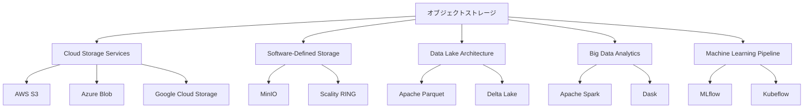

# Object Storage（オブジェクトストレージ）

## 📊 ハイプ・サイクル位置情報

**📊 Slope of Enlightenment（啓発の坂道）** | 🔵 2-5年で実用化  
*位置*: 実用性が理解され、段階的な改善が見られる段階  
*説明*: 非構造化データの大規模保存に最適化されたストレージシステム

---

## 🔍 5つの要点サマリー

### 1️⃣ **定義とアーキテクチャの本質**
オブジェクトストレージは、データをファイルやブロックではなく「オブジェクト」として管理するストレージアーキテクチャ。各オブジェクトは、データ本体・メタデータ・一意のID（UUID）で構成。階層構造（ディレクトリツリー）を持たないフラットな名前空間により、ペタバイト級のスケールアウトが可能。REST APIによるHTTP/HTTPSアクセスが標準。

### 2️⃣ **従来型ストレージ（ブロック・ファイル）との違い**
**ブロックストレージ**: 仮想マシンのディスク、データベース向け。低レイテンシだがスケーラビリティに限界。**ファイルストレージ**: 共有フォルダ、NAS。階層構造により、数億ファイル以上の管理が困難。**オブジェクトストレージ**: 大容量非構造化データ（ログ、画像、動画、センサーデータ）に最適。レイテンシは高いが、無限にスケール可能。

### 3️⃣ **ICテスト・品質保証分野での活用シナリオ**
半導体テストで生成される大量の非構造化データ（波形データ、画像検査結果、ログファイル）の長期保管に最適。メタデータ機能を活用し、テスト条件（温度、電圧、ロット番号）を各オブジェクトに紐付け可能。S3 Select機能により、オブジェクト内部を検索でき、必要なデータのみをダウンロード（エグレスコスト削減）。Python boto3ライブラリでの操作が容易。

### 4️⃣ **技術的特徴とメリット**
- **イレブンナインの耐久性**: データ複製（レプリケーション）とイレージャーコーディングにより、データ損失リスクを極小化（99.999999999%）
- **メタデータ拡張性**: カスタムメタデータをオブジェクトに付与可能。テスト日時、製品型番、テスター機種等を記録
- **バージョニング**: 同一キーのオブジェクトを複数バージョン保持可能。誤削除・誤上書きからの復旧
- **ライフサイクル管理**: ポリシーベースでストレージクラスを自動変更（Hot→Cool→Glacier）

### 5️⃣ **実装上の考慮事項**
オブジェクトストレージはPOSIX互換ファイルシステムではないため、既存アプリケーションの移行には注意が必要。ファイルの一部更新（Append）が不可能で、オブジェクト全体を再アップロードする必要あり。小ファイルの大量アップロードはオーバーヘッドが大きく、パフォーマンス低下の原因に。対策として、複数ファイルをTAR/ZIP形式でアーカイブしてからアップロードする方式が推奨される。

---

## 💼 具体的プロダクト事例

### 🇯🇵 日本企業の先進事例

#### **富士通 - FUJITSU Storage ETERNUS CD10000**
- **実装内容**: オンプレミス型オブジェクトストレージ、S3互換API対応
- **効果**: 製造業向けに画像検査データ、IoTセンサーデータを統合管理。データ主権要件に対応
- **リンク**: [FUJITSU Storage ETERNUS CD10000](https://www.fujitsu.com/jp/products/computing/storage/eternus-cd/)

#### **日立製作所 - Hitachi Content Platform (HCP)**
- **実装内容**: エンタープライズ向けオブジェクトストレージ、長期アーカイブ機能
- **効果**: 半導体製造データの10年保管要件に対応、メタデータ検索による迅速な不良解析
- **リンク**: [Hitachi Content Platform](https://www.hitachivantara.com/en-us/products/storage-platforms/content-platform.html)

#### **ソニー - 4K/8K映像コンテンツ管理**
- **実装内容**: AWS S3をバックエンドとしたメディア資産管理システム
- **効果**: ペタバイト級の映像データを効率管理、メタデータによるコンテンツ検索を実現
- **リンク**: [Sony Professional Solutions](https://pro.sony/ja_JP/)

### 🌐 グローバルスタンダード

#### **Amazon S3 (Simple Storage Service)**
- **特徴**: オブジェクトストレージのデファクトスタンダード、S3 APIが業界標準に
- **ユースケース**: データレイク、バックアップ、静的ウェブサイトホスティング、機械学習データセット
- **リンク**: [Amazon S3](https://aws.amazon.com/s3/)

#### **MinIO**
- **特徴**: オープンソースS3互換オブジェクトストレージ、Kubernetesネイティブ、オンプレミス展開可能
- **ユースケース**: プライベートクラウド構築、エッジコンピューティング、AI/MLワークロード
- **リンク**: [MinIO](https://min.io/)

#### **Scality RING**
- **特徴**: ソフトウェア定義ストレージ、ペタバイトスケール対応、マルチクラウド統合
- **ユースケース**: 大規模アーカイブ、コンテンツ配信、ランサムウェア対策（イミュータブルストレージ）
- **リンク**: [Scality RING](https://www.scality.com/products/ring/)

#### **Dell EMC ECS (Elastic Cloud Storage)**
- **特徴**: エンタープライズ向けオブジェクトストレージ、S3/Swift/HDFS対応
- **ユースケース**: ビッグデータ分析基盤、IoTデータ管理、長期アーカイブ
- **リンク**: [Dell EMC ECS](https://www.dell.com/ja-jp/dt/storage/ecs/index.htm)

#### **IBM Cloud Object Storage**
- **特徴**: イレージャーコーディング技術による超高耐久性、分散配置による災害対策
- **ユースケース**: グローバル企業のデータ統合管理、コンプライアンス対応アーカイブ
- **リンク**: [IBM Cloud Object Storage](https://www.ibm.com/cloud/object-storage)

---

## 💡 My Notes

（ここに個人的な気づき、アクションアイテム、関連リンク等を記載）

---

## ⭐ Rating: 5/5

**評価理由:**
- 非構造化データ管理において、技術的に最適なアーキテクチャであることが証明されている
- ICテストで生成される大量のログ・波形・画像データの保管に直接的に有用
- Pythonエコシステム（boto3、s3fs、pyarrow）との統合が成熟しており、分析ワークフローに組み込みやすい
- オンプレミス実装も可能（MinIO、Scality等）であり、データ主権要件に対応可能
- メタデータ検索機能により、テストデータの効率的な絞り込みが可能

---

## 📝 全体要約の特徴（5つの要点）

### 1. **非構造化データに特化したアーキテクチャ**
オブジェクトストレージは、構造化データ（RDBMSで管理されるテーブルデータ）ではなく、非構造化データ（ログ、画像、音声、動画、センサーデータ等）の保管に特化。半導体テストにおいては、波形データ（.wfm）、スクリーンショット（.png/.jpg）、テストログ（.txt/.csv）等が該当。従来のファイルサーバーでは管理が困難な数億〜数兆オブジェクトのスケールに対応。

### 2. **メタデータによる高度な検索性**
各オブジェクトに任意のメタデータを付与可能。例: `{"product": "XYZ-123", "test_date": "2025-10-14", "temperature": "85C", "result": "pass"}`。このメタデータを活用し、「特定製品の高温テスト結果のみ」「2025年9月のFail件数」等の検索が高速に実行可能。従来のファイル名ベース管理（例: `XYZ-123_2025-10-14_85C_pass.log`）と比較し、柔軟性が大幅に向上。

### 3. **Python分析環境との統合パターン**
- **boto3による直接アクセス**: `boto3.client('s3').get_object(Bucket='test-data', Key='lot-12345/wafer-03.csv')`
- **s3fsによるファイルシステムライクな操作**: `pd.read_csv('s3://test-data/lot-12345/wafer-03.csv')`
- **Dask/Pandasとの統合**: 大規模CSVの並列読み込み
- **PyArrowによる高速データ転送**: Parquet形式での効率的なデータ交換

### 4. **コスト最適化戦略**
オブジェクトストレージのコスト構造: (1)ストレージ料金（GB/月）、(2)リクエスト料金（PUT/GET課金）、(3)データ転送料金（エグレス）。**最適化手法**: 
- 頻繁にアクセスするデータはHotストレージ、年1回程度のアクセスはArchiveストレージへ自動移行
- S3 Select/Athenaによるサーバーサイドフィルタリング（必要データのみダウンロード）
- マルチパートアップロードによる大ファイル転送の効率化
- インテリジェントティアリング機能の活用

### 5. **データガバナンスとコンプライアンス**
オブジェクトストレージは、データガバナンス要件（監査証跡、アクセス制御、データ保持ポリシー）への対応が容易。**主要機能**:
- **バージョニング**: 誤削除・誤上書きからの復旧。テストデータの変更履歴を保持
- **オブジェクトロック**: WORM（Write Once Read Many）モードによる改ざん防止。規制対応（FDA 21 CFR Part 11等）
- **アクセスログ**: 全てのAPI呼び出しを記録。セキュリティ監査に活用
- **暗号化**: サーバーサイド暗号化（SSE-S3/SSE-KMS）、クライアントサイド暗号化

---

## 🇯🇵 日本の立ち位置・強み弱み分析（4点サマリー）

### 1️⃣ **🟢 強み: 長期データ保管文化との親和性**
日本の製造業は、製品不具合時のトレーサビリティ確保のため、製造・テストデータの長期保管（10-30年）を徹底している。オブジェクトストレージの高耐久性（イレブンナイン）と低コストアーカイブ機能は、この文化的要件に完璧に適合。自動車業界のISO/TS 16949、半導体業界のJEDEC規格等への対応も容易。

### 2️⃣ **🔴 弱み: ファイルシステムからのパラダイムシフト困難**
日本企業のITシステムは、ファイルサーバー（Windows共有フォルダ、NAS）に深く依存しており、オブジェクトストレージへの移行に心理的・技術的障壁がある。既存アプリケーションがPOSIXファイルシステムを前提としており、REST API方式への書き換えが必要。この移行コストを「投資対効果が不明確」として敬遠する傾向。

### 3️⃣ **🟡 中間的位置: オンプレミス志向とクラウドネイティブ技術のギャップ**
データ主権への懸念から、オンプレミス型オブジェクトストレージ（MinIO、Scality、HCP等）を選好する傾向がある。これ自体は悪くないが、クラウドネイティブなベストプラクティス（サーバーレスアーキテクチャ、イベント駆動処理、マネージドサービス活用）の習得が遅れる原因に。ハイブリッドクラウド戦略（オンプレミス＋クラウドの併用）の設計スキル不足。

### 4️⃣ **🟢 機会: 製造業DXとデータ分析基盤の進化**
日本の製造業DXにおいて、「データレイク」構築が急務となっている。オブジェクトストレージは、データレイクの中核技術として位置づけられる。特に、品質保証部門におけるPython/機械学習活用の拡大により、オブジェクトストレージの必要性が急速に高まっている。トヨタ、ソニー、パナソニック等の先進企業が実装を進めており、中小製造業への普及が期待される。

---

## 🎯 品質保証エンジニアとしてのアクションアイテム

### 短期（3ヶ月以内）
1. **オブジェクトストレージのハンズオン学習**
   - MinIOのDockerコンテナをローカル環境に構築
   - Pythonスクリプトでのオブジェクトアップロード・ダウンロード実装
   - メタデータ付与・検索の実験

2. **テストデータの分類と評価**
   - 現在のテストデータを「Hot（頻繁アクセス）」「Warm（月1回程度）」「Cold（年1回以下）」に分類
   - オブジェクトストレージ移行の優先順位決定

### 中期（6-12ヶ月）
1. **パイロットプロジェクト実施**
   - 特定製品ラインのテストデータをオブジェクトストレージへ移行
   - メタデータスキーマ設計（製品型番、テスト日時、テスター機種、温度条件等）
   - Python分析スクリプトの移行（s3fs/boto3活用）

2. **コスト・パフォーマンス評価**
   - ファイルサーバーとのコスト比較
   - データ取得速度の測定（ベンチマーク）

### 長期（1-3年）
1. **データレイク構築**
   - 全社テストデータをオブジェクトストレージに集約
   - Apache Parquet形式での最適化（カラムナーストレージ）
   - AWS Athena/Trino等のクエリエンジン導入

2. **機械学習パイプライン統合**
   - テストデータから不良予測モデルを自動学習
   - MLflowによるモデル管理（オブジェクトストレージ活用）

---

## 🔗 関連技術との関係性

---

**最終更新:** 2025年10月14日  
**次回レビュー:** 2026年4月（半年後）