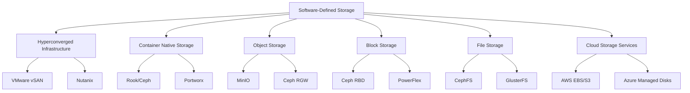

# Software-Defined Storage (SDS)

## 📊 ハイプ・サイクル位置情報

**📊 Slope of Enlightenment（啓発の坂道）** | 🔵 2-5年で実用化  
*位置*: 実用性が理解され、段階的な改善が見られる段階  
*説明*: ハードウェアから独立したソフトウェアベースのストレージ管理

---

## 🔍 5つの要点サマリー

### 1️⃣ **定義と技術的本質**
Software-Defined Storage (SDS)は、ストレージ機能（データ保護、スナップショット、レプリケーション等）をハードウェアから分離し、ソフトウェアレイヤーで実装する技術。従来のストレージアレイ（EMC、NetApp等の専用ハードウェア）と異なり、汎用サーバー（x86/ARM）上で動作するソフトウェアにより、ストレージプールを構築。API駆動によるプログラマブルな管理が可能。

### 2️⃣ **従来型ストレージとの決定的な違い**
**従来型**: 専用ハードウェア依存、ベンダーロックイン、高額な初期投資、スケールアップ（より高性能なハードウェアへの買い替え）が前提。**SDS**: ハードウェア非依存、スケールアウト（サーバー追加で容量・性能拡張）、低コスト、オープンソース選択肢あり（Ceph、GlusterFS）。ただし、運用ノウハウが必要で、設計不良によりパフォーマンス問題が発生するリスクあり。

### 3️⃣ **ICテスト・品質保証分野での活用シナリオ**
テストラボのストレージインフラをSDSで構築することで、テストデータ量の増減に柔軟に対応可能。新製品ライン追加時にサーバーを追加するだけで容量拡張でき、従来のようなストレージアレイの買い替えが不要。Pythonスクリプトからのデータアクセスは、NFSマウントまたはS3互換API（MinIO、Ceph RGW）経由で可能。コスト削減効果が大きく、データセンター予算の最適化に貢献。

### 4️⃣ **主要アーキテクチャと実装方式**
- **ハイパーコンバージドインフラ（HCI）**: コンピューティング・ストレージ・ネットワークを統合したアプライアンス。VMware vSAN、Nutanix等が代表例
- **分散ファイルシステム型**: Ceph（ブロック・オブジェクト・ファイル対応）、GlusterFS（スケーラブルNAS）
- **コンテナネイティブストレージ**: Rook（CephのKubernetesオーケストレーション）、Portworx、OpenEBS
- **クラウドネイティブSDS**: AWS EBS（ブロック）、Azure Managed Disks、Google Persistent Disk

### 5️⃣ **導入時の考慮事項とベストプラクティス**
SDSの成功には、適切な設計とサイジングが不可欠。**主要課題**: (1)パフォーマンスチューニングの複雑性、(2)障害時のデータ再構築時間（大容量環境で数時間〜数日）、(3)ネットワーク帯域の十分な確保（10GbE以上推奨）。**推奨アプローチ**: 小規模なPoC（Proof of Concept）から開始し、段階的に本番環境へ展開。SSDとHDDのハイブリッド構成によるコスト最適化。モニタリングツール（Prometheus、Grafana）による可視化。

---

## 💼 具体的プロダクト事例

### 🇯🇵 日本企業の先進事例

#### **NTTデータ - OpenStack Swiftベースのクラウドストレージ**
- **実装内容**: 自社データセンターにSDSを構築、顧客向けクラウドサービスとして提供
- **効果**: ハードウェアコストを50%削減、ストレージ容量を従来比3倍に拡張
- **リンク**: [NTTデータ クラウドソリューション](https://www.nttdata.com/jp/ja/)

#### **富士通 - FUJITSU Software Infrastructure Manager（ISM）**
- **実装内容**: ソフトウェア定義インフラ管理ツール、ストレージ仮想化機能
- **効果**: 複数ストレージベンダーの統合管理、自動化によるオペレーションコスト削減
- **リンク**: [FUJITSU Software ISM](https://www.fujitsu.com/jp/products/software/infrastructure-software/infrastructure-software/serverviewism/)

#### **日立製作所 - Hitachi Virtual Storage Platform (VSP)**
- **実装内容**: ストレージ仮想化技術、異種ストレージの統合管理
- **効果**: ストレージマイグレーションの無停止化、データ保護機能の統一
- **リンク**: [Hitachi VSP](https://www.hitachivantara.com/en-us/products/storage-platforms/virtual-storage-platform.html)

### 🌐 グローバルスタンダード

#### **Red Hat Ceph Storage**
- **特徴**: オープンソースSDS、ブロック・オブジェクト・ファイルストレージを統合提供、OpenStackとの親和性が高い
- **ユースケース**: プライベートクラウド構築、大規模データレイク、コンテナストレージ
- **リンク**: [Red Hat Ceph Storage](https://www.redhat.com/ja/technologies/storage/ceph)

#### **VMware vSAN**
- **特徴**: ハイパーコンバージドインフラの代表格、vSphere環境との完全統合、導入・運用が容易
- **ユースケース**: 仮想化基盤のストレージ統合、VDI（仮想デスクトップ）、データベース基盤
- **リンク**: [VMware vSAN](https://www.vmware.com/products/vsan.html)

#### **Nutanix**
- **特徴**: エンタープライズHCI、Acropolis OS、Prism管理コンソールによる直感的な運用
- **ユースケース**: データセンターモダナイゼーション、エッジコンピューティング、DR（災害復旧）
- **リンク**: [Nutanix](https://www.nutanix.com/jp)

#### **Dell EMC PowerFlex (旧VxFlex OS/ScaleIO)**
- **特徴**: ソフトウェアオンリーまたはアプライアンス提供、ブロックストレージに特化、超高性能
- **ユースケース**: データベース（Oracle、SQL Server）、ビッグデータ分析、コンテナ基盤
- **リンク**: [Dell EMC PowerFlex](https://www.dell.com/ja-jp/dt/storage/powerflex.htm)

#### **HPE SimpliVity**
- **特徴**: HCI、データ効率化技術（重複排除・圧縮）、バックアップ統合
- **ユースケース**: 支社・支店の仮想化基盤、ROBO（Remote Office / Branch Office）
- **リンク**: [HPE SimpliVity](https://www.hpe.com/jp/ja/integrated-systems/simplivity.html)

#### **MinIO (SDS for Object Storage)**
- **特徴**: オープンソースS3互換オブジェクトストレージ、Kubernetes対応、高性能
- **ユースケース**: プライベートクラウドのオブジェクトストレージ、AI/MLワークロード、データレイク
- **リンク**: [MinIO](https://min.io/)

---

## 💡 My Notes

（ここに個人的な気づき、アクションアイテム、関連リンク等を記載）

---

## ⭐ Rating: 4/5

**評価理由:**
- ハードウェアコスト削減とスケーラビリティ向上のメリットが明確
- テストラボのストレージ基盤刷新において、有力な選択肢となる
- ただし、導入・運用には専門知識が必要で、従来型ストレージより学習曲線が急
- 小規模環境では管理オーバーヘッドがコストメリットを上回る可能性あり
- 品質保証部門単独での導入は困難で、IT部門との連携が必須

---

## 📝 全体要約の特徴（5つの要点）

### 1. **ハードウェア依存からの脱却と柔軟性の獲得**
SDSの最大の特徴は、ストレージ機能をソフトウェアで実装することで、ハードウェアベンダーへの依存を低減できる点。従来のストレージアレイは、特定ベンダーの専用ハードウェアに縛られ、容量拡張時には同一ベンダーの高額な増設キャビネットを購入する必要があった。SDSでは、汎用x86サーバー（Dell、HPE、Supermicro等）を追加するだけで容量・性能を拡張可能。ハードウェアの世代交代時にも、異なるサーバーモデルを混在可能（ヘテロジニアスクラスタ）。

### 2. **API駆動によるプログラマブル管理**
SDSは、RESTful APIによる完全なプログラマブル管理を提供。Infrastructure as Code（IaC）の実践が可能になり、Terraform、Ansible、Kubernetes等の自動化ツールとの統合が容易。品質保証部門のPythonスクリプトから、ストレージボリュームの動的作成・削除、スナップショット取得等を自動化できる。例: テスト実行前に専用ボリューム作成、テスト完了後に自動削除（クリーンアップ）。

### 3. **コスト構造の変革と予算最適化**
従来型ストレージの総所有コスト（TCO）は、初期購入費・保守費（年間20-25%）・電力費で構成。SDSでは、初期投資を大幅に削減（50-70%）でき、段階的な投資が可能（Pay-as-you-grow）。ただし、運用コスト（人件費）が増加する可能性があるため、自動化ツール導入による効率化が重要。**試算例**: 100TB環境の5年間TCO比較では、SDSが従来型より30-50%低コストになるケースが多い（Gartner調査）。

### 4. **パフォーマンス特性と最適化アプローチ**
SDSのパフォーマンスは、ネットワーク帯域・サーバースペック・ディスク構成に大きく依存。**性能最適化のポイント**:
- **ネットワーク**: 10GbE以上、専用ストレージネットワーク（VLAN分離）
- **SSDとHDDのティアリング**: ホットデータをSSD、コールドデータをHDDに自動配置
- **キャッシュ最適化**: NVMe SSDをライトキャッシュとして活用
- **レプリケーション戦略**: 3レプリカ（3倍容量消費）vs イレージャーコーディング（1.5倍程度）

### 5. **エコシステムとの統合: コンテナ・クラウドネイティブ時代への対応**
現代のSDSは、Kubernetesとの統合を前提に設計されている。Container Storage Interface (CSI)により、Kubernetes上のアプリケーション（Pod）が動的にストレージボリュームを要求可能。**活用例**: 
- Jupyter Notebook環境を複数のデータサイエンティストに提供（個別の永続ボリューム付与）
- テストジョブごとに専用ボリューム作成（ジョブ完了後に自動削除）
- マルチテナント環境でのストレージクォータ管理

---

## 🇯🇵 日本の立ち位置・強み弱み分析（4点サマリー）

### 1️⃣ **🔴 弱み: ハードウェア信仰と保守主義**
日本企業、特に製造業においては、「ハードウェアアプライアンス = 信頼性」という固定観念が根強い。EMC、NetApp、日立、富士通等の大手ベンダー製ストレージアレイへの依存度が高く、「実績」「保守サポート」を重視する文化。SDSは「ソフトウェアだけで大丈夫なのか」という懸念により、採用が遅れる傾向。実際には、Google、Facebook等の超大規模環境でSDSが実証済みであるにも関わらず、日本企業の意思決定は保守的。

### 2️⃣ **🟡 中間的位置: HCI採用の拡大だが、フルSDSへの移行は限定的**
VMware vSAN、Nutanix等のハイパーコンバージドインフラ（HCI）は、日本でも急速に普及している。これはSDSの一形態だが、「アプライアンス製品」として提供されるため、従来のハードウェア購買プロセスに適合しやすい。一方、Ceph、GlusterFS等のフルソフトウェアSDSの採用は、大手クラウドプロバイダー（NTTコミュニケーションズ、さくらインターネット等）やWeb系企業に限定される。

### 3️⃣ **🟢 強み: 高品質な運用ノウハウと段階的導入アプローチ**
日本企業の強みは、徹底した運用設計と段階的な導入アプローチ。SDS導入時には、入念なPoC（概念実証）を実施し、パフォーマンス・信頼性・運用手順を検証する。障害シナリオの事前テスト、バックアップ・リストア手順の文書化等、日本的な「品質第一」の文化がSDS運用の安定性に貢献。トヨタ生産方式（TPS）の「段取り替え」の思想により、計画的な移行が得意。

### 4️⃣ **🟢 機会: データセンター刷新とクラウドネイティブ化の波**
日本企業のデータセンターは、老朽化が進んでおり（10-15年経過設備が多数）、刷新の好機。SDSは、データセンターモダナイゼーションの中核技術として位置づけられる。特に、以下の背景により、SDS採用が加速する見込み:
- **人材不足**: 従来型ストレージの専門家が引退・転職し、若手エンジニアはクラウド/コンテナネイティブスキルを保有
- **コスト圧力**: 円安・半導体不足により、ハードウェアコストが高騰。SDSによるコスト削減ニーズ増大
- **DX推進**: デジタルトランスフォーメーションの一環として、インフラのアジリティ向上が求められる

---

## 🎯 品質保証エンジニアとしてのアクションアイテム

### 短期（3ヶ月以内）
1. **SDSの学習と実験環境構築**
   - VirtualBox/VMware上でCephクラスタを構築（3ノード構成）
   - MinIOのDockerコンテナ起動、S3互換APIの動作確認
   - Pythonスクリプトでのストレージ操作（ボリューム作成、データ書き込み・読み込み）

2. **現行ストレージ環境の棚卸し**
   - テストラボのストレージ容量、利用率、増加トレンドを調査
   - ハードウェア保守期限の確認
   - ストレージ関連コスト（購入費、保守費、電力費）の集計

### 中期（6-12ヶ月）
1. **IT部門との連携とPoC提案**
   - SDSの技術プレゼンテーション資料作成
   - PoC計画書の作成（検証項目、スケジュール、成功基準）
   - 小規模環境での実証実験（テストデータの一部をSDS環境へ移行）

2. **コスト試算とROI分析**
   - 5年間のTCO比較（従来型ストレージ vs SDS）
   - ハードウェア選定（Dell、HPE、Supermicro等）と見積取得
   - 運用工数の見積もり

### 長期（1-3年）
1. **本番環境へのSDS導入**
   - テストラボのストレージ基盤をSDSへ段階的に移行
   - 監視・バックアップ体制の構築
   - 運用マニュアルの整備

2. **自動化とクラウドネイティブ化**
   - テスト実行時の動的ストレージプロビジョニング自動化
   - Kubernetes環境でのPersistent Volume活用
   - データレイク基盤としての活用（オブジェクトストレージ機能）

---

## 📊 SDS vs 従来型ストレージ 比較表

| 項目 | 従来型ストレージアレイ | Software-Defined Storage |
|------|------------------------|--------------------------|
| **初期コスト** | 高額（数百万〜数千万円） | 低コスト（サーバー+ソフトウェア） |
| **スケーラビリティ** | スケールアップ（買い替え） | スケールアウト（サーバー追加） |
| **ベンダーロックイン** | 高（専用ハードウェア） | 低（汎用サーバー、オープンソース） |
| **運用の複雑性** | 低（GUI管理、保守委託可） | 高（専門知識必要、自社運用） |
| **パフォーマンス** | 予測可能、安定 | ネットワーク・設計に依存 |
| **API駆動管理** | 限定的 | 完全対応（RESTful API） |
| **導入期間** | 短期（数週間） | 中長期（設計・検証に時間） |
| **適用領域** | ミッションクリティカル | クラウド、開発環境、データレイク |

---

## 🔗 関連技術との関係性

---

## 📚 参考資料とさらなる学習リソース

### 技術ドキュメント
- [Red Hat Ceph Storage Documentation](https://access.redhat.com/documentation/en-us/red_hat_ceph_storage)
- [VMware vSAN Design and Sizing Guide](https://docs.vmware.com/en/VMware-vSAN/)
- [Kubernetes CSI Documentation](https://kubernetes-csi.github.io/docs/)

### オンラインコース
- [Linux Foundation: Introduction to Ceph Storage (LFS253)](https://training.linuxfoundation.org/training/introduction-to-ceph-storage-lfs253/)
- [VMware Learning: vSAN Specialist](https://www.vmware.com/learning/certification/vcp-dcv-cert.html)

### コミュニティ
- [Ceph Community](https://ceph.io/en/community/)
- [Cloud Native Computing Foundation (CNCF) Storage SIG](https://github.com/cncf/tag-storage)

---

**最終更新:** 2025年10月14日  
**次回レビュー:** 2026年4月（半年後）