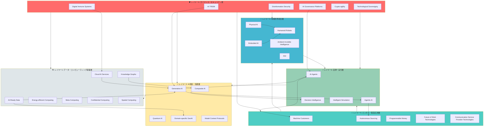

# Gartner 2025年度ハイプ・サイクル技術スタック構造分析

## 📊 技術スタック構造図

## 📋 技術スタック構造の説明

### 🏗️ **レイヤー1: データ・コンピューティング基盤層**
すべてのAI技術を支える基盤。半導体・ICテスト分野では最も重要な層。

**含まれる技術:**
- AI-Ready Data（AI活用可能な高品質データ）
- Cloud AI Services（クラウドAIサービス）
- Knowledge Graphs（知識グラフ）
- Energy-efficient Computing（省エネコンピューティング）
- Meta Computing（メタコンピューティング）
- Confidential Computing（機密コンピューティング）
- Spatial Computing（空間コンピューティング）

### 🧠 **レイヤー2: AI技術・知能層**
データを知能に変換する技術群。品質予測・異常検知の中核。

**含まれる技術:**
- Generative AI（生成AI）
- Composite AI（複合AI）
- Quantum AI（量子AI）
- Domain-specific GenAI（ドメイン特化型生成AI）
- Model Context Protocols（モデルコンテキストプロトコル）

### ⚡ **レイヤー3: 自律・実行層**
AIが判断し行動する層。テスト自動化・プロセス最適化の鍵。

**含まれる技術:**
- AI Agents（AIエージェント）
- Agentic AI（エージェント型AI）
- Decision Intelligence（意思決定インテリジェンス）
- Intelligent Simulation（インテリジェントシミュレーション）

### 🤖 **レイヤー4: 物理世界統合層**
AIと物理世界をつなぐ層。メカトロニクス製品の知能化。

**含まれる技術:**
- Humanoid Robots（ヒューマノイドロボット）
- Physical AI（物理AI）
- Embodied AI（身体性AI）
- Ambient Invisible Intelligence（アンビエント不可視知能）
- AGI（汎用人工知能）

### 💼 **レイヤー5: ビジネス・製造応用層**
実際のビジネス価値を生み出す層。調達・製造・販売の自動化。

**含まれる技術:**
- Machine Customers（機械顧客）
- Autonomous Sourcing（自律調達）
- Programmable Money（プログラマブルマネー）
- Future of Work Technologies（働き方の未来技術）
- Communication Service Provider Technologies（通信サービスプロバイダ技術）

### 🛡️ **レイヤー6: ガバナンス・セキュリティ層**
全層を横断的に保護・管理する層。品質保証・コンプライアンスの要。

**含まれる技術:**
- AI TRiSM（AI信頼性・リスク・セキュリティ管理）
- AI Governance Platforms（AIガバナンスプラットフォーム）
- Disinformation Security（偽情報セキュリティ）
- Digital Immune Systems（デジタル免疫システム）
- Crypto-agility（暗号アジリティ）
- Technological Sovereignty（技術主権）

---

## 🔍 各技術の5つの要点サマリー

### 🏗️ レイヤー1: データ・コンピューティング基盤層

#### 1.1 AI-Ready Data
**ハイプサイクル位置:** 📈 Peak of Inflated Expectations | 🔵 2-5年で実用化

**5つの要点:**
1. **定義**: AI学習・推論に最適化された、クリーン・ラベル付き・バイアス除去済みの高品質データセット
2. **ICテスト分野への影響**: テストデータの品質基準見直しが必要。既存のテストログをAI学習用に再構造化する必要性
3. **実装課題**: データプライバシー保護とAI活用のトレードオフ。合成データ生成技術の導入検討が必要
4. **日本の状況**: 製造データの収集は得意だが、AI活用のためのデータクリーニング・ラベリング体制が脆弱
5. **アクションアイテム**: Pythonベースのデータ前処理パイプライン構築、データ品質監査プロセスの確立

#### 1.2 Cloud AI Services
**ハイプサイクル位置:** 📊 Slope of Enlightenment | 🔵 2-5年で実用化

**5つの要点:**
1. **定義**: AWS、Azure、GCPなどが提供するマネージドAIサービス群。機械学習モデルの開発・デプロイを簡素化
2. **ICテスト分野への影響**: オンプレミスからクラウドへの移行により、スケーラブルなテスト解析が可能に
3. **実装課題**: 機密性の高い半導体テストデータのクラウド保存に対するセキュリティ懸念
4. **日本の状況**: クラウド利用率は増加中だが、データ主権への懸念から国内クラウド活用が主流
5. **アクションアイテム**: ハイブリッドクラウド戦略の策定、Confidential Computingとの組み合わせ検討

#### 1.3 Knowledge Graphs
**ハイプサイクル位置:** 📊 Slope of Enlightenment | 🔵 2-5年で実用化

**5つの要点:**
1. **定義**: エンティティ間の関係を構造化したグラフデータベース。文脈を理解するAIの基盤技術
2. **ICテスト分野への影響**: 不良解析における因果関係の可視化、設計仕様とテスト結果の紐付け強化
3. **実装課題**: 既存の製造・品質データをグラフ構造に変換するコスト。Neo4j等のツール習熟が必要
4. **日本の状況**: 研究機関での利用は進むが、製造現場での実装例は限定的
5. **アクションアイテム**: パイロットプロジェクトとしてテスト不良要因の知識グラフ化を実施

#### 1.4 Energy-efficient Computing
**ハイプサイクル位置:** 📊 Slope of Enlightenment | 🔵 2-5年で実用化

**5つの要点:**
1. **定義**: 電力効率を最大化した計算アーキテクチャ。AI推論の消費電力削減が主目的
2. **ICテスト分野への影響**: エッジAIデバイスのテスト要件変化。省電力動作での性能評価が必須に
3. **実装課題**: 性能と消費電力のトレードオフ最適化。テスト環境での電力測定精度向上
4. **日本の状況**: 省エネ技術は日本の伝統的強み。Preferred Networks、東芝等が先行
5. **アクションアイテム**: 省電力モード下でのICテストプロトコル開発、電力プロファイリングツール導入

#### 1.5 Meta Computing
**ハイプサイクル位置:** 🔧 Innovation Trigger | 🔴 5-10年で実用化

**5つの要点:**
1. **定義**: 複数のコンピューティングリソース（クラウド・エッジ・量子）を統合管理するメタレベルの計算基盤
2. **ICテスト分野への影響**: 長期的には分散テスト環境の最適化に寄与。現時点では研究段階
3. **実装課題**: 異種システム間のオーケストレーション技術が未成熟
4. **日本の状況**: 基礎研究レベル。産業応用は今後10年のテーマ
5. **アクションアイテム**: 技術動向のウォッチング継続。現時点では直接投資不要

#### 1.6 Confidential Computing
**ハイプサイクル位置:** 📊 Slope of Enlightenment | 🔵 2-5年で実用化

**5つの要点:**
1. **定義**: 使用中のデータを暗号化したまま処理するセキュリティ技術（Intel SGX、AMD SEV等）
2. **ICテスト分野への影響**: 機密性の高い半導体設計データをクラウドで安全に処理可能に
3. **実装課題**: パフォーマンスオーバーヘッド（10-50%）。対応ハードウェアへの依存
4. **日本の状況**: 金融・医療分野で先行導入。製造業での採用はこれから
5. **アクションアイテム**: クラウドAI活用の前提技術として評価。PoCプロジェクトの実施

#### 1.7 Spatial Computing
**ハイプサイクル位置:** 📊 Slope of Enlightenment | 🔵 2-5年で実用化

**5つの要点:**
1. **定義**: AR/VR/MRを活用した3次元空間でのコンピューティング体験（Apple Vision Pro等）
2. **ICテスト分野への影響**: テスト装置の遠隔操作、3D可視化による不良解析支援
3. **実装課題**: 高価なハードウェア投資。製造現場での実用性検証が必要
4. **日本の状況**: ソニー、キヤノン等がハードウェアで強み。産業応用は試験段階
5. **アクションアイテム**: 教育・トレーニング用途から導入検討。現場作業支援への段階的展開

---

### 🧠 レイヤー2: AI技術・知能層

#### 2.1 Generative AI (生成AI)
**ハイプサイクル位置:** 📉 Trough of Disillusionment | 🔵 2-5年で実用化

**5つの要点:**
1. **定義**: テキスト・画像・コードを生成するAI（ChatGPT、Claude、Midjourney等）
2. **ICテスト分野への影響**: テストコード自動生成、不良レポート自動作成、技術文書の翻訳・要約
3. **実装課題**: ハルシネーション（誤情報生成）リスク。品質保証分野での信頼性確保が課題
4. **日本の状況**: 活用は進むが、自社開発LLMは少数。米国依存度が高い
5. **アクションアイテム**: プロンプトエンジニアリング教育、RAG（Retrieval-Augmented Generation）の実装検討

#### 2.2 Composite AI
**ハイプサイクル位置:** 🔧 Innovation Trigger | 🔵 2-5年で実用化

**5つの要点:**
1. **定義**: 複数のAI技術（機械学習・ルールベース・知識グラフ等）を組み合わせたハイブリッドシステム
2. **ICテスト分野への影響**: 統計的異常検知と物理モデルの融合による高精度な不良予測
3. **実装課題**: 異なるAI手法の統合アーキテクチャ設計。モデル間の整合性確保
4. **日本の状況**: 製造業の強み（物理モデル）とAIの融合は日本の勝ち筋だが、実装例は少ない
5. **アクションアイテム**: 既存の物理モデルベーステストとML予測の統合プロジェクト立ち上げ

#### 2.3 Quantum AI
**ハイプサイクル位置:** 🔧 Innovation Trigger | 🔴 5-10年で実用化

**5つの要点:**
1. **定義**: 量子コンピュータを活用した機械学習。組合せ最適化問題で古典計算を超える性能
2. **ICテスト分野への影響**: テストパターン最適化、複雑な回路シミュレーションの高速化
3. **実装課題**: 量子コンピュータへのアクセス制限。アルゴリズム開発の専門知識必要
4. **日本の状況**: 理研、東大等の研究は進むが、産業応用は初期段階。IBM Quantum、Google Quantumへの依存
5. **アクションアイテム**: 長期研究テーマとして位置づけ。量子アニーリング（D-Wave）での最適化問題試行

#### 2.4 Domain-specific GenAI
**ハイプサイクル位置:** 🔧 Innovation Trigger | 🔵 2-5年で実用化

**5つの要点:**
1. **定義**: 特定産業・ドメインに特化した生成AIモデル（医療用、法務用、製造用等）
2. **ICテスト分野への影響**: 半導体テスト専用のコード生成AI、不良パターン特化型画像生成モデル
3. **実装課題**: ドメイン特化データの収集・ラベリングコスト。ファインチューニングの専門知識
4. **日本の状況**: 製造業向けLLMの開発は限定的。汎用モデルのファインチューニングが主流
5. **アクションアイテム**: 自社テストデータでのLLMファインチューニングPoC。オープンソースモデル活用

#### 2.5 Model Context Protocols
**ハイプサイクル位置:** 🔧 Innovation Trigger | 🔵 2-5年で実用化

**5つの要点:**
1. **定義**: AIモデル間でコンテキスト（文脈情報）を共有・連携するための標準プロトコル
2. **ICテスト分野への影響**: 複数のAIツール（テスト生成・解析・レポート）間のシームレスな連携
3. **実装課題**: 標準化が進行中。Anthropic社のMCPが代表例だが、業界標準は未確立
4. **日本の状況**: 標準化議論への参画が弱い。欧米主導の標準に追従する形
5. **アクションアイテム**: MCP仕様の追跡。社内AIツールのAPI標準化検討

---

### ⚡ レイヤー3: 自律・実行層

#### 3.1 AI Agents (AIエージェント)
**ハイプサイクル位置:** 📈 Peak of Inflated Expectations | 🔵 2-5年で実用化

**5つの要点:**
1. **定義**: 目標達成のために自律的に計画・実行・学習するAIシステム（AutoGPT、LangChain等）
2. **ICテスト分野への影響**: テスト計画の自動作成、異常検知時の自律的な追加テスト実行
3. **実装課題**: エージェントの暴走リスク。人間の監督範囲の設計が重要
4. **日本の状況**: 概念実証段階。製造現場での実運用例は少ない
5. **アクションアイテム**: 限定的な権限でのテストエージェント開発（Python + LangChain）。段階的な自律度向上

#### 3.2 Agentic AI
**ハイプサイクル位置:** 📈 Peak of Inflated Expectations | 🔵 2-5年で実用化

**5つの要点:**
1. **定義**: AI Agentsの上位概念。複数エージェントの協調、より高度な自律性を持つシステム
2. **ICテスト分野への影響**: テスト・解析・改善を自律的に循環させるAIシステムの実現
3. **実装課題**: マルチエージェントシステムの設計複雑性。責任の所在が不明確化するリスク
4. **日本の状況**: 研究段階。Gartnerが2025年の最重要技術として位置づけ
5. **アクションアイテム**: AI Agentsの習熟後に検討。現時点では情報収集フェーズ

#### 3.3 Decision Intelligence
**ハイプサイクル位置:** 🔧 Innovation Trigger | 🔵 2-5年で実用化

**5つの要点:**
1. **定義**: データ・AI・意思決定理論を統合し、複雑なビジネス判断を支援するフレームワーク
2. **ICテスト分野への影響**: 不良品の出荷判定、再テストの実施判断等の意思決定支援
3. **実装課題**: 意思決定プロセスの形式化。説明可能性の確保
4. **日本の状況**: コンサルティング会社が提唱するが、製造業での実装は限定的
5. **アクションアイテム**: 品質判定ロジックの構造化。Decision Modelingツールの評価

#### 3.4 Intelligent Simulation
**ハイプサイクル位置:** 🔧 Innovation Trigger | 🔵 2-5年で実用化

**5つの要点:**
1. **定義**: AIを活用した高精度・高速シミュレーション。物理シミュレーションの精度向上
2. **ICテスト分野への影響**: 半導体動作の高速シミュレーション。テストケース最適化
3. **実装課題**: 物理モデルとAIモデルの融合。学習データの品質依存性
4. **日本の状況**: シミュレーション技術は強いが、AI融合は発展途上
5. **アクションアイテム**: FEM/CFD等の既存シミュレーションへのAI統合研究

---

### 🤖 レイヤー4: 物理世界統合層

#### 4.1 Humanoid Robots
**ハイプサイクル位置:** 🔧 Innovation Trigger | 🔴 5-10年で実用化

**5つの要点:**
1. **定義**: 人間型ロボット。Tesla Optimus、Figure 01、Boston Dynamics Atlas等
2. **ICテスト分野への影響**: テスト装置の操作、製品の物理的ハンドリングの自動化
3. **実装課題**: 高コスト（1体数千万円）。安全性確保、既存設備との互換性
4. **日本の状況**: ホンダASIMO（開発終了）、ソフトバンクPepperの経験あり。技術基盤は強い
5. **アクションアイテム**: 長期的な技術ウォッチング。現時点では産業用ロボットアームが現実的

#### 4.2 Physical AI
**ハイプサイクル位置:** 🔧 Innovation Trigger | 🔴 5-10年で実用化

**5つの要点:**
1. **定義**: 物理世界を理解し相互作用するAI。ロボット工学とAIの融合技術
2. **ICテスト分野への影響**: 製品の物理的検査（外観・触感・音響）の自動化
3. **実装課題**: センシング技術との統合。リアルタイム処理の計算負荷
4. **日本の状況**: 産業用ロボット大国としての強みを活かせる分野
5. **アクションアイテム**: 画像検査AIの高度化。触覚センサー統合の研究

#### 4.3 Embodied AI
**ハイプサイクル位置:** 🔧 Innovation Trigger | 🔴 5-10年で実用化

**5つの要点:**
1. **定義**: 物理的身体を持ち環境と相互作用しながら学習するAI
2. **ICテスト分野への影響**: テスト環境での自律的な学習・適応システム
3. **実装課題**: シミュレーション→実世界転移（Sim-to-Real）のギャップ
4. **日本の状況**: 基礎研究レベル。産業応用は今後10年のテーマ
5. **アクションアイテム**: 学術動向のフォロー。現時点では直接投資不要

#### 4.4 Ambient Invisible Intelligence
**ハイプサイクル位置:** 🔧 Innovation Trigger | 🔴 5-10年で実用化

**5つの要点:**
1. **定義**: 環境に溶け込み意識されない知能。スマートファクトリーの究極形
2. **ICテスト分野への影響**: テスト室内の環境条件を自動最適化。作業者の意図を先読み
3. **実装課題**: プライバシー懸念。膨大なセンサーネットワークのコスト
4. **日本の状況**: IoT基盤技術は強いが、統合システム化は課題
5. **アクションアイテム**: IoTセンサーの段階的導入。データ収集基盤の整備

#### 4.5 AGI (Artificial General Intelligence)
**ハイプサイクル位置:** 🔧 Innovation Trigger | ⚫ 10年以上で実用化

**5つの要点:**
1. **定義**: 人間レベルの汎用知能。あらゆるタスクをこなせるAI（実現時期は不明）
2. **ICテスト分野への影響**: 仮に実現すれば全プロセスの自動化可能。現時点では理論的関心事
3. **実装課題**: 技術的実現性が不明。倫理・安全性の課題が山積
4. **日本の状況**: OpenAI、DeepMind等の欧米企業が研究をリード
5. **アクションアイテム**: 現時点でのアクション不要。技術トレンドとして認識のみ

---

### 💼 レイヤー5: ビジネス・製造応用層

#### 5.1 Machine Customers
**ハイプサイクル位置:** 📈 Peak of Inflated Expectations | 🔴 5-10年で実用化

**5つの要点:**
1. **定義**: AIエージェントが企業に代わって購買・契約を自律的に実行するシステム
2. **ICテスト分野への影響**: テスト部品・消耗品の自動発注。サプライヤー評価の自動化
3. **実装課題**: 法的責任の所在。取引先システムとの標準化
4. **日本の状況**: 概念導入期。EDIの延長線上として理解されつつある
5. **アクションアイテム**: 調達プロセスのデジタル化推進。API連携基盤の整備

#### 5.2 Autonomous Sourcing
**ハイプサイクル位置:** 🔧 Innovation Trigger | 🔵 2-5年で実用化

**5つの要点:**
1. **定義**: AIが調達先選定・価格交渉・契約を自動実行するシステム
2. **ICテスト分野への影響**: テスト装置・部材の最適調達。サプライチェーンリスク自動評価
3. **実装課題**: 調達戦略のAI化。人間の判断とのハイブリッド運用設計
4. **日本の状況**: 大手製造業が実証実験開始。中小企業への普及はこれから
5. **アクションアイテム**: 調達データの構造化。RPA+AIによる段階的自動化

#### 5.3 Programmable Money
**ハイプサイクル位置:** 🔧 Innovation Trigger | 🔴 5-10年で実用化

**5つの要点:**
1. **定義**: プログラム可能なデジタル通貨。スマートコントラクトと連動した自動決済
2. **ICテスト分野への影響**: 成果ベース支払い（良品率連動）の自動化。サプライチェーンファイナンスの効率化
3. **実装課題**: 法規制（日銀CBDC議論）。既存金融システムとの統合
4. **日本の状況**: CBDC実証実験段階。民間stablecoinの法整備進行中
5. **アクションアイテム**: 動向ウォッチング。現時点での直接投資は時期尚早

#### 5.4 Future of Work Technologies
**ハイプサイクル位置:** 🔧 Innovation Trigger～📊 Slope of Enlightenment | 🔵 2-5年で実用化

**5つの要点:**
1. **定義**: リモートワーク、AIアシスタント、デジタルツイン等の働き方改革技術群
2. **ICテスト分野への影響**: 遠隔テスト監視、AIによる作業支援、技術伝承のデジタル化
3. **実装課題**: 製造現場の物理制約。セキュリティとアクセス性のバランス
4. **日本の状況**: コロナ禍で加速したが、製造現場のDX化は道半ば
5. **アクションアイテム**: テストデータのリモートアクセス基盤整備。AIコパイロットツールの試験導入

#### 5.5 Communication Service Provider Technologies
**ハイプサイクル位置:** 🔧 Innovation Trigger～📊 Slope of Enlightenment | 🔵 2-5年で実用化

**5つの要点:**
1. **定義**: 5G/6G、ネットワークスライシング、エッジコンピューティング等の通信基盤技術
2. **ICテスト分野への影響**: リアルタイムテストデータ伝送。分散テスト環境の実現
3. **実装課題**: 5G産業用途の投資対効果。プライベート5Gのコスト
4. **日本の状況**: 通信インフラは世界トップレベル。産業応用は実証段階
5. **アクションアイテム**: ローカル5Gの導入検討（大規模工場向け）。現状はWi-Fi 6で対応可

---

### 🛡️ レイヤー6: ガバナンス・セキュリティ層

#### 6.1 AI TRiSM (AI Trust, Risk and Security Management)
**ハイプサイクル位置:** 🔧 Innovation Trigger | 🔵 2-5年で実用化

**5つの要点:**
1. **定義**: AI システムの信頼性・リスク・セキュリティを統合管理するフレームワーク
2. **ICテスト分野への影響**: AIテストツールの監査、バイアス検出、説明可能性確保
3. **実装課題**: 社内ガバナンス体制の構築。EU AI Act等の国際規制対応
4. **日本の状況**: 経産省「AI原則実践のためのガバナンス・ガイドライン」公表。実装は初期段階
5. **アクションアイテム**: **最優先事項**。AI利用ポリシー策定、リスク評価プロセス確立

#### 6.2 AI Governance Platforms
**ハイプサイクル位置:** 🔧 Innovation Trigger | 🔵 2-5年で実用化

**5つの要点:**
1. **定義**: AIモデルのライフサイクル管理、監視、コンプライアンス確保を支援するプラットフォーム
2. **ICテスト分野への影響**: 使用AIツールの一元管理、バージョン管理、監査証跡
3. **実装課題**: 既存MLOps基盤との統合。ツール選定（Fiddler、Arthur AI等）
4. **日本の状況**: 大企業での導入検討開始。標準ツールは未確立
5. **アクションアイテム**: AI TRiSM戦略の一環として評価。MLflow等のOSS活用から開始

#### 6.3 Disinformation Security
**ハイプサイクル位置:** 🔧 Innovation Trigger | 🔵 2-5年で実用化

**5つの要点:**
1. **定義**: ディープフェイク、偽情報攻撃からの防御技術
2. **ICテスト分野への影響**: テストデータの改ざん検知、技術文書の真正性確認
3. **実装課題**: 高度化する偽情報技術との追いかけっこ
4. **日本の状況**: 政府レベルで対策議論開始。製造業での認識は低い
5. **アクションアイテム**: データ完全性検証機構の強化。電子署名・ブロックチェーン活用検討

#### 6.4 Digital Immune Systems
**ハイプサイクル位置:** 📊 Slope of Enlightenment | 🔵 2-5年で実用化

**5つの要点:**
1. **定義**: システムの自己修復・自己防御能力。異常を自動検知し対処するアーキテクチャ
2. **ICテスト分野への影響**: テストシステムの自動復旧、異常動作の自己診断
3. **実装課題**: 複雑性増大によるデバッグ困難化
4. **日本の状況**: 製造業の予防保全ノウハウと親和性高い。実装例増加中
5. **アクションアイテム**: テスト装置の予防保全システム高度化。自動アラート機構強化

#### 6.5 Crypto-agility
**ハイプサイクル位置:** 🔧 Innovation Trigger | 🔵 2-5年で実用化

**5つの要点:**
1. **定義**: 暗号アルゴリズムを柔軟に切り替え可能なシステム設計。量子コンピュータ耐性対策
2. **ICテスト分野への影響**: テストデータ暗号化の将来対応。セキュアな通信プロトコル更新
3. **実装課題**: レガシーシステムの改修コスト。NIST PQC標準の動向追跡
4. **日本の状況**: 情報セキュリティ業界で議論開始。製造業での認知度は低い
5. **アクションアイテム**: 新規システムでの実装を標準化。既存システムは段階的対応

#### 6.6 Technological Sovereignty
**ハイプサイクル位置:** 🔧 Innovation Trigger | 🔴 5-10年で実用化

**5つの要点:**
1. **定義**: 重要技術の自国管理・自律性確保。地政学リスクへの対応
2. **ICテスト分野への影響**: 海外製EDAツールへの依存リスク認識。国産ツール育成の重要性
3. **実装課題**: グローバルサプライチェーンとの両立。技術開発投資の増大
4. **日本の状況**: 経済安全保障推進法施行。半導体は重点分野
5. **アクションアイテム**: 重要技術の棚卸し。代替ソリューションの調査・確保

---

## 🇯🇵 日本の立ち位置・強み・弱み分析（4点サマリー）

### 1️⃣ **圧倒的強み: 物理世界技術（ロボティクス・省エネ・品質管理）**
日本は**Humanoid Robots、Physical AI、Energy-efficient Computing、Digital Immune Systems**において、製造業の長年の経験と技術蓄積により世界トップクラスの競争力を保持。特にメカトロニクス分野での身体性を持つAI統合は、トヨタ、ファナック、安川電機等が先行。品質管理ノウハウ（カイゼン、TQM）はDigital Immune Systemsの基盤として活用可能。

### 2️⃣ **戦略的弱み: AIエージェント化とデータ基盤整備の遅れ**
**AI Agents、Agentic AI、AI-Ready Data**において明確な遅れ。生成AIの活用は進むものの、自律的に判断・行動するエージェント型システムの開発・実装経験が不足。製造データの収集は得意だが、AI学習用のデータクリーニング・ラベリング体制が脆弱。Knowledge Graphsの実装例も少なく、企業知識の構造化が課題。

### 3️⃣ **中間的位置: ガバナンス・セキュリティ（制度整備は進むが実装は初期段階）**
**AI TRiSM、AI Governance Platforms、Technological Sovereignty**において、政府主導で制度整備は進行中（経済安全保障推進法、AIガバナンスガイドライン等）。しかし、製造現場での具体的実装は初期段階。EU AI ActやNIST AI RMFといった国際標準への対応も後手に回る傾向。一方、Disinformation Securityへの認識は低い。

### 4️⃣ **新ビジネスモデル対応の遅れ: Machine Customers、Programmable Money等**
**Machine Customers、Autonomous Sourcing、Programmable Money**といった新しいビジネスモデルへの対応が遅れ。B2B取引の自動化・AI化の概念導入が進まず、従来の人間中心の商習慣に固執。特にProgrammable Money（デジタル通貨・スマートコントラクト）分野では、規制的・文化的障壁が高く、欧米・中国に大きく後れを取る可能性。

---

## 💡 My Notes

（ここに個人的な気づき、アクションアイテム、関連リンク等を記載）

---

## ⭐ Rating: 5/5

**評価理由:**
- Gartner 2025ハイプ・サイクルは、AIを中心とした技術トレンドを包括的にカバー
- 半導体・ICテスト・品質保証分野への直接的な影響が大きい技術が多数含まれる
- 日本の製造業が強みを活かしつつ、弱みを克服するための戦略立案に不可欠
- 技術スタック構造として整理することで、各技術の依存関係と優先順位が明確化
- AI TRiSM、Agentic AI、AI-Ready Dataへの早急な対応が競争力維持の鍵

---

## 📝 全体要約の特徴（5つの要点）

### 1. **技術の階層構造による理解**
27の技術を6つのレイヤー（データ基盤→AI技術→自律実行→物理統合→ビジネス応用→ガバナンス）に分類し、購買-製造-品質管理という直線的プロセスではなく、技術スタックとして立体的に理解可能。各層の相互依存関係が明確化され、投資優先順位の判断が容易に。

### 2. **ハイプサイクル位置と成熟度の可視化**
各技術がInnovation Trigger（初期）からPlateau of Productivity（成熟）のどの段階にあるかを明示。特に**AI Agents、Agentic AI、AI-Ready Data、Machine Customers**が「Peak of Inflated Expectations（過度な期待のピーク）」にあり、今後の幻滅期に注意が必要。一方、**Generative AI**は既に「Trough of Disillusionment（幻滅の谷）」に入り、実用フェーズへ移行中。

### 3. **ICテスト・品質保証分野への具体的影響分析**
各技術がメカトロニクス・半導体テスト分野に与える影響を明確化。特に重要なのは:
- **短期（1-2年）**: AI TRiSM導入による品質管理の信頼性確保
- **中期（3-5年）**: Agentic AIによるテスト自動化の高度化
- **長期（5-10年）**: Physical AI統合製品開発、量子AI準備

### 4. **日本の強み・弱みの明確化**
日本は物理世界技術（ロボティクス、省エネ、品質管理）で圧倒的強みを持つ一方、AIエージェント化とデータ基盤整備で戦略的遅れ。製造業の既存強みを活かしつつ、AI技術との融合が競争力維持の鍵。特に**Composite AI**（物理モデル+機械学習）は日本の勝ち筋。

### 5. **段階的実装戦略の提示**
緊急対応（6ヶ月）、中期展開（1-3年）、長期戦略（3-10年）の3段階で推奨アクションを整理。最優先は**AI TRiSMフレームワーク構築**と**AI-Ready Data整備**。技術的負債を抱えないよう、ガバナンス整備と並行してAIエージェント開発を進めることが重要。

---

## 🎯 戦略的インプリケーション（あなたの役割への示唆）

### 品質保証エンジニアとしての重点領域

#### 【緊急対応】6ヶ月以内
1. **AI TRiSM導入準備**
   - 使用中のAIツール（テスト自動生成、異常検知等）の棚卸し
   - リスク評価プロセスの確立
   - 監査証跡システムの設計

2. **テストデータのAI-Ready化**
   - Pythonによるデータクリーニング・ラベリングパイプライン構築
   - データ品質基準の策定
   - プライバシー保護データ合成技術の評価

#### 【中期展開】1-3年
1. **エージェント型テストシステム開発**
   - LangChain/AutoGPTを活用したテストエージェントPoC
   - 既存Pythonテストスクリプトのエージェント化
   - 人間-AI協働ワークフローの設計

2. **Composite AI実装**
   - 物理モデルベーステスト + 機械学習予測の統合
   - Knowledge Graphsによる不良要因解析の高度化

#### 【長期戦略】3-10年
1. **Physical AI統合製品への対応**
   - AIチップのテスト手法研究
   - エッジAIデバイスの品質評価基準策定

2. **量子AI準備**
   - 量子アニーリングによるテストパターン最適化の研究
   - 量子コンピューティング教育への投資

### 家族へのAI活用支援
- **化学系大学生**: Domain-specific GenAI（化学特化型AI）の活用支援。分子設計・反応予測への生成AI応用
- **スイミング中学生**: Intelligent Simulationによるフォーム解析、AIコーチングシステムの活用

---

**最終更新:** 2025年10月1日  
**次回レビュー:** 2026年1月（四半期更新）