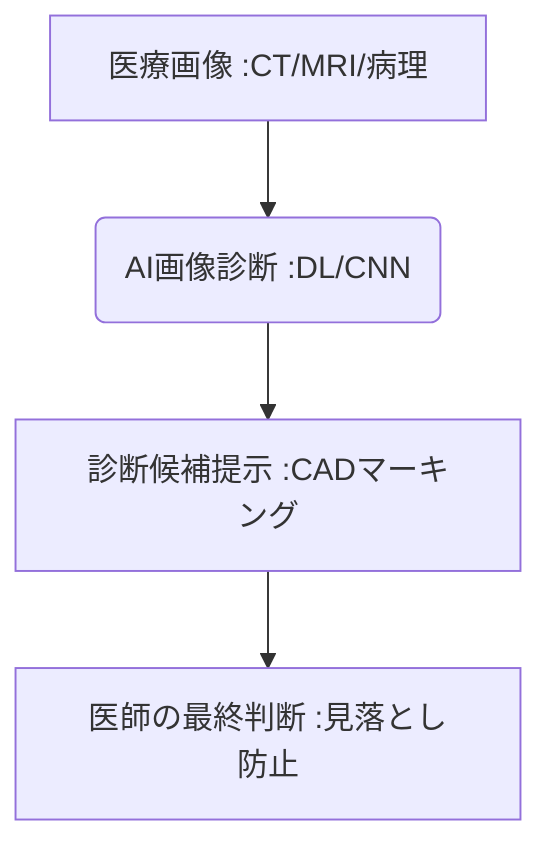

# T10-01-01 医療画像診断AI・コンピュータ支援診断(CAD)

## Summary（5つの要点）

1. **高精度検出**: **X線、CT、MRI、病理画像**を**ディープラーニング（CNN）**で解析し、**がん、肺炎、脳卒中**などの疾患を高精度で検出。
2. **医師の支援**: **コンピュータ支援診断（CAD）**として機能し、**放射線科医の読影を支援**することで、診断精度の向上と**見落としの防止**を実現。
3. **グローバルプレイヤー**: **Google Health（米国）**や、国内では**富士フイルム、エルピクセル**などが、特定疾患向けのAI開発を推進。
4. **効率化と均てん化**: 診断作業の**効率化**を図り、医師の経験や地域に依存しない**高品質な医療の提供（均てん化）**に貢献。
5. **課題**: AIの**医療機器としての承認**プロセス、AIが診断根拠を説明できない**ブラックボックス問題**の解決。

#### 概念図

---

### 技術評価表（定量的な視点）
| 評価項目 | 評価 | 根拠 |
| :--- | :--- | :--- |
| 導入コスト | ⭐⭐⭐⭐☆ | **高額なAIソフトウェアとPACS統合が必要。クラウド利用で低コスト化の傾向** |
| 技術成熟度 | ⭐⭐⭐⭐⭐ | **特定疾患（網膜症、乳がん）のAI精度は医師と同等以上。実用化段階** |
| 日本の競争力 | ⭐⭐⭐⭐⭐ | **富士フイルム、キヤノンなどの医療機器メーカーが強い開発基盤を保有** |
| 市場性 | ⭐⭐⭐⭐⭐ | **労働人口減少下の医療現場で、効率化・高度化に不可欠な技術** |
| 品質保証の重要性 | ⭐⭐⭐⭐⭐ | **誤診は人命に関わるため、高い感度・特異度と継続的な検証が必須** |

---

## 日本の立ち位置・強み弱みのSummary

### 強み：日本企業や研究機関が持つ独自の技術、優位性などを箇条書きで記述。

* **医療機器技術**: **富士フイルム、キヤノンメディカルシステムズ**など、世界トップクラスの医療画像機器開発力。
* **医療データ品質**: **国内の質の高い医療データ、放射線科医によるアノテーションデータ**の豊富さ。
* **病理画像診断**: **病理医不足**解消に向けた、病理画像のAI解析技術開発での先行。

### 弱み：日本が抱える規制、標準化の遅れ、海外依存などを箇条書きで記述。

* **医療機器承認プロセス**: **AIソフトウェアの変更管理**に関する規制当局（PMDA）の指針整備が急務。
* **AI倫理・責任の所在**: **AIの判断ミス**が発生した場合の、医師とAI開発者の責任の線引きが不明確。
* **データのサイロ化**: **病院間の医療データ共有**が進んでおらず、AI学習に利用可能な大規模データの収集が困難。

---

## 技術ロードマップ（短期/中期/長期）

### 短期目標（～2027年）

* **特定疾患（例：結節性疾患、肺炎）**向けの**AI画像診断支援ソフトウェア**が、主要な医療機関で導入。
* **AIが検出した病変**の**根拠（ヒートマップなど）**を医師に提示する**説明可能性（Explainable AI: XAI）**機能の標準化。
* **AIの学習データ**と**実臨床データ**の**バイアス**を検出・是正する手法の確立。

### 中期目標（2028年～2031年）

* **複数のモダリティ（CT/MRI/X線）**を統合的に解析し、**疾患の横断的な診断**を行う**統合AI診断プラットフォーム**が普及。
* **病理診断AI**が実用化され、診断時間を大幅に短縮し、**診断品質の地域差を解消**。
* **AIの継続的な学習と更新**を前提とした、**SaMD（Software as a Medical Device）**の法規制フレームワークが確立。

### 長期目標（2032年～2035年）

* **AIが医師の関与なし**に、特定のスクリーニング検査を**完全に自動診断**し、異常時のみ医師に連携するシステムが普及。
* **VR/AR技術**と連携し、AIが解析した**3D病変データ**を医師が**ホログラム**として見ながら手術を計画（T8-01関連）。

### 📚 参照リンク

1. [Google Health: AI in Healthcare](https://health.google/projects/ai-in-healthcare/)
2. [富士フイルム: AI技術による医療画像診断支援](https://www.fujifilm.com/jp/ja/healthcare/ai-technology)
3. [エルピクセル: EIzlを用いた医療AI開発](https://lpixel.net/)
