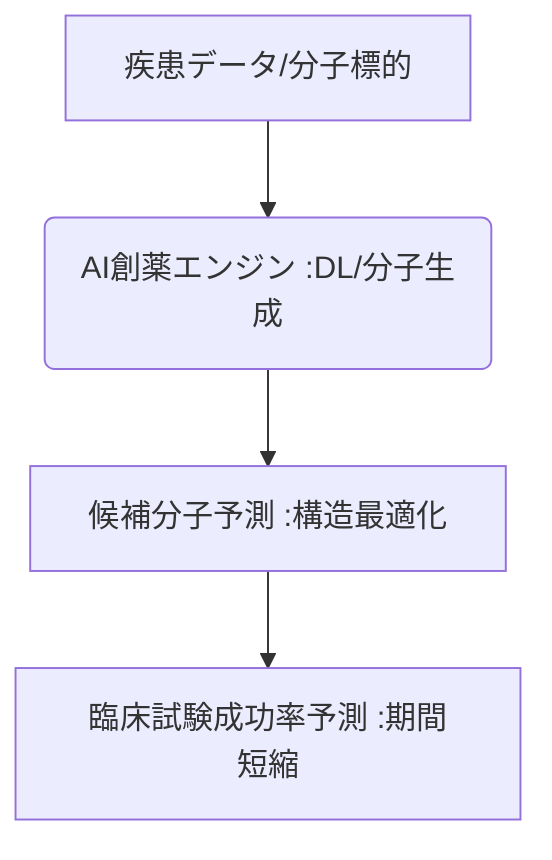

# T10-01-02 AI創薬・ドラッグディスカバリー

## Summary（5つの要点）

1. **高速スクリーニング**: **AI**が**数億種類**の膨大な化合物ライブラリから、特定の標的分子に作用する**創薬候補を高速で予測・スクリーニング**。
2. **分子設計の最適化**: **深層生成モデル**を活用し、**ターゲットへの親和性が高く、副作用が少ない**新たな分子構造を自動で設計・最適化。
3. **開発期間の短縮**: AIによる**前臨床試験、臨床試験の成功率予測**により、新薬開発にかかる期間を従来の**10年超から5～7年**に短縮し、コストを削減。
4. **主要プレイヤー**: **Insilico Medicine、Exscientia（海外）**、国内では**Preferred Networks**などが、AI創薬プラットフォームを開発。
5. **応用分野**: 特に**難病、希少疾患**に対する、**従来のスクリーニング手法では見つけられなかった**新たな治療薬候補の発見。

#### 概念図

---

### 技術評価表（定量的な視点）
| 評価項目 | 評価 | 根拠 |
| :--- | :--- | :--- |
| 導入コスト | ⭐⭐⭐☆☆ | **AIプラットフォーム開発コストは高いが、実験コストを大幅に削減** |
| 技術成熟度 | ⭐⭐⭐☆☆ | **基礎研究は進展。AI主導で発見された新薬候補が臨床試験入りしている段階** |
| 日本の競争力 | ⭐⭐⭐⭐☆ | **Preferred Networksなど、AI技術では世界的優位性。製薬企業の連携が課題** |
| 市場性 | ⭐⭐⭐⭐⭐ | **新薬開発の成功率向上、コスト削減の要求から、市場は急成長中** |
| 品質保証の重要性 | ⭐⭐⭐⭐⭐ | **AIが生成した分子の毒性、薬効の予測精度の検証が必須** |
---

## 日本の立ち位置・強み弱みのSummary

### 強み：日本企業や研究機関が持つ独自の技術、優位性などを箇条書きで記述。

* **AI・計算科学技術**: **Preferred Networks**など、ディープラーニングや大規模計算を創薬に応用する技術。
* **化学・創薬基盤**: **武田薬品工業、アステラス製薬**など、既存の強力な創薬研究ノウハウと化合物ライブラリ。
* **スーパーコンピュータ**: **富岳**などの世界トップクラスの計算リソースを活用したシミュレーション能力。

### 弱み：日本が抱える規制、標準化の遅れ、海外依存などを箇条書きで記述。

* **データの連携不足**: **アカデミアと製薬企業間**の**非公開研究データ**の連携・共有が不十分。
* **創薬データの標準化の遅れ**: **実験データ、化合物情報**のフォーマット標準化が遅れ、AI学習用データの整備に時間を要する。
* **倫理的課題**: **AIが設計した分子**の知的財産権（特許）の帰属や、安全性担保に関する議論の遅れ。

---

## 技術ロードマップ（短期/中期/長期）

### 短期目標（～2027年）

* **AIによるリード化合物探索**のフェーズにおいて、**探索期間を50%以上短縮**する実証が標準化。
* **臨床試験の設計、被験者選択**にAIが活用され、**試験の成功確率予測**の精度が向上。
* **分子構造予測**に関する**大規模なオープンデータセット**が国際的に整備され、AI学習が加速。

### 中期目標（2028年～2031年）

* **AIが設計し、合成プロセスもAIが提案**した**新規分子構造**が、**治験（フェーズI/II）**に突入し、医薬品として承認される事例が続出。
* **患者のゲノム情報（T10-01-03）**と連携し、**個人に最適化された治療薬**をAIが設計する個別化創薬が実用化。
* **デジタルツイン（T15-06）**を用いて、**ヒトの臓器**の薬物反応を**in silico（コンピュータ内）**で再現。

### 長期目標（2032年～2035年）

* **完全自律型AI創薬システム**が稼働し、**標的分子の特定から新薬承認申請まで**を一貫してAIがリード。
* **AI創薬**が、**パンデミックや新興感染症**に対する**超高速ワクチン・治療薬開発**の標準プロセスとなる。

### 📚 参照リンク

1. [Insilico Medicine: AI-driven Drug Discovery](https://www.insilico.com/)
2. [Exscientia: AI創薬のパイオニア](https://www.exscientia.ai/)
3. [Preferred Networks: AI創薬への取り組み](https://www.preferred.jp/ja/news/pr20210217/)
