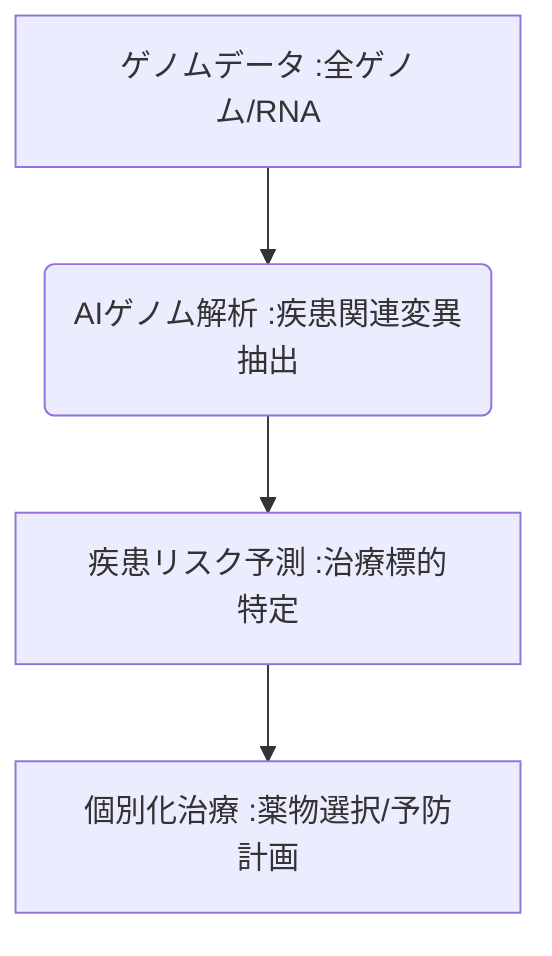

# T10-01-03 AIゲノム解析・個別化医療

## Summary（5つの要点）

1. **大規模データ解析**: **次世代シーケンサー**で得られた**全ゲノムシークエンスデータ**を、**AI（機械学習）**を用いて高速かつ高精度に解析。
2. **治療最適化**: **がん**治療において、個人の**遺伝子変異**に応じて最適な**分子標的薬**を選択し、治療効果を最大化。
3. **リスク予測**: 遺伝子情報から**生活習慣病、難病**などの**将来的な疾患リスクを予測**し、早期の予防的介入を可能にする。
4. **主要プレイヤー**: **Foundation Medicine（米国）**や**理化学研究所（日本）**などが、がんゲノム医療の解析基盤を開発。
5. **倫理的課題**: **ゲノムデータ**という極めて機密性の高い情報の**プライバシー保護、データ倫理**に関する議論と法規制（T5-05-05関連）が不可欠。

#### 概念図

---

### 技術評価表（定量的な視点）
| 評価項目 | 評価 | 根拠 |
| :--- | :--- | :--- |
| 導入コスト | ⭐⭐⭐☆☆ | **シーケンサーの低価格化が進行。解析AIとデータベースの構築は高額** |
| 技術成熟度 | ⭐⭐⭐⭐☆ | **がんゲノム医療は実用段階。難病、生活習慣病のリスク予測が進化中** |
| 日本の競争力 | ⭐⭐⭐⭐☆ | **理化学研究所の基盤研究、日本の大規模バイオバンクデータが強み** |
| 市場性 | ⭐⭐⭐⭐⭐ | **個別化医療は医療の未来。全人類のゲノム情報が対象** |
| 品質保証の重要性 | ⭐⭐⭐⭐⭐ | **遺伝子変異の読み取りミス、AIの誤解析は深刻な誤診に直結** |
---

## 日本の立ち位置・強み弱みのSummary

### 強み：日本企業や研究機関が持つ独自の技術、優位性などを箇条書きで記述。

* **国家レベルのバイオバンク**: **東北メディカル・メガバンク機構**などの大規模なコホート研究データ、疾患レポジトリ。
* **理化学研究所の基礎研究**: **ゲノム解析、疾患モデル、AI解析**に関する世界的トップレベルの研究実績。
* **がんゲノム医療の推進**: **がんゲノム医療中核拠点病院**を中心とした、臨床現場での解析・診断の仕組み整備。

### 弱み：日本が抱える規制、標準化の遅れ、海外依存などを箇条書きで記述。

* **ゲノムデータの利活用規制**: **個人情報保護法、生命倫理**の観点から、研究目的でのゲノムデータ共有・利用に制約が多い。
* **解析プラットフォームの海外依存**: **シーケンサー（Illuminaなど）**、**AI解析ソフトウェア**の一部で海外製品への依存度が高い。
* **結果説明の難しさ**: **AIによるリスク予測の結果**を、医師が患者に適切に説明し、不安を取り除くための体制不足。

---

## 技術ロードマップ（短期/中期/長期）

### 短期目標（～2027年）

* **がんゲノム医療**における**AIを活用した診断レポート作成**が標準化され、専門医の負担を軽減。
* **AIによる疾患関連遺伝子の絞り込み**が、創薬の**ターゲット探索（T10-01-02）**に日常的に活用。
* **ゲノムデータのプライバシー保護**に関する**ブロックチェーン（T5-05-05）**の活用研究が本格化。

### 中期目標（2028年～2031年）

* **AIゲノム解析**が、**生活習慣病、認知症**などの**多因子疾患**の**超早期リスク予測**に実用化され、予防医療プログラムが普及。
* **治療効果**を**AIがリアルタイム**で予測し、**遺伝子治療、再生医療**における**治療計画を動的に変更**。
* **消費者向け遺伝子検査**の結果を、医療機関が**保険診療**でフォローアップできる体制を構築。

### 長期目標（2032年～2035年）

* **出生時**に**全ゲノム解析**と**AIによる生涯リスク予測**が実施され、**個別化予防医療**が社会の標準となる。
* **遺伝子情報に基づいたAI**が、**食生活（T17-01-02）、運動、睡眠**に関する**超個別化されたアドバイス**を継続的に提供。

### 📚 参照リンク

1. [Foundation Medicine Japan: がんゲノムプロファイリング](https://www.foundationmedicine.jp/)
2. [理化学研究所 ゲノム医科学研究センター](https://www.riken.jp/)
3. [東北メディカル・メガバンク機構 (ToMMo)](https://www.megabank.tohoku.ac.jp/)
