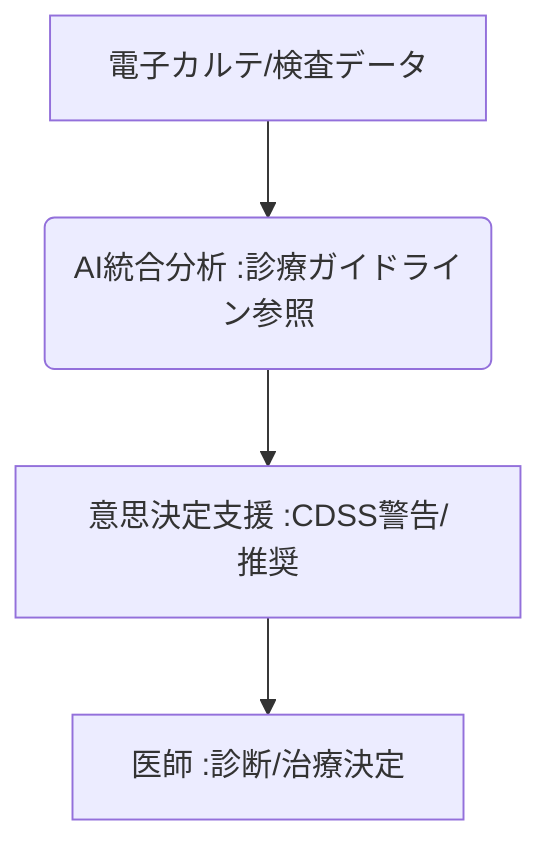

# T10-01-04 AI診療支援システム・臨床意思決定支援(CDSS)

## Summary（5つの要点）

1. **データ統合分析**: **電子カルテ、検査結果、画像、診療ガイドライン**など、患者の全医療データを**AI**で統合的に分析。
2. **意思決定の支援**: 医師に対して**診断候補、治療推奨、薬剤の相互作用・副作用警告**などをリアルタイムで提示する**臨床意思決定支援（CDSS）**。
3. **医療の質向上**: **医師の知識や経験の差**を埋め、**医療の質と安全性**を向上させるとともに、**診断の見落とし**リスクを低減。
4. **主要プレイヤー**: かつては**IBM Watson Health**が有名だったが、現在は**Merativ（継続）、日本ではメドピア、アルム**などが開発をリード。
5. **課題**: AIの**責任の所在**、AIの提示する情報に対する**医師の過信**を防ぐためのインターフェース設計。

#### 概念図

---

### 技術評価表（定量的な視点）
| 評価項目 | 評価 | 根拠 |
| :--- | :--- | :--- |
| 導入コスト | ⭐⭐⭐☆☆ | **既存の電子カルテシステムとの連携、AI学習データの整備にコスト** |
| 技術成熟度 | ⭐⭐⭐☆☆ | **薬剤警告などの単純機能は成熟。複雑な多疾患患者への推奨は途上** |
| 日本の競争力 | ⭐⭐⭐⭐☆ | **医療従事者間のコミュニケーション支援、地域医療連携システムで強み** |
| 市場性 | ⭐⭐⭐⭐⭐ | **医療安全、医師の働き方改革、高齢化社会で必須のシステム** |
| 品質保証の重要性 | ⭐⭐⭐⭐⭐ | **誤った治療推奨は患者予後を悪化させるため、AIの妥当性検証が必須** |
---

## 日本の立ち位置・強み弱みのSummary

### 強み：日本企業や研究機関が持つ独自の技術、優位性などを箇条書きで記述。

* **医療データ連携**: **DPC（診断群分類）データ、レセプトデータ**など、診療報酬に関わる標準化された医療データの蓄積。
* **専門医ネットワーク**: **メドピア**など、医師間の専門知識共有プラットフォームを基盤としたCDSS開発。
* **地域医療連携**: **アルム**の**Join**など、医療機関の垣根を超えた情報共有・意思決定支援システムの実績。

### 弱み：日本が抱える規制、標準化の遅れ、海外依存などを箇条書きで記述。

* **電子カルテの非標準化**: **各病院**で異なる電子カルテシステム（ベンダーロックイン）が、**AIの汎用的な導入**を妨げている。
* **日本語の壁**: **日本語特有の曖昧な表現**（T10-01-05関連）が、AIが電子カルテ情報を正確に理解する際の障壁。
* **医師の抵抗感**: **「AIに頼りすぎる」**ことへの抵抗感や、AIの推奨が診療ガイドラインと異なる場合の**責任の所在**への懸念。

---

## 技術ロードマップ（短期/中期/長期）

### 短期目標（～2027年）

* **薬剤の相互作用警告、投与量のエラーチェック**など、**医療安全**に関わるCDSS機能が全医療機関で標準搭載。
* **診療ガイドライン**が**AIが読み取りやすい形式（機械可読性）**で作成される仕組みを確立。
* **電子カルテシステム**間のデータ連携APIが標準化され、CDSSの**病院間の移植性**が向上。

### 中期目標（2028年～2031年）

* **AI**が、患者の全データを基に**診断候補を上位5つ**まで提示し、医師の診断プロセスを短縮。
* **個別化医療（T10-01-03）**と連携し、**ゲノム情報や生活習慣**に基づいた**超個別化された治療計画**をAIが提案。
* **CDSS**が、**地域医療連携**の中心となり、病院間での患者データの共有と診療の継続性を支援。

### 長期目標（2032年～2035年）

* **AI**が、**軽症患者の診療、慢性疾患の管理**を医師に代わって自動で行い、医師は難病・重症患者の治療に集中。
* **CDSS**が、医師や看護師の**認知負荷、疲労度**を**ウェアラブルデバイス（T5-08-05）**で計測し、エラー発生リスクを予測・警告。

### 📚 参照リンク

1. [メドピア: 集合知とAIによる医療課題解決](https://www.medpeer.co.jp/)
2. [アルム: 医療関係者間コミュニケーションアプリ「Join」](https://www.allm.net/join/)
3. [日本医療情報学会: 臨床意思決定支援システム](https://www.jami.jp/)
