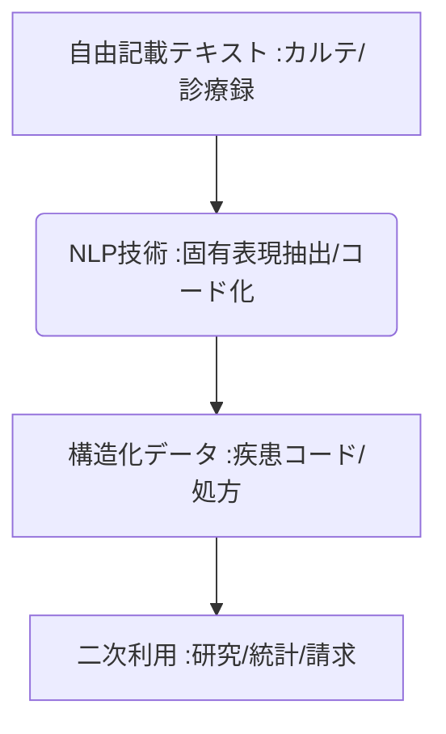

# T10-01-05 自然言語処理(NLP)・電子カルテ情報抽出

## Summary（5つの要点）

1. **非構造化データの活用**: 医師が記述した**電子カルテ、診療録、サマリー**などの**自由記載テキスト**をAIで解析。
2. **構造化への変換**: **自然言語処理（NLP）技術**により、テキストから**症状、診断名、処方、治療経過**などの情報を抽出し、**国際疾病分類（ICD）コード**などの構造化データに変換。
3. **二次利用の効率化**: 抽出された構造化データは、**臨床研究、医療統計、保険請求、病院経営分析**などの**二次利用**を劇的に効率化。
4. **日本の研究事例**: **MedicalNLP研究会、東京大学病院**などが、**日本語の医療用語**に特化したNLPモデルを研究・開発。
5. **課題**: **日本語**特有の**医療スラング、略語、表記揺れ**、そして**医師ごとの記載スタイルの非統一性**への対応。

#### 概念図

---

### 技術評価表（定量的な視点）
| 評価項目 | 評価 | 根拠 |
| :--- | :--- | :--- |
| 導入コスト | ⭐⭐⭐☆☆ | **日本語特化AIモデル開発は高額。クラウドAPI利用で低コスト化** |
| 技術成熟度 | ⭐⭐⭐☆☆ | **英語圏に比べ日本語は途上。特定ドメインの抽出精度は実用レベル** |
| 日本の競争力 | ⭐⭐⭐⭐☆ | **日本語NLP研究で先行。固有の医療知識をAIに学習させるノウハウ** |
| 市場性 | ⭐⭐⭐⭐⭐ | **ビッグデータ時代の医療研究、行政統計に不可欠な基盤技術** |
| 品質保証の重要性 | ⭐⭐⭐⭐⭐ | **抽出ミスの誤コード化は、保険請求、統計結果の信頼性を損なう** |
---

## 日本の立ち位置・強み弱みのSummary

### 強み：日本企業や研究機関が持つ独自の技術、優位性などを箇条書きで記述。

* **日本語医療NLP研究**: **日本語**の**医療文書、特有の文法構造**に対応するための**学術的知見**が豊富。
* **大規模学習データ**: **東大病院**などの大規模病院が保有する**膨大な自由記載カルテ**を学習データとして活用。
* **AI画像診断との連携**: **T10-01-01**と連携し、画像所見のテキスト記載を構造化し、AI診断の精度検証に利用。

### 弱み：日本が抱える規制、標準化の遅れ、海外依存などを箇条書きで記述。

* **医療用語の非標準化**: **多岐にわたる専門用語、略語、俗語**が混在し、AIの認識精度向上の障壁。
* **プライバシー規制**: **患者個人情報**が含まれる**自由記載テキスト**の外部利用に関する厳しい規制。
* **データ提供のインセンティブ不足**: 病院が保有する**重要な非構造化データ**を、研究目的で外部に提供する**仕組みとインセンティブ**が不足。

---

## 技術ロードマップ（短期/中期/長期）

### 短期目標（～2027年）

* **退院サマリー、病理レポート**など、比較的**構造化しやすい文書**における**特定項目（疾患名、術式）**の自動コード化が実用化。
* **医師の音声入力**を**リアルタイム**でテキスト化し、**NLPが構造化**を同時に行うシステムのプロトタイプ開発。
* **日本語医療NLPの学習済みモデル**が、オープンソースとして公開され、研究・開発が加速。

### 中期目標（2028年～2031年）

* **電子カルテシステム**に**NLP機能が標準搭載**され、医師の記載作業を支援（予測入力、自動補完）。
* **臨床試験の被験者適格性判断**において、**カルテの自由記載テキスト**から**除外基準**を自動抽出・判定するAIシステムを導入。
* **医療統計、疫学研究**において、**NLPで構造化**された大規模なカルテデータセットが活用され、新たな知見を発見。

### 長期目標（2032年～2035年）

* **患者からの問診**を**AIが自然言語**で受け付け、**カルテを自動生成**し、**CDSS（T10-01-04）**にシームレスに連携。
* **非構造化テキスト**が**完全に自動構造化**され、医療情報の二次利用における**コストと手間がゼロ**になる。

### 📚 参照リンク

1. [東京大学: 医療NLPの研究開発事例](https://www.k.u-tokyo.ac.jp/info/entry/35227/)
2. [MedicalNLP研究会](https://www.mednlp.org/)
3. [日本医療情報学会](https://www.jami.jp/)
