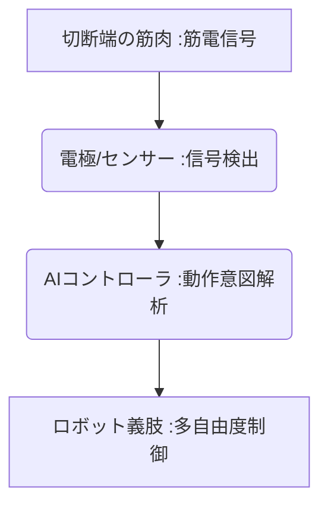

# T10-02-01 ロボット義肢・筋電義手

## Summary（5つの要点）

1. **意思による制御**: **切断端に残る筋肉の電気信号（筋電）**を電極で検出し、AIで解析することで、ユーザーの**意思に応じた義肢の動作**を実現。
2. **多機能性**: 複数のモーターを搭載し、**指を独立して制御**できるため、コップを持つ、キーボードを打つなど、**複雑な動作を再現**可能。
3. **主要プレイヤー**: 国内では**川村義肢、ダブル技研**が開発・提供。海外では**Össur（オズール）、Ottobock**などが市場をリード。
4. **触覚フィードバック**: 義肢の先端にセンサーを搭載し、**つかんだ物の硬さや触感をユーザーに伝える**フィードバック技術が進化中。
5. **課題**: 高精度なものは**高額**であり、また、装着者の**訓練期間、身体への適合性**の確保が重要。

#### 概念図

---

### 技術評価表（定量的な視点）
| 評価項目 | 評価 | 根拠 |
| :--- | :--- | :--- |
| 導入コスト | ⭐⭐☆☆☆ | **高機能なものは数百万～千万円超。保険適用範囲の拡大が課題** |
| 技術成熟度 | ⭐⭐⭐⭐☆ | **基本的な制御は成熟。触覚フィードバック、BCI連携が進化中** |
| 日本の競争力 | ⭐⭐⭐⭐☆ | **精密機械加工、モーター制御技術、義肢装具士の技術力で強み** |
| 市場性 | ⭐⭐⭐⭐☆ | **高齢化に伴う切断患者増加、身体機能拡張ニーズで成長見込み** |
| 品質保証の重要性 | ⭐⭐⭐⭐⭐ | **日常使用の耐久性、誤動作による安全性リスク管理が必須** |

---

## 日本の立ち位置・強み弱みのSummary

### 強み：日本企業や研究機関が持つ独自の技術、優位性などを箇条書きで記述。

* **精密モーター・駆動系技術**: **小型・高出力**なモーター、ギアボックスの設計製造技術。
* **義肢装具士の技能**: **個々人の身体特性**に合わせたフィッティング、調整を行う**専門職の質の高さ**。
* **触覚・ハプティクス研究**: 慶應大学等、**ロボットハンドによる触覚の再現**技術で世界的に先行。

### 弱み：日本が抱える規制、標準化の遅れ、海外依存などを箇条書きで記述。

* **高機能義肢の保険適用**: **日常生活動作のレベル**に応じた**公的補助の適用範囲**が限定的。
* **BCI（T10-02-02）連携の遅れ**: **脳波・神経信号**を直接制御に用いる**最先端技術**の開発で米国・欧州に後れ。
* **データ標準化**: 筋電データ、ユーザーの動作パターンデータの**収集・共有の標準化**が不十分。

---

## 技術ロードマップ（短期/中期/長期）

### 短期目標（～2027年）

* **筋電義手**の**バッテリー持続時間、軽量化**が進み、日常的な装着性が向上。
* **AI**がユーザーの**意図をより速く、正確に予測**し、誤動作率が大幅に低下。
* **装着訓練用VRシミュレータ**が普及し、リハビリテーションの効率が向上。

### 中期目標（2028年～2031年）

* **触覚フィードバック機能**が標準搭載され、**握力の調整、物の質感の認知**が可能に。
* **非侵襲型BMI（T10-02-02）**と連携し、より**自然な動作意図**の読み取りと制御を実現。
* **3Dプリンティング**による**ソケット（装着部）**の**超精密・個別化製造**が主流に。

### 長期目標（2032年～2035年）

* **完全神経制御義肢**が実用化され、**健常な手足とほぼ遜色ない**動作と感覚を実現。
* **ロボット義肢**が**日常の道具**として普及し、**身体機能の拡張（健常者への応用）**としての側面も持つ。

### 📚 参照リンク

1. [川村義肢株式会社](https://www.kawamura-gishi.co.jp/)
2. [サイバニクス研究センター（筑波大学・山海研究室）](https://www.cybernics.tsukuba.ac.jp/)
3. [日本義肢装具学会](https://www.jspo.jp/)
