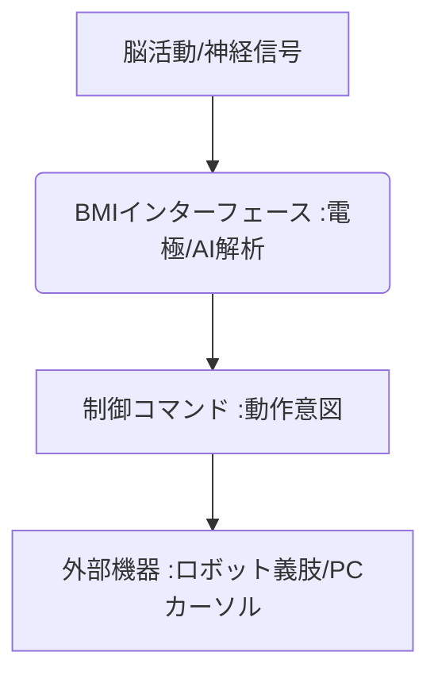

# T10-02-02 BMI(ブレイン・マシン・インタフェース)・神経制御義肢

## Summary（5つの要点）

1. **脳直結の制御**: **脳波（EEG）や埋め込み電極**を用いて**脳や末梢神経の信号を直接読み取り**、外部のデバイス（義肢、PC、ロボットアーム）を操作。
2. **完全麻痺患者の支援**: **ALS（筋萎縮性側索硬化症）**など、**完全麻痺**によりコミュニケーションや動作が困難な患者の**生活支援**に革命をもたらす。
3. **侵襲型と非侵襲型**: **Neuralink（米国）**のように脳に電極を埋め込む**侵襲型**と、ヘッドセットで脳波を計測する**非侵襲型**（T5-08-05関連）がある。
4. **神経制御義肢**: 読み取った**運動意図**を基に、**義肢（T10-02-01）**や**パワードスーツ（T10-02-03）**を**直感的**に動かす。
5. **課題**: 侵襲型は**安全性、長期安定性、倫理的側面**が課題。非侵襲型は**信号の空間・時間分解能**の向上が求められる。

#### 概念図

---

### 技術評価表（定量的な視点）
| 評価項目 | 評価 | 根拠 |
| :--- | :--- | :--- |
| 導入コスト | ⭐⭐☆☆☆ | **侵襲型は極めて高額。非侵襲型は低価格化が進行中** |
| 技術成熟度 | ⭐⭐⭐☆☆ | **非侵襲型は研究段階。侵襲型は臨床試験が進行中** |
| 日本の競争力 | ⭐⭐⭐⭐☆ | **理化学研究所、大阪大学などの基礎研究、非侵襲型デバイス開発で強み** |
| 市場性 | ⭐⭐⭐⭐⭐ | **医療・介護分野、将来のヒューマンインターフェースの基盤技術** |
| 品質保証の重要性 | ⭐⭐⭐⭐⭐ | **脳に直結するため、データの信頼性、システムの安全性・安定性が最重要** |

---

## 日本の立ち位置・強み弱みのSummary

### 強み：日本企業や研究機関が持つ独自の技術、優位性などを箇条書きで記述。

* **非侵襲型BMI研究**: **頭皮上からの脳波計測**における**高精度な信号処理、ノイズ除去**技術。
* **理化学研究所の基礎研究**: **「意図」を読み取るための脳情報解析**の分野で国際的に高い実績。
* **医療機器産業との連携**: **生体信号処理**における医療機器メーカー（オムロン等）の技術。

### 弱み：日本が抱える規制、標準化の遅れ、海外依存などを箇条書きで記述。

* **侵襲型デバイスの規制**: **脳への埋め込み**に関する**医療機器としての承認**と**倫理的審査**が厳格。
* **大規模な臨床試験データ**: **Neuralink**など、海外スタートアップが先行する**大規模なヒト臨床データ**の不足。
* **倫理的・社会的受容**: **「思考の読み取り」**や**脳のハッキング**に対する**社会的な不安や抵抗感**。

---

## 技術ロードマップ（短期/中期/長期）

### 短期目標（～2027年）

* **非侵襲型BMI**が、**PCのカーソル操作、簡単なテキスト入力**の精度を向上させ、ALS患者の一部で実用化。
* **VR/ARデバイス**と非侵襲型BMIが連携し、**集中力（T5-08-05）**に基づくコンテンツ制御を実証。
* **末梢神経信号**を用いた**筋電義肢（T10-02-01）**の**直感的制御**が実現。

### 中期目標（2028年～2031年）

* **侵襲型BMI**が、**完全麻痺患者**の**コミュニケーション、電動車椅子操作**の手段として臨床応用を拡大。
* **脳信号**の読み取りと同時に**電気刺激**を送り、**触覚や動作感覚を脳にフィードバック**する双方向BCIが実現。
* **AI**が、**複雑な思考パターン**を学習し、**複数の動作**を一連のコマンドとして実行。

### 長期目標（2032年～2035年）

* **BMI**が、**キーボードやマウスに代わる**、**思考による主要なヒューマンインターフェース**として普及。
* **脳信号の相互通信**が可能となり、**感情や知識**をデジタルで共有する**「ブレイン・ネットワーキング」**が実現。

### 📚 参照リンク

1. [理化学研究所 脳神経科学研究センター](https://www.riken.jp/research/labs/bsi/)
2. [Neuralink (イーロン・マスクCEO)](https://www.neuralink.com/)
3. [日本神経科学学会](https://www.jnss.org/)
