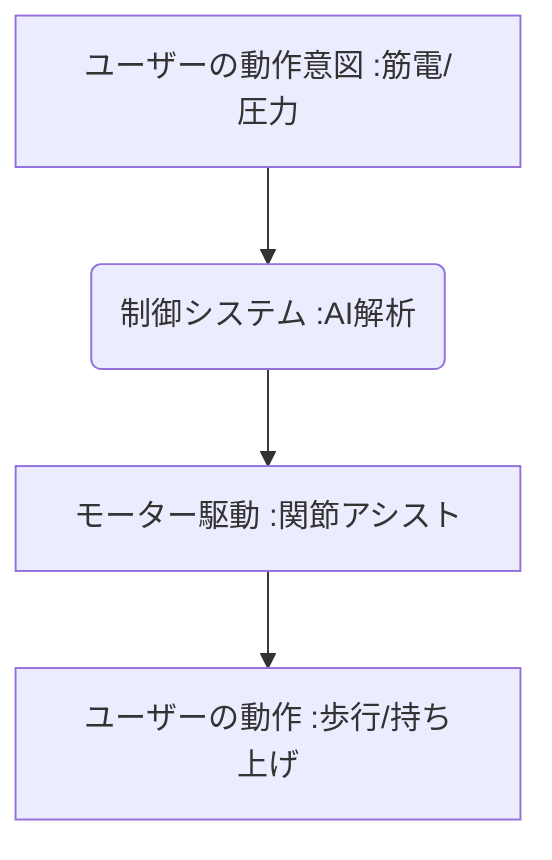

# T10-02-03 パワードスーツ・リハビリ支援ロボット

## Summary（5つの要点）

1. **動作アシスト**: **電動モーターやアクチュエータ**が、装着者の**関節動作をアシスト**し、**重い物の持ち上げ、立ち上がり、歩行**などの動作を支援。
2. **筋電・意思連動制御**: **筋電信号（T10-02-01）**を検出するか、**動作意図**をAIで解析することで、**違和感なく装着者の動きに追従**する制御を実現。
3. **応用分野**: **歩行困難者**の自立歩行支援、**リハビリテーション**の負荷調整、**介護現場**での移乗介助や腰痛予防に活用。
4. **主要プレイヤー**: 国内では**CYBERDYNE（HAL）、パナソニック**、海外では**Ekso Bionics、Rewalk**などが実用化。
5. **課題**: **機体の軽量化、長時間駆動のためのバッテリー性能向上**、そして**医療・介護機器としての導入コスト**の低減。

#### 概念図

---

### 技術評価表（定量的な視点）
| 評価項目 | 評価 | 根拠 |
| :--- | :--- | :--- |
| 導入コスト | ⭐⭐☆☆☆ | **医療・介護用途の機体は高額。一般作業用は低コスト化が進む** |
| 技術成熟度 | ⭐⭐⭐⭐☆ | **リハビリ・介護支援での実用例が多数。軽量化、小型化が進化中** |
| 日本の競争力 | ⭐⭐⭐⭐⭐ | **CYBERDYNE（HAL）が世界的に先行。高齢者介護分野での需要が大きい** |
| 市場性 | ⭐⭐⭐⭐⭐ | **高齢化社会、人手不足の製造・物流・介護現場で必須の技術** |
| 品質保証の重要性 | ⭐⭐⭐⭐⭐ | **誤作動、機体破損は転倒・怪我に直結するため、信頼性、安全性が最重要** |
---

## 日本の立ち位置・強み弱みのSummary

### 強み：日本企業や研究機関が持つ独自の技術、優位性などを箇条書きで記述。

* **サイバニクス技術**: **CYBERDYNEのHAL**に代表される、**生体信号（筋電）**を解析して動作を制御する技術。
* **医療・介護連携**: **リハビリテーション病院、介護施設**との連携による**臨床データの蓄積**と製品改善。
* **精密ロボット制御**: **ホンダのASIMO、ソニーのaibo**などで培われた**ヒューマノイドロボット**の高度な制御技術。

### 弱み：日本が抱える規制、標準化の遅れ、海外依存などを箇条書きで記述。

* **医療機器承認の複雑性**: **リハビリ用途**での**効果のエビデンス**確立と**医療機器としての承認**に時間を要する。
* **現場導入のコスト負担**: 介護保険制度における**レンタル・購入補助**の対象拡大が進んでいない。
* **バッテリー技術**: **長時間・高出力駆動**に必要な**高性能バッテリー（T13-03-01）**の小型化・軽量化競争で、海外に後れを取る可能性。

---

## 技術ロードマップ（短期/中期/長期）

### 短期目標（～2027年）

* **介護現場**での**移乗・持ち上げ作業**を支援する**軽量型アシストスーツ**が普及し、腰痛リスクを低減。
* **リハビリロボット**が、**動作の定量評価、AIによる個別メニュー自動作成**機能で、セラピストの作業を支援。
* **機体の駆動時間**が、**8時間以上**のフルタイム作業に耐えうるレベルに向上。

### 中期目標（2028年～2031年）

* **パワードスーツ**が、**歩行困難者**の**階段昇降、屋外歩行**を完全に支援し、日常生活の自由度を大幅に向上。
* **BMI（T10-02-02）**と連携し、**思考や意図**による**より直感的でシームレスな制御**が実現。
* **リハビリテーションデータ**をAIで解析し、**回復の進捗と目標達成時期**を科学的に予測。

### 長期目標（2032年～2035年）

* **健常者**が**身体能力を拡張**するための**汎用型パワードスーツ**が普及し、物流、建設、災害救助で活用。
* **パワードスーツ**が**恒久的な身体の一部**として機能し、**遠隔操作（テレイグジスタンス）**による作業代行が可能に。

### 📚 参照リンク

1. [CYBERDYNE株式会社（HAL）](https://www.cyberdyne.jp/)
2. [Ekso Bionics（米国）](https://eksobionics.com/)
3. [日本ロボット学会](https://www.rsj.or.jp/)
