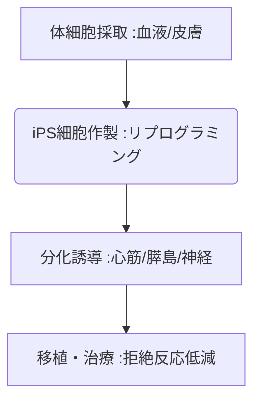

# T10-02-04 人工臓器・再生医療(iPS細胞由来臓器)

## Summary（5つの要点）

1. **iPS細胞の活用**: **人工多能性幹細胞（iPS細胞）**を分化誘導し、**心臓、腎臓、肝臓、膵臓**などの機能を持つ**細胞、組織、臓器**を作製。
2. **拒絶反応の低減**: iPS細胞を基にした**備蓄細胞（ストック）**を活用することで、**HLA型**を合わせ、**移植後の拒絶反応リスクを大幅に低減**。
3. **ドナー不足の解消**: **臓器移植**における世界的な**ドナー不足**という根本的な課題を解消する可能性を秘める。
4. **臓器チップ**: 治療目的の移植だけでなく、iPS細胞由来の**ミニ臓器（オルガノイド）**を**創薬（T10-01-02）**の**薬効・毒性試験**に応用（**オーガンオンチップ**）。
5. **主要プレイヤー**: **京都大学iPS細胞研究所（CiRA）**が中心となり、**網膜、心筋、膵島**などの臨床応用研究を世界的にリード。

#### 概念図

---

### 技術評価表（定量的な視点）
| 評価項目 | 評価 | 根拠 |
| :--- | :--- | :--- |
| 導入コスト | ⭐⭐☆☆☆ | **細胞培養、品質管理に高度な設備が必要。大量生産技術の確立が課題** |
| 技術成熟度 | ⭐⭐⭐☆☆ | **網膜、心筋細胞は臨床研究段階。複雑な臓器の完全な機能再現は途上** |
| 日本の競争力 | ⭐⭐⭐⭐⭐ | **山中伸弥教授の発見以来、iPS細胞研究で世界的な優位性を維持** |
| 市場性 | ⭐⭐⭐⭐⭐ | **臓器移植、難治性疾患の根本治療として、極めて大きな市場ポテンシャル** |
| 品質保証の重要性 | ⭐⭐⭐⭐⭐ | **細胞の安全な分化、腫瘍化リスク（発がん性）の厳格な排除が必須** |
---

## 日本の立ち位置・強み弱みのSummary

### 強み：日本企業や研究機関が持つ独自の技術、優位性などを箇条書きで記述。

* **iPS細胞技術**: **ノーベル賞**に繋がったiPS細胞の**作製、培養、分化誘導**の基礎技術。
* **iPS細胞ストック事業**: **京都大学CiRA**を中心とした、**拒絶反応の少ないiPS細胞**の**公的備蓄**システム。
* **再生医療製品の規制**: **条件・期限付き承認制度**など、**再生医療実用化を促進**するための**柔軟な規制**。

### 弱み：日本が抱える規制、標準化の遅れ、海外依存などを箇条書きで記述。

* **大規模生産技術の不足**: **細胞の高品質な自動大量培養**、**品質管理の自動化**技術で欧米に後れ。
* **複雑臓器の設計**: **腎臓、肝臓**などの**複雑な構造を持つ臓器**をiPS細胞から創り出す**組織工学技術**の難易度が高い。
* **医療経済性**: 高度な再生医療の**治療費が非常に高額**になり、**保険適用**をどうするかという課題。

---

## 技術ロードマップ（短期/中期/長期）

### 短期目標（～2027年）

* **iPS細胞由来の心筋シート、神経前駆細胞**などが、**治験（臨床試験）**の段階を拡大し、**安全性**を確立。
* **オルガノイド（ミニ臓器）**が、**創薬（T10-01-02）**における**薬効・毒性試験**の代替モデルとして広く活用。
* **遺伝子編集技術（T10-03-05関連）**を用いて、iPS細胞の**腫瘍化リスクを低減**する技術を開発。

### 中期目標（2028年～2031年）

* **心不全、パーキンソン病、脊髄損傷**など、**難治性疾患**に対するiPS細胞由来の**細胞移植治療**が、**保険診療**として一部実用化。
* **バイオ3Dプリンティング**により、iPS細胞を用いた**血管を持つ複雑な組織**の製造が可能に。
* **AI**が、iPS細胞の**分化誘導の最適条件**を自動探索し、**高品質な細胞の歩留まり**を向上。

### 長期目標（2032年～2035年）

* **iPS細胞**から作られた**完全な機能を持つ人工臓器（腎臓、肝臓など）**が、**臓器移植のドナー**として実用化。
* **生体内**で細胞の**再生を誘導**する**in vivoリプログラミング**技術が確立し、**体内で壊れた臓器を修復**。

### 📚 参照リンク

1. [京都大学iPS細胞研究所 (CiRA)](https://www.cira.kyoto-u.ac.jp/j/)
2. [日本再生医療学会](http://www.jsrm.jp/)
3. [ロシュ/中外製薬: オルガノイド活用](https://www.roche.com/)
