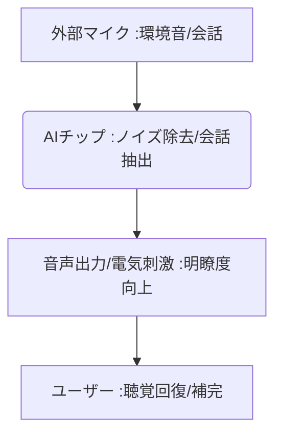

# T10-02-05 スマート補聴器・人工内耳

## Summary（5つの要点）

1. **AIノイズ除去・音声強調**: **スマート補聴器**は、AI（ディープラーニング）が周囲の**環境音（雑踏、風切り音）を解析**し、**会話の音声のみを強調・抽出**することで、明瞭度を向上。
2. **人工内耳**: **重度難聴者**に対し、**手術で蝸牛に電極を埋め込み**、聴神経を**電気刺激**することで、**聴覚を回復**させる医療機器。
3. **接続性・多機能化**: **Bluetooth**でスマートフォンと接続し、**ストリーミング音楽再生、ハンズフリー通話**、そして**遠隔での調整**が可能。
4. **ウェアラブル技術**: 補聴器自体が**ヘルスケアトラッカー**として機能し、**心拍数、歩数、転倒検知**などのデータを収集。
5. **主要プレイヤー**: **コクレア（人工内耳）、オーティコン、シーメンス（シグニア）**などが市場を牽引。AppleなどのIT企業も参入。

#### 概念図

---

### 技術評価表（定量的な視点）
| 評価項目 | 評価 | 根拠 |
| :--- | :--- | :--- |
| 導入コスト | ⭐⭐☆☆☆ | **人工内耳は高額な手術・機器費用。スマート補聴器も高性能なものは高額** |
| 技術成熟度 | ⭐⭐⭐⭐⭐ | **人工内耳は成熟。AIによる音響処理は急速に進化中** |
| 日本の競争力 | ⭐⭐⭐☆☆ | **基礎技術は高いが、グローバルな製品開発・市場シェアで海外大手優勢** |
| 市場性 | ⭐⭐⭐⭐⭐ | **高齢化に伴う難聴者増加、若年層のイヤホン利用習慣で需要拡大** |
| 品質保証の重要性 | ⭐⭐⭐⭐⭐ | **聴力は生活の質（QOL）に直結。AI処理の遅延、音質、電池寿命が重要** |
---

## 日本の立ち位置・強み弱みのSummary

### 強み：日本企業や研究機関が持つ独自の技術、優位性などを箇条書きで記述。

* **音響・マイク技術**: **ソニー、パナソニック**など、精密な**マイク、音声処理技術**の基盤。
* **医療機器産業の品質**: **人工内耳**の**長期的な信頼性、安全性**を保証する製造品質。
* **AI研究**: **日本語の音声認識、ノイズ処理**に特化したAIモデル開発の知見。

### 弱み：日本が抱える規制、標準化の遅れ、海外依存などを箇条書きで記述。

* **グローバルな市場シェア**: **コクレア、オーティコン**など、欧米大手企業が世界の市場シェアを支配。
* **補聴器の社会的受容**: **補聴器に対するネガティブなイメージ**が依然として強く、普及の妨げになっている。
* **AIモデルの学習データ**: **多様な音響環境、言語**に対応するための**大規模な学習データ**の確保が課題。

---

## 技術ロードマップ（短期/中期/長期）

### 短期目標（～2027年）

* **スマート補聴器**の**AIノイズ除去機能**が、**騒がしいレストラン、複数人の会話**で**健常者レベルの明瞭度**を実現。
* **補聴器**が**転倒検知、緊急通報**機能を標準搭載し、高齢者の**安全見守りデバイス**として機能。
* **遠隔での聴力測定、補聴器のフィッティング調整**サービスが普及。

### 中期目標（2028年～2031年）

* **人工内耳**が、**より少ない電極**で**より自然な音質**を再現し、**音楽鑑賞**も楽しめるレベルに向上。
* **AI**が、ユーザーの**脳活動（T10-02-02）**や**集中度（T5-08-05）**を解析し、**聞きたい音源**を自動で選択・強調。
* **OTC（店頭販売）補聴器**の品質が向上し、**低〜中度の難聴者**が**低コスト**で利用可能に。

### 長期目標（2032年～2035年）

* **人工聴覚デバイス**が、**外耳・中耳・内耳の機能を完全に代替**し、**先天性、重度の聴覚障害**が解消。
* **ブレイン・マシン・インタフェース（BCI）**と連携し、**思考による直接的な音量・音質制御**が実現。

### 📚 参照リンク

1. [コクレア・ジャパン株式会社（人工内耳）](https://www.cochlear.com/jp/home)
2. [オーティコン補聴器](https://www.oticon.co.jp/)
3. [日本聴覚医学会](https://www.audiology-japan.jp/)
