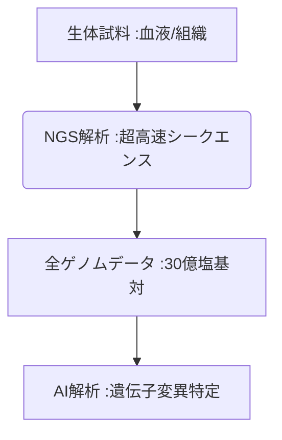

# T10-03-01 次世代シークエンサー(NGS)・全ゲノム解析

## Summary（5つの要点）

1. **超高速・低コスト化**: **NGS（Next-Generation Sequencer）**により、ヒトの**全ゲノム（約30億塩基対）**を**数日、数万円**という劇的な速度とコストで解析可能に。
2. **大規模データ解析**: 従来のサンガー法に比べ、**同時に大量のDNA断片**を読み取ることができ、**大量のゲノムデータ**を生成。
3. **個別化医療の基盤**: **がん**の遺伝子変異、**難病**の原因遺伝子、**薬剤応答性（T10-03-04）**などを特定し、**個別化医療（T10-01-03）**の基盤となる。
4. **主要プレイヤー**: **Illumina（米国）**が市場を支配。**PacBio、Oxford Nanopore**などが、**ロングリード**（長いDNA鎖のまま解析）技術で追随。
5. **課題**: 解析機器の高性能化に対し、得られた**膨大なデータの保管・解析（バイオインフォマティクス）**、そして**プライバシー保護**が重要な課題。

#### 概念図

---

### 技術評価表（定量的な視点）
| 評価項目 | 評価 | 根拠 |
| :--- | :--- | :--- |
| 導入コスト | ⭐⭐☆☆☆ | **機器導入は高額だが、解析コスト自体は劇的に低減。クラウド解析で低コスト化** |
| 技術成熟度 | ⭐⭐⭐⭐⭐ | **基礎技術は成熟。ロングリード技術、超小型化が進化中** |
| 日本の競争力 | ⭐⭐⭐☆☆ | **機器開発は海外依存。バイオインフォマティクス、臨床応用研究で強み** |
| 市場性 | ⭐⭐⭐⭐⭐ | **全医療分野、農業、食品、環境分野まで応用範囲が広く、市場は拡大し続ける** |
| 品質保証の重要性 | ⭐⭐⭐⭐⭐ | **シークエンスエラー、リードの誤配置は、その後の診断・治療のミスに直結** |
---

## 日本の立ち位置・強み弱みのSummary

### 強み：日本企業や研究機関が持つ独自の技術、優位性などを箇条書きで記述。

* **バイオインフォマティクス**: **理化学研究所、東大**などの**AIゲノム解析（T10-01-03）**における、データ解析技術。
* **大規模バイオバンク**: **東北メディカル・メガバンク機構**が保有する、**日本人のゲノム・健康情報**の大規模なデータセット。
* **医療現場での連携**: **がんゲノム医療中核拠点病院**を中心とした、**臨床でのNGS活用**の体制構築。

### 弱み：日本が抱える規制、標準化の遅れ、海外依存などを箇条書きで記述。

* **解析機器の海外依存**: **Illumina**など、海外メーカーがNGS市場を寡占。
* **ゲノムデータ利活用規制**: **個人情報保護法、生命倫理**の観点から、**研究利用のためのデータ共有**が欧米に比べ遅れている。
* **標準化の遅れ**: **解析結果（VCFファイルなど）**の**臨床報告、病院間の互換性**に関する**業界標準の策定**が途上。

---

## 技術ロードマップ（短期/中期/長期）

### 短期目標（～2027年）

* **全ゲノム解析**のコストが**100ドル（約1.5万円）**に近づき、**臨床検査**として利用される範囲が拡大。
* **ロングリード技術**が、**がんの複雑な構造変異、遺伝子重複**の解析において標準技術となる。
* **病院でのNGSデータ解析**の**標準化、品質保証**に関する**ガイドライン**が整備。

### 中期目標（2028年～2031年）

* **NGS**が、**新生児のスクリーニング検査**として導入され、**先天性疾患**の**超早期診断・治療介入**を可能に。
* **AIゲノム解析（T10-01-03）**と連携し、**個人のがんリスク**を**遺伝子情報**から正確に予測。
* **ウェアラブルデバイス**が、**血液や汗**から**DNAを抽出し、簡易なNGS解析**を行う（**モバイルゲノミクス**）。

### 長期目標（2032年～2035年）

* **全人類**の**生涯の健康管理、予防医療**の基盤として、**全ゲノム解析データ**が活用される。
* **NGS**が、**DNAストレージ**や**バイオコンピュータ**など、**次世代情報技術**の基盤となる。

### 📚 参照リンク

1. [Illumina: Next-Generation Sequencing](https://www.illumina.com/)
2. [Oxford Nanopore Technologies](https://nanoporetech.com/)
3. [日本バイオインフォマティクス学会](https://www.jsbi.org/)
