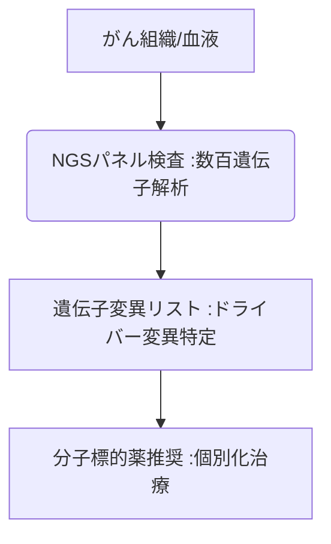

# T10-03-02 がんゲノムプロファイリング

## Summary（5つの要点）

1. **遺伝子変異の一括解析**: **次世代シークエンサー（T10-03-01）**を用い、**がん組織**に含まれる**数百種類のがん関連遺伝子**の変異を**一括で解析**する**パネル検査**。
2. **治療薬の選択**: 検出された遺伝子変異（ドライバー変異）に基づき、その変異を標的とする**最適な分子標的薬や治験薬**の候補を選択。
3. **国内承認検査**: **FoundationOne CDx、OncoGuide**などが国内で**保険適用**されており、臨床現場での利用が拡大。
4. **リキッドバイオプシー**: 血液中の**ctDNA（癌細胞由来のDNA）**を解析することで、**生検（組織採取）なし**での遺伝子変異の検出技術が進化。
5. **課題**: 遺伝子変異が見つかっても**対応する治療薬が存在しない（Actionableな変異の少なさ）**こと、そして**検査の迅速性**の確保。

#### 概念図

---

### 技術評価表（定量的な視点）
| 評価項目 | 評価 | 根拠 |
| :--- | :--- | :--- |
| 導入コスト | ⭐⭐⭐☆☆ | **検査費用は保険適用で患者負担は低減。解析体制の構築コストは高い** |
| 技術成熟度 | ⭐⭐⭐⭐☆ | **実用段階。リキッドバイオプシーの感度・特異度向上が進行中** |
| 日本の競争力 | ⭐⭐⭐⭐☆ | **臨床体制の整備で先行。AI解析による治療推奨の高度化が鍵** |
| 市場性 | ⭐⭐⭐⭐⭐ | **がん治療のパラダイムシフト。全がん患者への適用が目標** |
| 品質保証の重要性 | ⭐⭐⭐⭐⭐ | **治療方針決定に直結。DNA抽出、解析、レポート作成の全てで高精度が必須** |
---

## 日本の立ち位置・強み弱みのSummary

### 強み：日本企業や研究機関が持つ独自の技術、優位性などを箇条書きで記述。

* **臨床体制の整備**: **がんゲノム医療中核拠点病院**を中心とした、**検査・診断・治療**の連携体制構築。
* **独自のパネル検査**: **NCCオンコパネル**など、日本の臨床データに基づいた独自のパネル検査開発。
* **AIによる治療レコメンデーション**: **臨床意思決定支援システム（T10-01-04）**と連携した、治療推奨の高度化。

### 弱み：日本が抱える規制、標準化の遅れ、海外依存などを箇条書きで記述。

* **リキッドバイオプシーの承認**: **血液検査**による**がんの超早期診断**（T10-03-03）の**保険適用**に慎重。
* **海外依存**: 主要なパネル検査キット（Foundation One CDxなど）は**海外企業**が開発・提供。
* **データ共有の障壁**: 得られたゲノムデータを**研究利用**するための**規制と仕組み**が複雑。

---

## 技術ロードマップ（短期/中期/長期）

### 短期目標（～2027年）

* **がんゲノムプロファイリング**が、**希少がん、小児がん**など、より広範囲の患者に**標準的に適用**される。
* **リキッドバイオプシー**の**早期再発モニタリング、治療効果判定**への活用が普及。
* **AI（T10-01-03）**が、**遺伝子変異**に加えて**免疫チェックポイント関連因子**なども統合解析し、治療推奨を高度化。

### 中期目標（2028年～2031年）

* **健常者**を対象とした**リキッドバイオプシー**による**がんの超早期診断**が実用化。
* **AI創薬（T10-01-02）**と連携し、**遺伝子変異**に対応する**オーダーメイドな治療薬**を**迅速に設計**。
* **AI**が、**分子標的薬**の**投与量、投与期間**を**個々の患者のゲノム情報**に基づいて最適化。

### 長期目標（2032年～2035年）

* **遺伝子情報**に基づき、**がんの発生自体を予測・予防**する**超個別化予防医療**が確立。
* **ゲノムプロファイリング**が、**がん**だけでなく**アルツハイマー病**などの**難治性疾患全般**に適用される。

### 📚 参照リンク

1. [Foundation Medicine Japan: がんゲノムプロファイリング](https://www.foundationmedicine.jp/)
2. [国立がん研究センター: がんゲノム医療](https://www.ncc.go.jp/jp/r02/genomumedicine/index.html)
3. [Foundation Medicine (米国)](https://www.foundationmedicine.com/)
