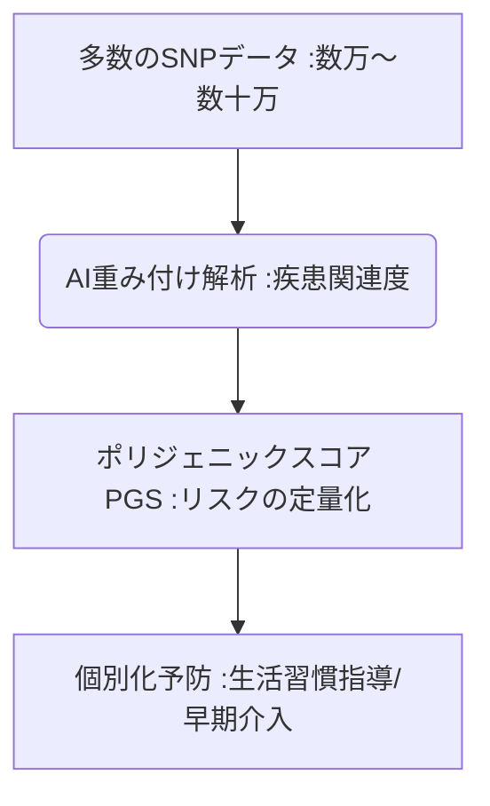

# T10-03-03 多因子疾患リスク予測・ポリジェニックスコア

## Summary（5つの要点）

1. **多数遺伝子の総合評価**: **糖尿病、心臓病、高血圧、精神疾患**など、**複数の遺伝子変異**と**環境因子**が関与する**多因子疾患**のリスクを評価。
2. **ポリジェニックスコア（PGS）**: **疾患に関連する数万～数十万**の**SNP（一塩基多型）**の寄与度を重み付けし、**総合的な遺伝的リスク**を一つのスコアで算出。
3. **発症前予防**: スコアが高い個人を特定し、**生活習慣改善、早期検診**などの**予防的介入**を**発症前**に行うことで、医療費削減に貢献。
4. **大規模コホート研究**: **英国Biobank、東北メディカル・メガバンク**など、**大規模なゲノム・臨床データ**を基盤としてAIモデルが構築。
5. **課題**: **人種・集団間の遺伝的背景の差**により、スコアの予測精度が異なる**「予測バイアス」**の解消。

#### 概念図

---

### 技術評価表（定量的な視点）
| 評価項目 | 評価 | 根拠 |
| :--- | :--- | :--- |
| 導入コスト | ⭐⭐⭐⭐☆ | **SNPアレイ解析で比較的低コスト。解析AIの精度維持にコスト** |
| 技術成熟度 | ⭐⭐⭐☆☆ | **研究段階から臨床への移行期。特定の疾患で高い予測精度を示す** |
| 日本の競争力 | ⭐⭐⭐⭐⭐ | **東北メディカル・メガバンクのコホートデータが世界的に高い価値を持つ** |
| 市場性 | ⭐⭐⭐⭐⭐ | **生活習慣病対策、予防医療の根幹。健康診断の標準項目になる可能性** |
| 品質保証の重要性 | ⭐⭐⭐⭐⭐ | **スコアの誤解釈、過度な不安喚起を防ぐための科学的妥当性が必須** |
---

## 日本の立ち位置・強み弱みのSummary

### 強み：日本企業や研究機関が持つ独自の技術、優位性などを箇条書きで記述。

* **大規模コホート**: **東北メディカル・メガバンク**による**約15万人**の**ゲノム・生活習慣データ**の蓄積。
* **日本人特有のモデル**: **人種特有の遺伝的背景**に対応した**日本人向けのPGSモデル**の開発。
* **予防医療の推進**: **特定健診・保健指導**の仕組みと連携した、**PGSに基づく予防介入**の社会実装。

### 弱み：日本が抱える規制、標準化の遅れ、海外依存などを箇条書きで記述。

* **倫理的課題**: **保険加入、雇用**などにおける**遺伝的リスク情報**の**差別的利用**に対する懸念。
* **PGSの解釈**: **スコア**を**一般市民や非専門医**が**正確に理解**するための**教育・体制**が不十分。
* **国際的な比較**: **英国Biobank**など、**欧米の大規模データ**との**予測精度の国際的な比較検証**の推進。

---

## 技術ロードマップ（短期/中期/長期）

### 短期目標（～2027年）

* **PGS**が、**乳がん、心筋梗塞**など、**一部の多因子疾患**の**リスク評価**に限定的に導入。
* **ゲノムデータ**を**プライバシー保護（T5-05-05）**した状態で利用するための**計算技術（秘密計算）**が実用化。
* **AI（T10-01-03）**が、**生活習慣データ**と**PGS**を統合し、**より高精度な複合リスク**を算出。

### 中期目標（2028年～2031年）

* **健康診断**の**標準項目**として**PGS**が導入され、**多因子疾患**の**超早期リスク評価**が一般化。
* **AI**が、**遺伝的リスク**に基づき、**食生活（T17-01-02）、運動、薬剤選択**の**超個別化された予防プログラム**を自動生成。
* **医療機関**が、**高リスク者**に対し**保険適用**での**予防的介入**（例：低用量アスピリン処方）を実施。

### 長期目標（2032年～2035年）

* **出生時**の**全ゲノム解析（T10-03-01）**に基づき、**生涯の健康管理、予防医療**が**完全に個別化**される。
* **環境因子（マイクロバイオームT10-03-05など）**の**リアルタイムデータ**とPGSが統合され、**発症リスクを動的**に予測。

### 📚 参照リンク

1. [東北メディカル・メガバンク機構 (ToMMo)](https://www.megabank.tohoku.ac.jp/)
2. [UK Biobank (英国)](https://www.ukbiobank.ac.uk/)
3. [理化学研究所 ライフサイエンス連携推進部門](https://www.riken.jp/)
