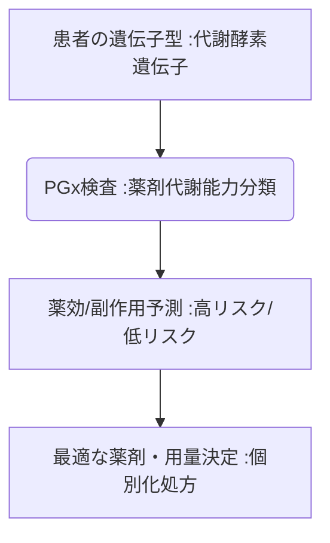

# T10-03-04 薬理ゲノム検査(PGx)・副作用予測

## Summary（5つの要点）

1. **薬剤代謝能力の解析**: **薬物代謝酵素**や**トランスポーター**に関わる**遺伝子型**を解析し、**薬剤の代謝速度、効果、副作用**のリスクを予測。
2. **最適な薬剤・用量の選択**: **抗がん剤、抗うつ薬、抗凝固薬**など、**個人差が大きい**薬剤について、**遺伝子型**に基づき**最適な薬剤、投与量**を決定。
3. **重篤副作用の回避**: **重篤な皮膚障害**などを引き起こす遺伝子型を**事前に検査**し、**副作用リスク**を**事前回避**することで医療安全を向上。
4. **実用化の進行**: 一部の薬剤（例：**ワルファリン**、特定の**抗がん剤**）について、**PGx検査**が**保険適用**され、臨床現場での利用が拡大。
5. **課題**: **対象薬剤**の**PGx検査の保険適用**の拡大、**検査結果**の**電子カルテ（T10-01-04）**への**標準的な組み込み**。

#### 概念図

[Image illustrating how a patient's genotype for a drug-metabolizing enzyme (e.g., CYP2D6) determines whether they are a poor, intermediate, normal, or ultrarapid metabolizer, and the resulting optimal drug dosage.]

---

### 技術評価表（定量的な視点）
| 評価項目 | 評価 | 根拠 |
| :--- | :--- | :--- |
| 導入コスト | ⭐⭐⭐⭐☆ | **特定の遺伝子型を見るため、全ゲノム解析に比べ低コスト** |
| 技術成熟度 | ⭐⭐⭐⭐⭐ | **対象薬剤は限定的だが、検査技術は確立済み。実用化段階** |
| 日本の競争力 | ⭐⭐⭐⭐☆ | **ファーマコゲノミクス研究が活発。アジア人特有の遺伝子型の知見** |
| 市場性 | ⭐⭐⭐⭐⭐ | **薬物治療の最適化、医療安全に不可欠であり、将来的に標準化が予測** |
| 品質保証の重要性 | ⭐⭐⭐⭐⭐ | **検査結果の誤りは、薬の無効化、重篤副作用の引き金となる** |
---

## 日本の立ち位置・強み弱みのSummary

### 強み：日本企業や研究機関が持つ独自の技術、優位性などを箇条書きで記述。

* **PMDAの承認体制**: **医薬品医療機器総合機構（PMDA）**がPGx検査を含む**コンパニオン診断薬**の承認を積極的に進めている。
* **アジア人データ**: **アジア人集団**に多い**特有の遺伝子多型**（例：CYP2D6の機能低下型）に関する知見。
* **薬剤師の知識**: **薬剤師**による**PGx検査結果**に基づいた**処方提案**のノウハウ。

### 弱み：日本が抱える規制、標準化の遅れ、海外依存などを箇条書きで記述。

* **保険適用の限定性**: **PGx検査**が**保険適用**される**薬剤の種類**がまだ限定的。
* **電子カルテ連携**: **PGx検査の結果**を**電子カルテ**に**標準的**に組み込み、**CDSS（T10-01-04）**で活用する仕組みの整備遅れ。
* **医師の知識普及**: **PGx検査**を**日常診療**で活用するための**医師・薬剤師**への**教育普及**が急務。

---

## 技術ロードマップ（短期/中期/長期）

### 短期目標（～2027年）

* **抗うつ薬、免疫抑制剤**など、**効果や副作用**に**個人差**が大きい**主要な薬剤**について**PGx検査**が**保険適用**を拡大。
* **薬局**で**PGx検査**が実施され、**薬剤師**が**処方前のリスク**を医師にフィードバックする仕組みが確立。
* **CDSS（T10-01-04）**が、**PGx検査結果**に基づき**処方箋発行時**に**リアルタイムで警告**を提示。

### 中期目標（2028年～2031年）

* **PGx検査**が、**全ての新規患者**に対する**標準的な初期検査**として導入。
* **AI創薬（T10-01-02）**が、**特定のPGx遺伝子型**を持つ集団に**最適化された薬剤**を設計。
* **PGx情報**を**マイナンバーカード**などの**デジタルID（T5-05-05）**と連携し、医療機関での**迅速な利用**を実現。

### 長期目標（2032年～2035年）

* **出生時**に取得した**全ゲノムデータ（T10-03-01）**が**PGx情報**として活用され、**生涯**にわたる**最適な薬物治療**が実現。
* **AI**が、**PGx情報、生活習慣、疾患状態**を統合し、**体内の薬物動態**を**リアルタイム**で予測・制御。

### 📚 参照リンク

1. [医薬品医療機器総合機構（PMDA）: PGx関連情報](https://www.pmda.go.jp/)
2. [日本薬理学会](https://www.pharmacol.or.jp/)
3. [Clinical Pharmacogenetics Implementation Consortium (CPIC)](https://cpicpgx.org/)
