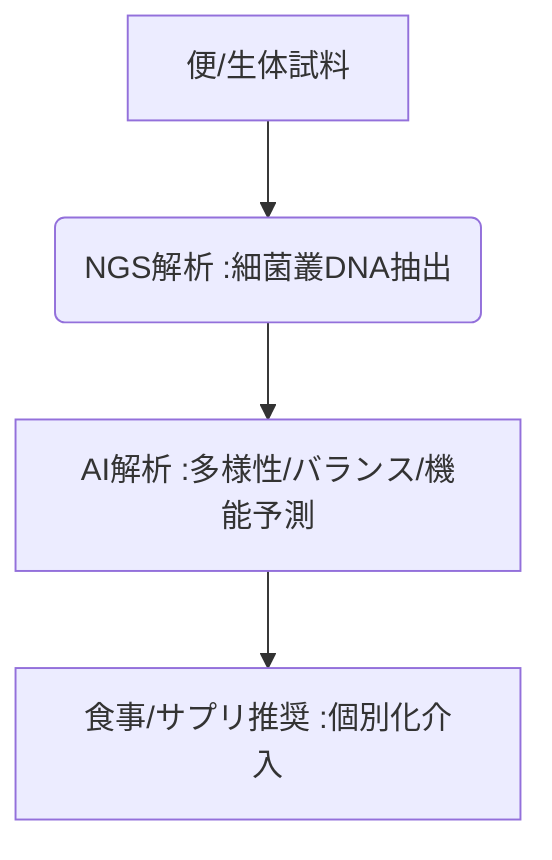

# T10-03-05 マイクロバイオーム解析・腸内細菌叢診断

## Summary（5つの要点）

1. **細菌叢のDNA解析**: **腸内**に生息する**数兆個の細菌、真菌、ウイルスのDNA**を**次世代シークエンサー（T10-03-01）**で網羅的に解析。
2. **疾患との関連解明**: **肥満、糖尿病、炎症性腸疾患、自己免疫疾患、うつ病**など、**多様な疾患**との**腸内細菌叢の構成**の関連性をAIで解明。
3. **予防・治療への応用**: 解析結果に基づき、**個人の腸内環境**に最適な**プロバイオティクス（善玉菌）、プレバイオティクス（食物繊維）、食事（T17-01-02）**を提案。
4. **国内サービス**: **メタジェン、サイキンソー**など、腸内細菌叢解析サービスを提供する企業が登場し、コンシューマー向けにも展開。
5. **課題**: **細菌叢**と**特定の疾患**の**因果関係の特定**、そして**介入（プロバイオティクス）**の**効果の安定性**の確保。

#### 概念図

---

### 技術評価表（定量的な視点）
| 評価項目 | 評価 | 根拠 |
| :--- | :--- | :--- |
| 導入コスト | ⭐⭐⭐⭐☆ | **解析コストは低下。個人向けサービスも普及し、比較的低コストで利用可能** |
| 技術成熟度 | ⭐⭐⭐☆☆ | **研究段階。特定の疾患との関連は解明中だが、臨床応用は途上** |
| 日本の競争力 | ⭐⭐⭐⭐⭐ | **乳酸菌・ビフィズス菌研究で世界的優位性。食品メーカーとの連携が強み** |
| 市場性 | ⭐⭐⭐⭐⭐ | **健康食品、医療、美容、畜産など、広範囲な産業への応用が期待** |
| 品質保証の重要性 | ⭐⭐⭐⭐☆ | **サンプリング、DNA抽出、解析の全てで一貫した品質管理が必須** |
---

## 日本の立ち位置・強み弱みのSummary

### 強み：日本企業や研究機関が持つ独自の技術、優位性などを箇条書きで記述。

* **プロバイオティクス研究**: **ヤクルト、明治**など、**ビフィズス菌・乳酸菌**に関する**世界最先端の研究**と製品開発力。
* **食品産業との連携**: **機能性食品（T17-01-02）**としての**腸内環境改善製品**の市場が成熟。
* **メタボロミクス技術**: **腸内細菌**が産生する**代謝産物（短鎖脂肪酸など）**の**高精度解析技術**。

### 弱み：日本が抱える規制、標準化の遅れ、海外依存などを箇条書きで記述。

* **治療薬としての承認**: **腸内細菌**を**薬剤**として利用する**「糞便微生物移植（FMT）」**などの**医療応用**の規制整備が途上。
* **国際標準化**: **解析手法、結果のレポート**に関する**国際的な標準化**への貢献が限定的。
* **生活習慣データ連携**: **食事、運動、睡眠**などの**詳細な生活習慣データ**と**マイクロバイオームデータ**の**統合解析**の仕組みの構築遅れ。

---

## 技術ロードマップ（短期/中期/長期）

### 短期目標（～2027年）

* **AI**が、**腸内細菌叢のデータ**から**肥満、糖尿病**などの**リスク**を**生活習慣（T17-01-02）**と併せて予測し、**個別化された食事指導**が普及。
* **プロバイオティクス**製品の**機能性表示**が、**腸内細菌叢の変化**を指標とすることが可能に。
* **糞便微生物移植（FMT）**が、**難治性腸炎（CDI）**治療の**標準治療**として確立。

### 中期目標（2028年～2031年）

* **腸内細菌**が、**抗がん剤、免疫チェックポイント阻害薬**などの**薬効（T10-03-04）**を左右することが解明され、**治療方針**に**腸内環境**が考慮される。
* **AI**が、**腸内細菌叢データ**に基づき、**うつ病、自閉症**などの**精神疾患**の**診断、治療**を支援（**腸脳相関**）。
* **合成生物学（T15-05）**を用いて、**特定の機能**を持つ**デザイン化された細菌**を腸内に定着させる技術が実用化。

### 長期目標（2032年～2035年）

* **腸内細菌叢の制御**が、**難病、老化**に対する**主要な予防・治療手段**となる。
* **マイクロバイオームデータ**が、**全ゲノムデータ（T10-03-01）**と並び、**個人の健康管理**の**標準的な指標**となる。

### 📚 参照リンク

1. [株式会社メタジェン](https://www.metagen.co.jp/)
2. [株式会社サイキンソー](https://cykinso.co.jp/)
3. [日本細菌学会](http://www.jsb.gr.jp/)
