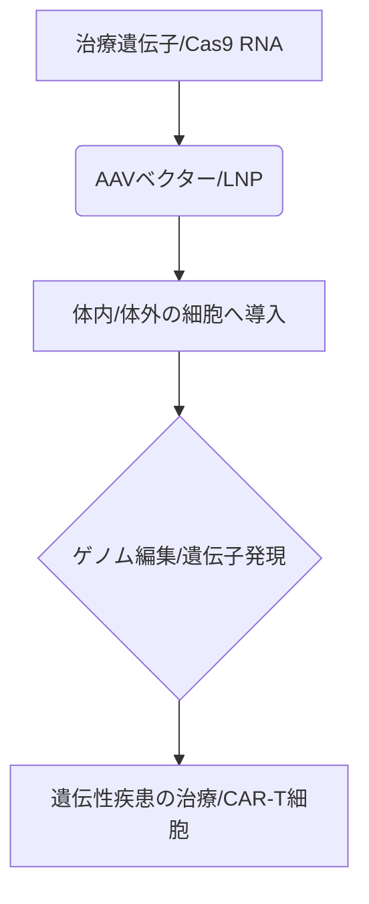

# T10-04-01 遺伝子治療とゲノム編集（CRISPR-Cas9）

## Summary（5つの要点）

1. **定義**: **遺伝子**の欠陥や機能不全が原因の疾患に対し、正常な遺伝子を導入したり、原因となる遺伝子を修正・不活化することで**根治**を目指す治療法。
2. **ゲノム編集**: **CRISPR-Cas9**などの技術を使って**DNA**の特定の部位を切断し、遺伝子を**正確**に改変する。従来の遺伝子治療よりも**効率的**かつ**高精度**。
3. **デリバリー**: 治療遺伝子を細胞に届けるための媒体として、**アデノ随伴ウイルス（AAV）ベクター**や**脂質ナノ粒子（LNP/T10-01-05）**が主に利用される。
4. **応用分野**: **遺伝性疾患（鎌状赤血球病など）**の根治療法、**CAR-T細胞**などの免疫細胞療法、そしてがん治療。**in vivo（体内）**と**ex vivo（体外）**での適用が進む。
5. **課題**: **オフターゲット効果**（意図しないゲノム部位の切断）の抑制、ベクターの安全性と免疫原性、そして**高額**な治療コストと倫理的な懸念。

#### 概念図

---

### 技術評価表（定量的な視点）
| 評価項目 | 評価 | 根拠 |
| :--- | :--- | :--- |
| 導入コスト | ⭐⭐☆☆☆ | 研究開発、製造、治験に**巨額**。治療費も非常に**高額** |
| 技術成熟度 | ⭐⭐⭐⭐☆ | **CRISPR**は**ノーベル賞**受賞。臨床試験が急増し、実用化段階 |
| 日本の競争力 | ⭐⭐⭐⭐☆ | 基礎研究は強い。特に**AAV**、**CAR-T**などの周辺技術で優位性 |
| 市場性 | ⭐⭐⭐⭐⭐ | 難治性疾患、がんの根治療法として、市場は**爆発的**に**拡大** |
| 品質保証の重要性 | ⭐⭐⭐⭐⭐ | **オフターゲット効果**、ベクターの安全性は**不可逆**なリスクに直結 |

---

## 日本の立ち位置・強み弱みのSummary

### 強み：日本企業や研究機関が持つ独自の技術、優位性などを箇条書きで記述。

* **AAVベクター**: **アデノ随伴ウイルス**の製造、改良に関する**高い技術力**。
* **CAR-T療法**: **iPS細胞（T10-02-01）**を用いた**高機能**な**CAR-T細胞**の開発。
* **基礎研究**: **ゲノム編集技術**の作用機序や**安全性向上**に関する**高い基礎研究**。

### 弱み：日本が抱える規制、標準化の遅れ、海外依存などを箇条書きで記述。

* **特許・プラットフォーム**: **CRISPR-Cas9**の**基本特許**は**欧米**が保有しており、**ロイヤリティ負担**が**大きい**。
* **製造コスト**: **ウイルスベクター**や**細胞製剤（T10-02-05）**の**大規模**な製造技術で**海外**に後れ。
* **倫理的規制**: **生殖細胞**の**ゲノム編集**に関する**規制**が**厳格**。

---

## 技術ロードマップ（短期/中期/長期）

### 短期目標（～2027年）

* **in vivo（体内）**での**ゲノム編集治療**が一部の**遺伝性疾患**（網膜疾患など）で**実用化**され、**保険適用**。
* **CAR-T療法**の適用疾患が**血液がん**から**固形がん**へ**拡大**。

### 中期目標（2028年～2031年）

* **ベース編集**、**プライム編集**などの**次世代**の**ゲノム編集技術**が主流となり、**オフターゲット効果**が**ほぼなくなる**。
* **LNP（T10-01-05）**による**非ウイルス**な**遺伝子デリバリー**が**確立**し、安全性と**製造コスト**が**改善**。

### 長期目標（2032年～2035年）

* **ゲノム編集**が**個別化医療**の**標準**となり、患者の**電子カルテ（T10-01-01）**に基づき治療法が決定される。
* **多因子疾患**（糖尿病、認知症など）を対象とした**複雑**な**遺伝子**の**同時編集**が**実現**。

### 📚 参照リンク

1. [CRISPR Therapeutics](https://www.crisprtx.com/)
2. [日本遺伝子細胞治療学会](http://www.jsgt.jp/)