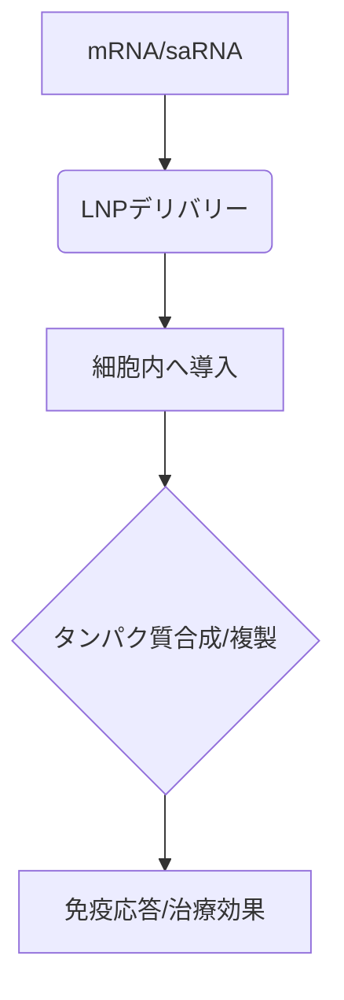

# T10-04-02 mRNAワクチン技術と自己増殖型RNA

## Summary（5つの要点）

1. **基本原理**: **抗原**となるタンパク質の**設計図（mRNA）**を体内に導入し、患者自身の細胞で抗原を作らせることで**免疫応答**を誘発する。
2. **利点**: **開発速度**が**極めて速く**、**変異株**への**迅速**な対応が可能。製造が比較的シンプルで**スケールアップ**しやすい。
3. **デリバリー**: **mRNA**は不安定なため、**脂質ナノ粒子（LNP/T10-01-05）**で包み込み、細胞への**効率的**な導入と分解からの**保護**を行う。
4. **自己増殖型RNA（Self-amplifying RNA）**: 導入された**RNA**が細胞内で**自らを複製**する機能を持ち、**少量**で**効果を発揮**する**次世代型**。
5. **応用分野**: 感染症ワクチンに加え、**がん免疫療法（個別化ネオアンチゲンワクチン）**や心血管疾患など**慢性疾患**の**治療薬**への応用が進む。

#### 概念図

---

### 技術評価表（定量的な視点）
| 評価項目 | 評価 | 根拠 |
| :--- | :--- | :--- |
| 導入コスト | ⭐⭐⭐☆☆ | 製造はしやすいが、**LNP製造**や**低温輸送網**にコスト |
| 技術成熟度 | ⭐⭐⭐⭐⭐ | **コロナワクチン**で**確立済み**。プラットフォーム化完了 |
| 日本の競争力 | ⭐⭐⭐☆☆ | アビガン、塩野義など国内勢が**saRNA**で追い上げ |
| 市場性 | ⭐⭐⭐⭐⭐ | **定期接種**や**がん治療**への応用で**巨大市場**を形成 |
| 品質保証の重要性 | ⭐⭐⭐⭐☆ | **安定性**、**純度**、**LNPの安全性**確保が極めて重要 |

---

## 日本の立ち位置・強み弱みのSummary

### 強み：日本企業や研究機関が持つ独自の技術、優位性などを箇条書きで記述。

* **saRNA技術**: **自己増殖型RNA**に関する**独創的**な研究と臨床開発が進行中。
* **LNP技術**: デリバリーを担う**LNP**の**安定化**、**高機能化**に関する技術。
* **製造インフラ**: 国内での**迅速**な**原薬**と**製剤**の**一貫製造体制**の構築。

### 弱み：日本が抱える規制、標準化の遅れ、海外依存などを箇条書きで記述。

* **基本特許**: 初期**基本mRNA技術**の**特許**は**欧米企業**が**独占**。
* **臨床開発ノウハウ**: パンデミック時の**大規模**な開発で**海外**に後れをとった。
* **サプライチェーン**: **原料**や**特殊な試薬**の**海外依存度**が**高い**。

---

## 技術ロードマップ（短期/中期/長期）

### 短期目標（～2027年）

* **季節性インフルエンザ**や**RSウイルス**など**複数**の感染症を対象とした**複合（マルチプレックス）ワクチン**が承認される。

### 中期目標（2028年～2031年）

* **個別化がんワクチン**が主流となり、既存の化学療法や免疫チェックポイント阻害剤と**併用**される。
* **saRNA**が標準mRNAを**代替**し、接種量と**コスト**が**大幅に低減**する。

### 長期目標（2032年～2035年）

* **治療用mRNA**（タンパク質補充や抗体産生）が**難治性疾患**や**慢性疾患**の治療に**広く応用**される。
* **室温**での**長期保存**が可能な**LNP**や製剤化技術が**確立**する。

### 📚 参照リンク

1. [Moderna Therapeutics](https://www.modernatx.com/)
2. [日本核酸医薬学会](http://www.jns.gr.jp/)