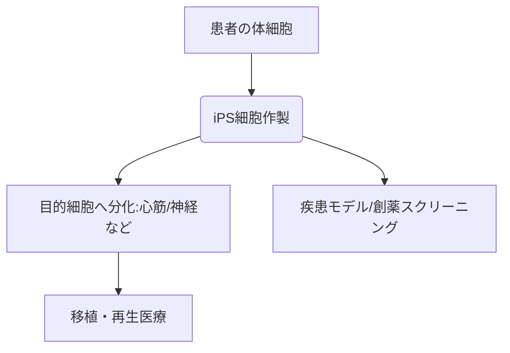

# T10-04-03 再生医療とiPS細胞（誘導多能性幹細胞）

## Summary（5つの要点）

1. **定義**: **傷害**や**機能不全**に陥った臓器や組織を、細胞を移植したり利用したりして**修復**・**再生**する医療。
2. **iPS細胞**: **体細胞**に特定の因子を導入して作られる、**無限**の**増殖能力**と様々な組織へ**分化**できる能力（**多能性**）を持つ細胞。
3. **応用**: **iPS細胞**から**網膜**、**心筋**、**神経**など様々な細胞を作製し、**パーキンソン病**や**心不全**などの治療に利用する。
4. **細胞バンク**: **他者**への移植の際に**拒絶反応**が**起こりにくい**タイプの**iPS細胞**を**備蓄**した**ストック**が構築され、**迅速**な医療提供を可能にする。
5. **課題**: **iPS細胞**から目的の細胞へ**分化**させる際の**歩留まり**の**低さ**、移植後の**腫瘍化**（がん化）**リスク**、そして細胞の**大規模**な**製造**と**品質管理**。

#### 概念図

---

### 技術評価表（定量的な視点）
| 評価項目 | 評価 | 根拠 |
| :--- | :--- | :--- |
| 導入コスト | ⭐⭐☆☆☆ | 細胞培養、**品質管理**、**製造管理**に**高コスト** |
| 技術成熟度 | ⭐⭐⭐☆☆ | 臨床研究段階。**網膜**・**心臓**で治験が進むが、普遍的な治療ではない |
| 日本の競争力 | ⭐⭐⭐⭐⭐ | **山中伸弥教授**の**発見**。**ストック事業**など**世界をリード** |
| 市場性 | ⭐⭐⭐⭐⭐ | 臓器移植の代替、難病の治療法として**潜在市場は極大** |
| 品質保証の重要性 | ⭐⭐⭐⭐⭐ | 細胞の**ロット間差**、**異物混入**、**腫瘍化リスク**が極めて重大 |

---

## 日本の立ち位置・強み弱みのSummary

### 強み：日本企業や研究機関が持つ独自の技術、優位性などを箇条書きで記述。

* **iPS細胞の基本技術**: **特許**と**研究**の**両面**で**世界**の**中心**。
* **iPS細胞ストック**: **京都大学**を中心に**拒絶反応**の少ない細胞の**備蓄体制**を**確立**。
* **迅速な臨床応用**: **「条件及び期限付き承認」制度**により、治験から**実用化**までの期間が**短縮**されている。

### 弱み：日本が抱える規制、標準化の遅れ、海外依存などを箇条書きで記述。

* **コスト**: **自家細胞**を用いる場合、**製造コスト**が**非常に高くなる**。
* **スケールアップ**: **大量**の細胞を**安定**して**製造**する**製造**・**品質管理技術**が課題。
* **規制の曖昧さ**: **再生医療**と**創薬**の**境界**にある技術の**規制**が**複雑**。

---

## 技術ロードマップ（短期/中期/長期）

### 短期目標（～2027年）

* **iPS細胞**由来の**心筋細胞**や**神経細胞**を用いた一部の疾患で**治験が完了**し、**承認**される。

### 中期目標（2028年～2031年）

* **iPS細胞**から作製した細胞を用いた**疾患モデル**が**創薬**の**主流**となり、新薬開発を**加速**させる。
* **体外**での**ミニ臓器（オルガノイド/T10-04-04）**の**作製技術**が**確立**し、**薬物毒性試験**に応用される。

### 長期目標（2032年～2035年）

* **iPS細胞**から作製した臓器を用いた**「人工臓器移植」**が**実現**し、**ドナー不足**の問題が**解決**される。
* **加齢**による**機能低下**を再生させる**アンチエイジング**治療への応用が可能になる。

### 📚 参照リンク

1. [京都大学iPS細胞研究所 (CiRA)](https://www.cira.kyoto-u.ac.jp/)
2. [再生医療イノベーションフォーラム (FIRM)](http://www.firm.or.jp/)