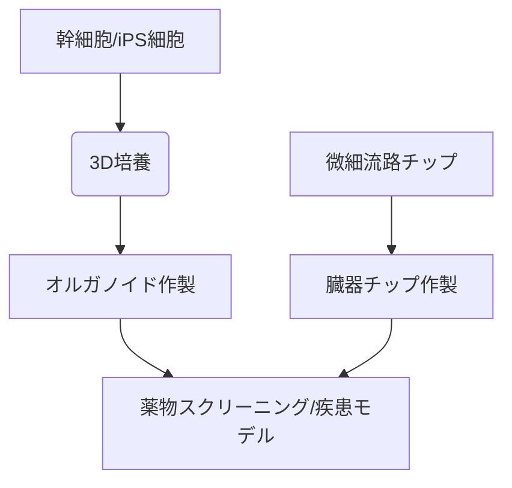

# T10-04-04 オルガノイド（ミニ臓器）と臓器チップ

## Summary（5つの要点）

1. **オルガノイド**: **iPS細胞（T10-04-03）**や**幹細胞**を**三次元的**に培養し、試験管内で**本物**の**臓器**に似た**構造と機能**を再現した数ミリサイズの**「ミニ臓器」**。
2. **臓器チップ（Organ-on-a-Chip）**: **微細**な**流路**を持つチップ上で、細胞を培養し、**血流**や**機械的**な**刺激**を再現することで**生体**の**臓器の環境**を**模倣**する技術。
3. **創薬応用**: **動物実験**を**代替**する**高精度**な**疾患モデル**として利用され、薬物の**有効性**、**毒性**の**スクリーニング**を**効率化**する。
4. **個別化医療**: **患者**の**iPS細胞**から**オルガノイド**を作製し、**薬**の**効き方**を**事前**に**確認**することで、**最適**な**治療法**を**選択**する。
5. **課題**: **オルガノイド**は**血管**や**免疫細胞**を**欠く**ため**生体の複雑さ**を**再現**しきれず、**臓器チップ**は**長期間**の**安定**した**培養**と**量産性**に課題が残る。

#### 概念図

---

### 技術評価表（定量的な視点）
| 評価項目 | 評価 | 根拠 |
| :--- | :--- | :--- |
| 導入コスト | ⭐⭐⭐☆☆ | **微細加工**、**複雑**な**培養設備**が必要だが、**動物実験**より**安価**になる可能性 |
| 技術成熟度 | ⭐⭐⭐☆☆ | **研究段階**。一部の**毒性試験**で**実用化**が始まった段階 |
| 日本の競争力 | ⭐⭐⭐⭐☆ | **iPS細胞技術**と**バイオエンジニアリング**の**融合**で**優位性** |
| 市場性 | ⭐⭐⭐⭐☆ | **動物実験代替**の流れと**個別化医療**の進展で市場は**急成長** |
| 品質保証の重要性 | ⭐⭐⭐☆☆ | **生体内環境の再現性**、**再現性**、**ロット間差**の**標準化**が課題 |

---

## 日本の立ち位置・強み弱みのSummary

### 強み：日本企業や研究機関が持つ独自の技術、優位性などを箇条書きで記述。

* **iPS細胞との融合**: **iPS細胞**を起点とする**高品質**な**オルガノイド**作製技術。
* **マイクロ流体工学**: **微細加工**や**バイオエンジニアリング**の技術で**臓器チップ**の開発が**活発**。
* **ヒト疾患モデル**: **日本人**に**特有**な**遺伝的背景**を持つ**疾患モデル**の**構築**。

### 弱み：日本が抱える規制、標準化の遅れ、海外依存などを箇条書きで記述。

* **標準化**: **オルガノイド**の作製プロトコルや**品質評価**の**国際的**な**標準化**に後れ。
* **チップ製造**: **高度**な**微細加工技術**を持つ**海外メーカー**への**依存**が一部ある。
* **規制対応**: **動物実験**の**代替**としての**規制当局**の**承認プロセス**が**複雑**。

---

## 技術ロードマップ（短期/中期/長期）

### 短期目標（～2027年）

* **製薬企業**における薬物の**肝毒性**や**腸管吸収**の評価に**臓器チップ**の利用が**標準化**される。

### 中期目標（2028年～2031年）

* **患者由来**の**オルガノイド**を用いた**臨床試験**（薬剤応答の予測）が普及し、**治療の個別化**に貢献する。
* **血管**や**免疫細胞**を含む**複合的**な**オルガノイド**（より生体に近いモデル）が**開発**される。

### 長期目標（2032年～2035年）

* **複数**の**臓器チップ**を接続した**「ヒト・オン・ア・チップ」システム**が構築され、**全身**の**薬物動態**や**相互作用**の評価が**可能**になる。
* **オルガノイド**を用いた**移植医療**の**前段階**での活用（機能評価など）が検討される。

### 📚 参照リンク

1. [Wyss Institute for Biologically Inspired Engineering](https://wyss.harvard.edu/technology/organ-chips/)
2. [日本再生医療学会](http://www.jsrm.jp/)