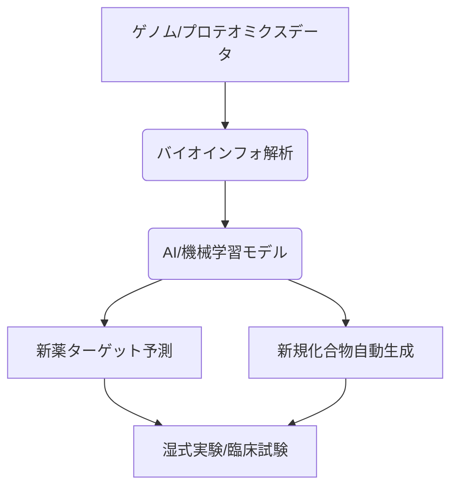

# T10-04-05 バイオインフォマティクスとAI創薬

## Summary（5つの要点）

1. **定義**: **生物学**の**大規模**なデータ（**ゲノム配列**、**タンパク質**構造など）を**情報科学**や**統計学**を使って解析し、生命現象の理解や**新薬開発**に活かす分野。
2. **AI創薬**: **AI**（**ディープラーニング**など）を利用して、**① 新たな標的の同定**、**② 候補化合物の設計・生成**、**③ 臨床試験の最適化**を行い、開発の**期間とコスト**を**大幅に削減**する。
3. **データの活用**: **ヒトゲノム**配列、**電子カルテ（T10-05-01）**データ、**プロテオミクス**、**構造生物学**データなどを**統合的**に解析する。
4. **生成AI**: **Generative AI**を**活用**し、**結合**や**薬効**が**予測**される**新規**な**分子構造**を**自動**で**設計**し、ウェットラボでの**実験**に回す。
5. **課題**: 学習に使う**データ**の**質と量**の**確保**、**AI**が提案した分子の**合成の難しさ**、そして**AIの予測**の**生物学的**な**解釈と検証**。

#### 概念図

---

### 技術評価表（定量的な視点）
| 評価項目 | 評価 | 根拠 |
| :--- | :--- | :--- |
| 導入コスト | ⭐⭐⭐⭐☆ | **高性能計算リソース**と**専門家**の**人件費**が**高額** |
| 技術成熟度 | ⭐⭐⭐☆☆ | **標的同定・化合物設計**で成果が出始めた段階。臨床はこれから |
| 日本の競争力 | ⭐⭐⭐☆☆ | **IT人材不足**が課題だが、理研や京大などで**基礎研究**は強力 |
| 市場性 | ⭐⭐⭐⭐⭐ | **製薬コストの削減要求**から、**AI創薬市場**は**急拡大中** |
| 品質保証の重要性 | ⭐⭐⭐☆☆ | **AIモデル**の**ブラックボックス化**、**予測の再現性**が重要 |

---

## 日本の立ち位置・強み弱みのSummary

### 強み：日本企業や研究機関が持つ独自の技術、優位性などを箇条書きで記述。

* **スーパーコンピュータ**: **富岳**などの**世界有数**の**計算リソース**を**創薬**に**活用**。
* **バイオバンク**: 疾患と**ゲノムデータ**を連携させた**大規模**な**バイオバンク**の**整備**。
* **構造生物学**: **タンパク質**の**構造**を**解明**する**高い技術力**。

### 弱み：日本が抱える規制、標準化の遅れ、海外依存などを箇条書きで記述。

* **AI人材**: **データサイエンティスト**、**計算科学者**の**絶対数**が**海外**に比べて**不足**している。
* **データ連携**: **医療機関**間の**データ共有**や**標準化**が**遅れ**、**大規模**な**データセット**の**構築が困難**。
* **スタートアップ**: **AI創薬**分野の**スタートアップ**が**欧米**に比べて**少ない**。

---

## 技術ロードマップ（短期/中期/長期）

### 短期目標（～2027年）

* **AI**によって**リード化合物**が**設計**され、**前臨床試験**に進む**新薬候補**が増加する。

### 中期目標（2028年～2031年）

* **AI**が見つけた**完全**な**新規**な**作用機序**を持つ**化合物**が**臨床試験**を**通過**し、**承認**される。
* **臨床試験**の**被験者**の**選定**や**用量設定**に**AI**が**本格的**に**活用**され、**成功率**が**向上**する。

### 長期目標（2032年～2035年）

* **AI創薬**が**新薬開発**の**主要な手法**となり、開発期間が**平均で数年短縮**される。
* **患者**の**ゲノム**と**医療データ**に基づき、**AI**が**個別**に**最適**な**治療薬**を**設計**し、**即時**に**製造**される時代が到来する。

### 📚 参照リンク

1. [Insilico Medicine](https://www.insilico.com/)
2. [理化学研究所 生命医科学研究センター](https://www.ims.riken.jp/)