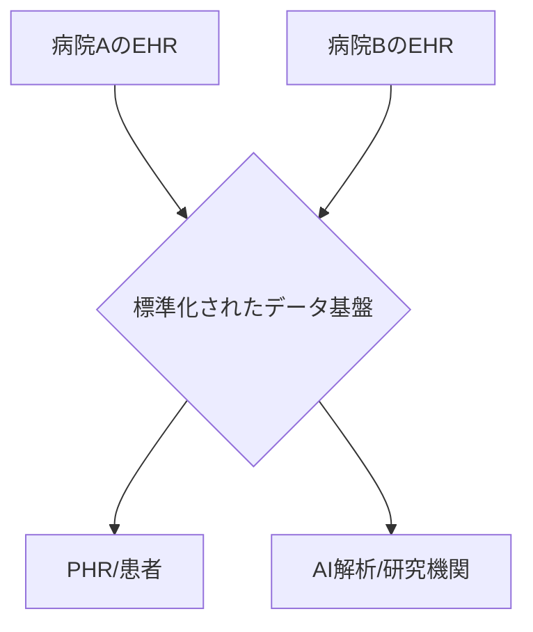

# T10-05-01 電子カルテシステム（EHR）の標準化とデータ活用

## Summary（5つの要点）

1. **EHR（電子カルテ）**: **診療**の**記録**を**電子化**し、患者の**医療情報**を**一元管理**するシステム。病院内の**効率化**、**安全**な**医療**の提供に不可欠。
2. **標準化**: **医療機関**や**システム**の垣根を越えて**データ**を**共有**・**活用**するため、**記述**方法や**フォーマット**を**統一**すること（**HL7 FHIR**、**SS-MIX**など）。
3. **データ連携**: 患者の**同意**の下、**複数**の**医療機関**の**診療情報**や**健診データ**を**連携**させ、**継続的**な**質の高い医療**を提供する。
4. **活用**: **集積**した**医療ビッグデータ**を**AI（T10-05-03）**で解析し、**新たな治療法**の**開発**や**医療政策**の**策定**、**公衆衛生**の**向上**に役立てる。
5. **課題**: **セキュリティ**と**プライバシー**の**確保**、**標準化**の**推進**と**医療機関**への**普及**、そして**データ**を**扱える人材**の**育成**。

#### 概念図

---

### 技術評価表（定量的な視点）
| 評価項目 | 評価 | 根拠 |
| :--- | :--- | :--- |
| 導入コスト | ⭐⭐⭐⭐☆ | **システムの導入・更新**、**ベンダー間**の**連携コスト**が**高い** |
| 技術成熟度 | ⭐⭐⭐☆☆ | **システム導入**は進むが、**データ連携・標準化**は途上 |
| 日本の競争力 | ⭐⭐⭐☆☆ | **独自の規格が乱立**し、**国際標準化**への対応が課題 |
| 市場性 | ⭐⭐⭐⭐☆ | **医療DX**の**基盤**であり、市場は**安定的**かつ**継続的**に**拡大** |
| 品質保証の重要性 | ⭐⭐⭐⭐⭐ | 患者の**生命**に関わる情報。**データ**の**一貫性**と**正確性**が**最重要** |

---

## 日本の立ち位置・強み弱みのSummary

### 強み：日本企業や研究機関が持つ独自の技術、優位性などを箇条書きで記述。

* **高い普及率**: **大規模**な**病院**での**電子カルテ**の**導入率**は**比較的高**い。
* **レセプトデータ**: **国民皆保険制度**に基づく**大規模**な**診療報酬データ（NDB）**の**存在**。
* **セキュリティ**: **個人情報保護法**に基づく**厳格**な**運用**。

### 弱み：日本が抱える規制、標準化の遅れ、海外依存などを箇条書きで記述。

* **標準規格の乱立**: **ベンダー**ごとの**独自規格**や**SS-MIX**など**複数**の**規格**が**混在**し、**連携**を**阻害**。
* **データ連携の遅れ**: **地域医療連携**や**PHR（T10-05-02）**との**連携**が**欧米より遅延**。
* **中小病院**: **中小**の**医療機関**での**電子カルテ**の**導入率**が**低い**。

---

## 技術ロードマップ（短期/中期/長期）

### 短期目標（～2027年）

* **政府主導**で**HL7 FHIR**など**国際標準**に基づく**標準化**が**推進**され、**基盤**が**整備**される。

### 中期目標（2028年～2031年）

* **全国**の**医療機関**で**標準化**された**電子カルテ**が**普及**し、患者の**生涯**にわたる**医療情報**が**一元的**に**管理**される。
* **救急時**や**災害時**に患者の**医療情報**へ**迅速**に**アクセス**できる**体制**が**構築**される。

### 長期目標（2032年～2035年）

* **医療ビッグデータ**と**AI**を**活用**した**個別化予防医療**が**主流**となり、**医療**の**質**と**効率**が**大幅**に**向上**する。
* **診療情報**が**研究**や**創薬**に**リアルタイム**で**活用**される**エコシステム**が**確立**する。

### 📚 参照リンク

1. [厚生労働省 医療DX推進本部](https://www.mhlw.go.jp/stf/seisakunitsuite/bunya/0000177189.html)
2. [医療情報システム開発センター (MEDIS)](http://www.medis.or.jp/)