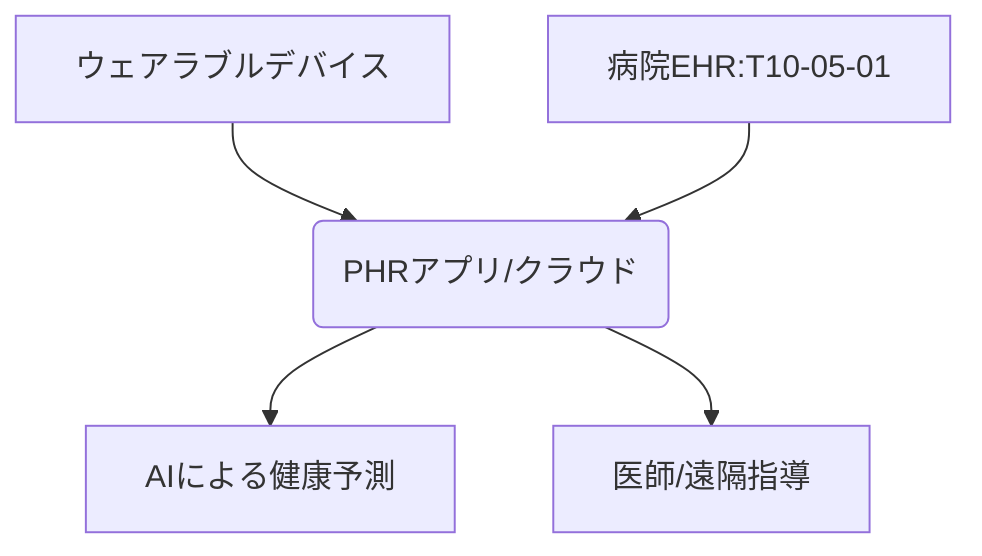

# T10-05-02 PHR（Personal Health Record）とウェアラブルデバイス

## Summary（5つの要点）

1. **PHR**: **患者**自身が**生涯**にわたり、自らの**医療**・**健康データ**を**収集**・**管理**・**活用**する仕組み。**電子カルテ（T10-05-01）**の情報と**連携**する。
2. **ウェアラブルデバイス**: **スマートウォッチ**や**スマートリング**など、**常時**身につけて**心拍数**、**睡眠**、**活動量**、**心電図**などの**生体データ**を**計測**する機器。
3. **予防医療への応用**: **PHR**に**蓄積**された**生活データ**と**医療データ**を**分析**し、**疾患**の**早期発見**や**生活習慣**の**改善**に繋げる。
4. **遠隔モニタリング**: **慢性疾患**の**患者**の**バイタル**を**遠隔**で**医師**が**常時**モニタリングし、**重症化**を**予防**する**医療サービス**の**基盤**となる。
5. **課題**: **デバイス**の**測定精度**の**向上**、**医療データ**と**生活データ**の**セキュア**な**統合**、**患者**の**継続的**な**利用**を**促すインセンティブ**の**設計**。

#### 概念図

---

### 技術評価表（定量的な視点）
| 評価項目 | 評価 | 根拠 |
| :--- | :--- | :--- |
| 導入コスト | ⭐⭐⭐☆☆ | **ウェアラブルデバイス**は比較的安価だが、**システム連携コスト**が必要 |
| 技術成熟度 | ⭐⭐⭐⭐☆ | **デバイス**は**普及**。医療連携は**法整備**、**標準化**が途上 |
| 日本の競争力 | ⭐⭐⭐☆☆ | **デバイス製造**は強いが、サービスとしての**PHR展開**に**遅れ** |
| 市場性 | ⭐⭐⭐⭐⭐ | **予防医療**、**健康寿命延伸**への意識の高まりから**市場は巨大** |
| 品質保証の重要性 | ⭐⭐⭐☆☆ | **測定データ**の**正確性**、**個人情報保護**が重要 |

---

## 日本の立ち位置・強み弱みのSummary

### 強み：日本企業や研究機関が持つ独自の技術、優位性などを箇条書きで記述。

* **高い技術力**: **センサー**や**小型デバイス**の**製造**における**高い技術力**。
* **国民の健康意識**: 国民の**予防医療**への**意識が高く**、デバイスの**普及**が進む。
* **PHR推進**: **マイナポータル**を**活用**した**PHR**の**推進**が**国家プロジェクト**として進行。

### 弱み：日本が抱える規制、標準化の遅れ、海外依存などを箇条書きで記述。

* **データの壁**: **医療機関**の**EHR**データと個人の**PHR**データの**連携**に関する**法制面**の課題。
* **サービス開発**: **計測データ**を**活用**した**高度**な**健康**・**医療サービス**の**開発**が**海外に後れ**。
* **デバイスの医療機器認証**: **医療機器**としての**認証プロセス**が**複雑**で時間がかかる。

---

## 技術ロードマップ（短期/中期/長期）

### 短期目標（～2027年）

* **マイナポータル**を通じた**特定**の**健診データ**や**薬剤情報**の**PHR**への**連携**が**実現**する。

### 中期目標（2028年～2031年）

* **ウェアラブルデバイス**が**取得**した**バイタルデータ**に基づく**遠隔診療**が**保険適用**され、**慢性疾患**の**管理**に**不可欠**な要素となる。
* **PHR**に**蓄積**された**データ**を**活用**した**パーソナルジム**や**栄養指導サービス**が**普及**する。

### 長期目標（2032年～2035年）

* **PHR**が**予防**・**治療**・**介護**を**統合**する**プラットフォーム**となり、**健康寿命**が**延伸**する。
* **ウェアラブルデバイス**が**血液**や**尿**の**分析**など、**非侵襲**で**より詳細**な**生化学データ**を**計測**できる**ようになる**。

### 📚 参照リンク

1. [Apple Watchの健康機能](https://www.apple.com/jp/watch/)
2. [内閣官房 健康・医療戦略推進本部](https://www.kantei.go.jp/jp/singi/kenkouiryou/)