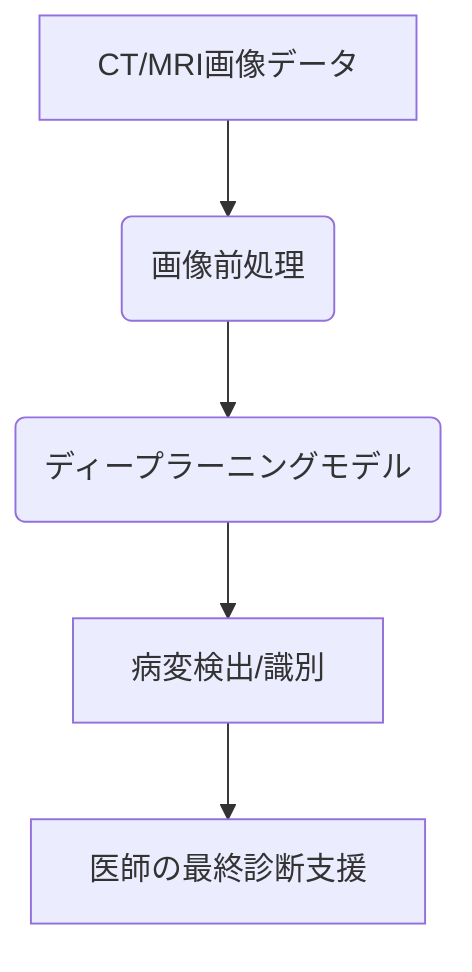

# T10-05-03 医療におけるAI診断・画像解析

## Summary（5つの要点）

1. **AI診断**: **レントゲン**、**CT**、**MRI**、**内視鏡**などの**医療画像**を**AI**（**ディープラーニング**）で**解析**し、**病変**の**検出**、**識別**、**定量**を**行う**技術。
2. **画像解析の役割**: **医師**の**診断**を**支援**し、**見落とし**を**防ぐ**とともに、診断の**効率**と**均一性**を**向上**させる。特に、**放射線科**や**病理診断**で**活用**が進む。
3. **病理診断**: **細胞**や**組織**の**デジタルスライド**を**AI**が**解析**し、**悪性度**の**分類**や**予後**の**予測**を行う。診断の**属人性**を**排除**する。
4. **ディープラーニング**: **大量**の**教師データ**（正常・異常の画像と診断結果）で**AI**を**学習**させ、人間には識別が**困難**な**微細**な**特徴**を**検出**する。
5. **課題**: **AI**を**学習**させるための**高品質**な**アノテーション（注釈）付きデータ**の**確保**、**AI**が下した診断の**根拠**の**説明**（**公平性**と**信頼性**）、そして**保険適用**の**拡大**。

#### 概念図

---

### 技術評価表（定量的な視点）
| 評価項目 | 評価 | 根拠 |
| :--- | :--- | :--- |
| 導入コスト | ⭐⭐⭐☆☆ | **AIソフトウェアライセンス**、**サーバー費用**、**データ整備コスト** |
| 技術成熟度 | ⭐⭐⭐⭐☆ | 一部の**画像診断支援**で**既に薬事承認**され、**実用化段階** |
| 日本の競争力 | ⭐⭐⭐⭐☆ | **医療画像機器メーカー**が**強く**、**データ整備**も進む |
| 市場性 | ⭐⭐⭐⭐⭐ | **医師**の**負担軽減**、**医療**の**質向上**ニーズから**急成長市場** |
| 品質保証の重要性 | ⭐⭐⭐⭐⭐ | **誤診**は患者の**生命**に関わるため、**信頼性**と**安全性**が**最重要** |

---

## 日本の立ち位置・強み弱みのSummary

### 強み：日本企業や研究機関が持つ独自の技術、優位性などを箇条書きで記述。

* **医療機器メーカー**: **キヤノン**、**富士フイルム**など、**画像診断機器**の**高いシェア**。
* **研究開発**: **国立がん研究センター**などの**病院**と**連携**した**AI開発**。
* **薬事承認**: **医療機器**としての**AIソフトウェア**の**迅速**な**薬事承認実績**。

### 弱み：日本が抱える規制、標準化の遅れ、海外依存などを箇条書きで記述。

* **データの壁**: **医療機関間**での**データ連携**や**共有**が**遅れ**、**学習データ**の**不足**が**課題**。
* **AI人材**: **医療**と**IT**の**両方**に**精通**した**AI開発・運用人材**が**不足**。
* **保険適用**: **新しいAI技術**の**保険適用**の**プロセス**が**複雑**で**時間**がかかる。

---

## 技術ロードマップ（短期/中期/長期）

### 短期目標（～2027年）

* **放射線**、**眼科**、**内視鏡**など**特定**の**疾患**の**検出**を**目的**とした**AI**が**広範**に**普及**し、**診断支援**の**標準**となる。

### 中期目標（2028年～2031年）

* **マルチモダリティAI**（画像、遺伝子、**電子カルテ（T10-05-01）**データを**統合**）が**開発**され、**予後予測**や**治療効果予測**に**応用**される。
* **病理診断**の**AI**が**医師**を**代替**する形で一部の**一次診断**を**担う**。

### 長期目標（2032年～2035年）

* **AI**が**医師**と**協調**する**「ヒューマン・イン・ザ・ループ」診断**が**確立**し、**誤診率**が**ゼロ**に**近づく**。
* **ウェアラブルデバイス（T10-05-02）**からの**リアルタイム生体データ**と**画像解析**が**統合**され、**個別**の**予防医療**が**実現**する。

### 📚 参照リンク

1. [公正取引委員会 医療AIに関する調査報告書](https://www.ftc.go.jp/houdou/pressrelease/2023/jun/230628_kansa-h.html)
2. [日本医療研究開発機構 (AMED) AI医療プロジェクト](https://www.amed.go.jp/)