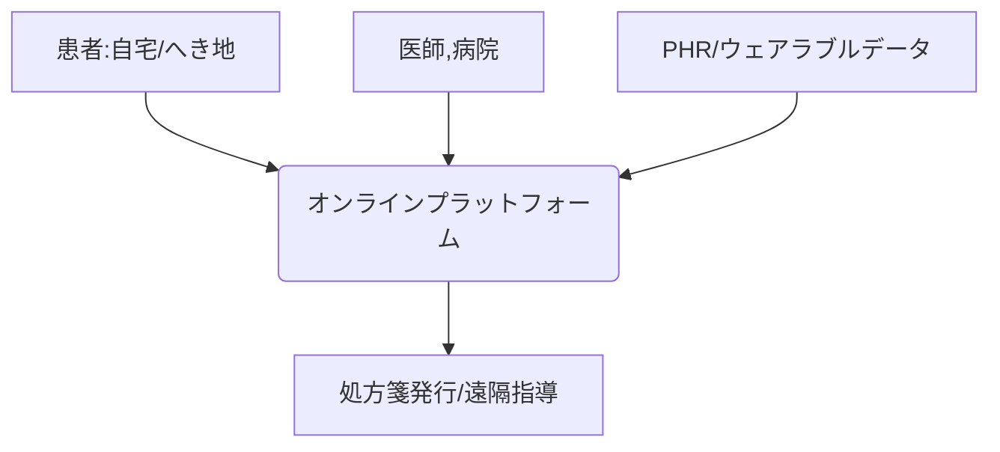

# T10-05-04 遠隔医療とオンライン診療

## Summary（5つの要点）

1. 遠隔医療: 情報通信技術（ICT）を利用して、遠隔地にいる患者と医師を繋ぎ、診療、診断、指導、治療などを行う医療行為の総称。
2. オンライン診療: 医師と患者がリアルタイムで行う診察。対面診療と組み合わせて、慢性疾患の定期的なフォローアップや再診に利用される。
3. メリット: 地理的な制約を解消し、医療過疎地域や離島に専門医の診療を提供できる。患者の移動負担や院内感染リスクを軽減する。
4. 連携: ウェアラブルデバイス（T10-05-02）やPHRから得られた生体データを活用し、遠隔で患者の状態を詳細に把握しながら診療を行う。
5. 課題: 初診の制限、触診や聴診など身体所見の取得の難しさ、通信環境の不安定さ、そしてセキュリティと医療事故の責任の明確化。

#### 概念図

---

### 技術評価表（定量的な視点）
| 評価項目 | 評価 | 根拠 |
| :--- | :--- | :--- |
| 導入コスト | ⭐⭐☆☆☆ | プラットフォーム構築、端末・通信環境整備にコスト |
| 技術成熟度 | ⭐⭐⭐⭐☆ | 通信技術は確立。制度・運用面の成熟度が課題 |
| 日本の競争力 | ⭐⭐⭐☆☆ | 技術は世界水準だが、規制により導入が遅れた歴史がある |
| 市場性 | ⭐⭐⭐⭐☆ | 地域医療の維持、慢性疾患増加により需要は確実 |
| 品質保証の重要性 | ⭐⭐⭐⭐☆ | 通信の安定性、セキュリティ、診断の質の確保が重要 |

---

## 日本の立ち位置・強み弱みのSummary

### 強み：日本企業や研究機関が持つ独自の技術、優位性などを箇条書きで記述。

* 安定した通信網: 高速で安定した5Gなどの通信インフラ。
* 高齢化社会: 医療ニーズが高いため、遠隔医療の必要性が極めて高い。
* 規制緩和: 新型コロナ禍を機にオンライン診療の規制緩和が進んだ。

### 弱み：日本が抱える規制、標準化の遅れ、海外依存などを箇条書きで記述。

* 初診の壁: 原則、初診のオンライン診療は制限されており、普及の足かせとなっている。
* 機器の連携: 電子カルテ（T10-05-01）やPHRとオンライン診療システムの円滑な連携が課題。
* 医師の習熟度: オンライン診療への対応に慣れていない医師がまだ多い。

---

## 技術ロードマップ（短期/中期/長期）

### 短期目標（～2027年）

* オンライン診療の保険適用範囲が拡大し、慢性疾患の再診での利用が一般化する。

### 中期目標（2028年～2031年）

* 触診や聴診を代替する遠隔診断デバイスが普及し、オンライン診療で対応できる疾患が増加する。
* 地域の薬局と連携したオンライン服薬指導が標準化する。

### 長期目標（2032年～2035年）

* 医師の判断が必要な場合を除き、AIが遠隔モニタリングと連動した自動診断・処方支援を行うシステムが構築される。
* 国際的な遠隔専門医ネットワークが構築され、世界中の患者が専門医療を受けられるようになる。

### 📚 参照リンク

1. [厚生労働省 オンライン診療の適切な実施に関する指針](https://www.mhlw.go.jp/stf/seisakunitsuite/bunya/0000161401.html)
2. [日本遠隔医療学会](http://j-telemed.org/)