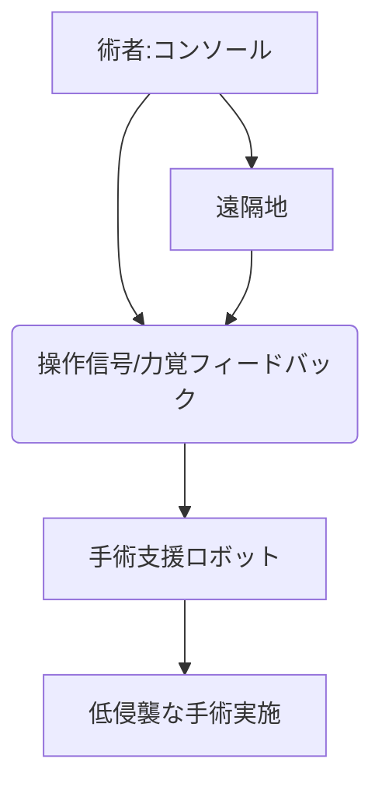

# T10-05-05 ロボット手術（ダヴィンチ等）と遠隔手術

## Summary（5つの要点）

1. ロボット手術: 医師がコンソールから操作し、多関節を持つ手術支援ロボットを使って行う手術。代表例はダヴィンチ（Intuitive Surgical）。
2. 低侵襲性: 小さな切開で手術が可能なため、患者の身体的負担が軽減され、回復が早い。
3. 高精度: 術者の手の震えを補正し、肉眼では見えない視野を3Dで拡大して見せることで、複雑な手技を正確に行うことができる。
4. 遠隔手術: 高速・低遅延の通信技術（5Gなど）を使って、遠隔地からロボットを操作し、手術を行う。高度な専門医療をへき地に提供できる可能性がある。
5. 課題: 導入コストの高さ、医師の操作習熟にかかる時間、遠隔手術における通信遅延リスクと法的な責任の所在。

#### 概念図

---

### 技術評価表（定量的な視点）
| 評価項目 | 評価 | 根拠 |
| :--- | :--- | :--- |
| 導入コスト | ⭐⭐☆☆☆ | 機器本体、メンテナンス、消耗品などすべてが高額 |
| 技術成熟度 | ⭐⭐⭐⭐☆ | 泌尿器科、消化器外科で標準的な治療法として確立 |
| 日本の競争力 | ⭐⭐⭐☆☆ | ダヴィンチへの依存度が高いが、国産メーカーの追い上げがある |
| 市場性 | ⭐⭐⭐⭐⭐ | 低侵襲手術への移行、適用疾患の拡大で市場は拡大 |
| 品質保証の重要性 | ⭐⭐⭐⭐⭐ | 機器の誤作動、通信障害は患者の生命に直結 |

---

## 日本の立ち位置・強み弱みのSummary

### 強み：日本企業や研究機関が持つ独自の技術、優位性などを箇条書きで記述。

* 精密機械: ロボット、精密機器における製造技術が世界トップクラス。
* 国産ロボット: 川崎重工業のhinotoriなど、国産メーカーの参入と保険適用の拡大。
* 医師の技術: 細やかな手技を可能にする医師の高い技術水準。

### 弱み：日本が抱える規制、標準化の遅れ、海外依存などを箇条書きで記述。

* 市場占有率: Intuitive Surgical（ダヴィンチ）の市場独占が続いている。
* コストと保険適用: 導入コストの高さ、保険適用の範囲がまだ限定的。
* 遠隔手術の法整備: 遠隔手術に関する法的な責任や規制の整備が遅れている。

---

## 技術ロードマップ（短期/中期/長期）

### 短期目標（～2027年）

* ロボット手術の保険適用疾患がさらに拡大し、導入病院が増加する。

### 中期目標（2028年～2031年）

* AIが術前計画と術中ナビゲーションを支援し、ロボット手術の安全性と効率が向上する。
* 国産の手術支援ロボットが海外市場へ本格的に進出する。

### 長期目標（2032年～2035年）

* 5Gや次世代通信を使った遠隔手術が実用化され、専門医の技能が地理的制約を超えて提供される。
* 完全な自動手術支援ロボット（自律的な手術補助）が開発される。

### 📚 参照リンク

1. [Intuitive Surgical Japan](https://www.intuitivesurgical.com/ja/)
2. [日本ロボット外科学会](http://www.jrses.jp/)