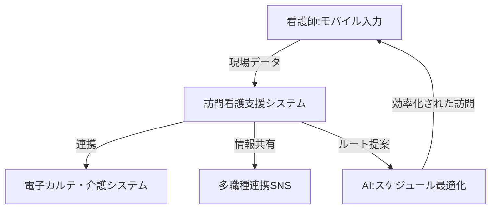

--- 
title: T10-06-01 在宅医療支援システム・訪問看護DX
url: https://ewellibow.jp/news/press/2636/
date: 2025-11-14
tags:
  - 訪問看護
  - DX
  - AI
  - 電子カルテ連携
  - 多職種連携
source: テクノロジーロードマップ2026-2035 第2部第10章、Google検索
---

# T10-06-01 在宅医療支援システム・訪問看護DX

## Summary（5つの要点）

1.  **人材不足解消の鍵**: 訪問看護ステーション数の増加（年平均8.8%成長）に対し、深刻な看護師不足と小規模経営の課題を抱えており、DXによる業務効率化が不可欠。
2.  **モバイル連携と記録の自動化**: モバイル端末を用いた**現場での記録入力**と、**電子カルテ（EHR）**や**介護記録システム**とのシームレスなデータ連携により、事務作業時間を大幅に短縮する。
3.  **AIによる動態管理**: 訪問先への移動ルートをAIがリアルタイムで最適化し、悪天候や交通状況の変化にも対応。複数の訪問案件を効率的にスケジューリングすることで、訪問件数の最大化と残業削減を実現する。
4.  **多職種連携SNSの活用**: 医師、薬剤師、ケアマネジャー、介護士などの多職種間で、機密性を担保した専用SNSを通じて患者情報を迅速に共有し、連携ミスによるヒヤリハットを防止する。
5.  **データに基づいた品質評価**: 記録された訪問データやケア内容を分析し、ケアの質を定量的に評価。標準化された質の高いケアを提供するPDCAサイクルを支援する。

#### 概念図

---

### 技術評価表（定量的な視点）

| 評価項目 | 評価 | 根拠 |
| :--- | :--- | :--- |
| 導入コスト | ⭐⭐⭐⭐☆ | クラウド型システムの利用により、初期導入コストは低減傾向にあるが、ステーション間の導入格差は大きい。 |
| 技術成熟度 | ⭐⭐⭐⭐☆ | 基本機能（記録、請求）は成熟。AIによる高度な最適化や動態管理は急速に普及中。 |
| 日本の競争力 | ⭐⭐⭐⭐⭐ | 日本独自の介護保険制度に特化したシステム（iBowなど）が国内市場をリードしており、競争力は極めて高い。 |
| 市場性 | ⭐⭐⭐⭐⭐ | 2025年以降の在宅医療需要の急増、人員不足を背景に、導入は必要不可欠とされ、市場は拡大し続ける。 |
| 品質保証の重要性 | ⭐⭐⭐⭐☆ | 誤った情報入力、通信障害による記録遅延は、報酬請求ミスやケアミスにつながるため、システムの信頼性が極めて重要。 |

---

## 日本の立ち位置・強み弱みのSummary

### 強み

* **国内特有の制度対応力**: 介護保険・医療保険制度に完全に準拠したシステムが早期に開発され、使い勝手に優れている。
* **モバイル通信インフラ**: 5G/LTEネットワークが国内全域に整備されており、訪問時のモバイル入力、リアルタイム連携を安定して行える。
* **現場知見のデータ化**: 訪問看護師の現場の知見や業務フローがシステム設計に深く反映されており、実務に即した改善が進められている。

### 弱み

* **小規模ステーションのITリテラシー格差**: 営利法人による大手の導入が進む一方、小規模なステーションでは依然として紙ベースの業務が多く、DXの恩恵が行き届いていない。
* **多職種連携の壁**: システム間の連携が不十分で、異なる事業所（病院、薬局、ケアマネ事業所）が異なるシステムを使用しているため、シームレスな情報共有に課題が残る。
* **看護師のAI活用への抵抗感**: AIによるスケジュールや業務改善の提案に対し、人間の判断や経験を優先する傾向があり、新しい技術の導入が慎重になる場合がある。

---

## 技術ロードマップ（短期/中期/長期）

### 短期目標（～2027年）

* 主要な訪問看護支援システムが、AIによる**移動時間予測**と**自動スケジュール調整機能**を標準機能として提供する。
* **モバイル端末での音声入力機能**を強化し、看護記録の入力時間を20%削減する。
* **地域包括ケアシステム**内の全事業所間で、患者の基本情報、バイタル情報、ケア記録を**標準化されたAPI**で共有可能とする。

### 中期目標（2028年～2031年）

* ウェアラブルデバイスからのバイタルデータを、訪問看護支援システムに**自動でフィードバック**し、訪問時のバイタル入力作業を廃止する。
* AIが過去のデータから患者の**急変リスク**や**退院後の生活破綻リスク**を予測し、訪問看護計画を自動で推奨する機能を実装する。
* **ブロックチェーン技術**などを活用し、多職種連携における機密性の高い情報共有の**トレーサビリティ**と**セキュリティ**を確立する。

### 長期目標（2032年～2035年）

* 訪問看護師の業務が事務作業から完全に解放され、**高度な臨床判断**と**専門性の高い手技**に特化する。
* 全国全ての訪問看護ステーションで、**AI駆動型**の統合支援システムが稼働し、看護師一人当たりの対応可能件数を現在の1.5倍に引き上げる。
* **地域医療機関**、**調剤薬局**、**在宅機器メーカー**のシステムが完全に連携し、患者中心のシームレスなケアを実現する。

### 📚 参照リンク

1.  医療現場で活躍するウェアラブルデバイスとは？種類・機能や活用事例を紹介: [https://www.technology-doctor.com/articles/3id3cyXi](https://www.technology-doctor.com/articles/3id3cyXi)
2.  過去最高の増加数！ 訪問看護ステーション 開設・廃止・休止 最新情報: [https://ewellibow.jp/news/press/2636/](https://ewellibow.jp/news/press/2636/)
3.  医療・ヘルスケア分野におけるIoT事例20選: [https://www.kotora.jp/c/itiger-case-330/](https://www.kotora.jp/c/itiger-case-330/)
