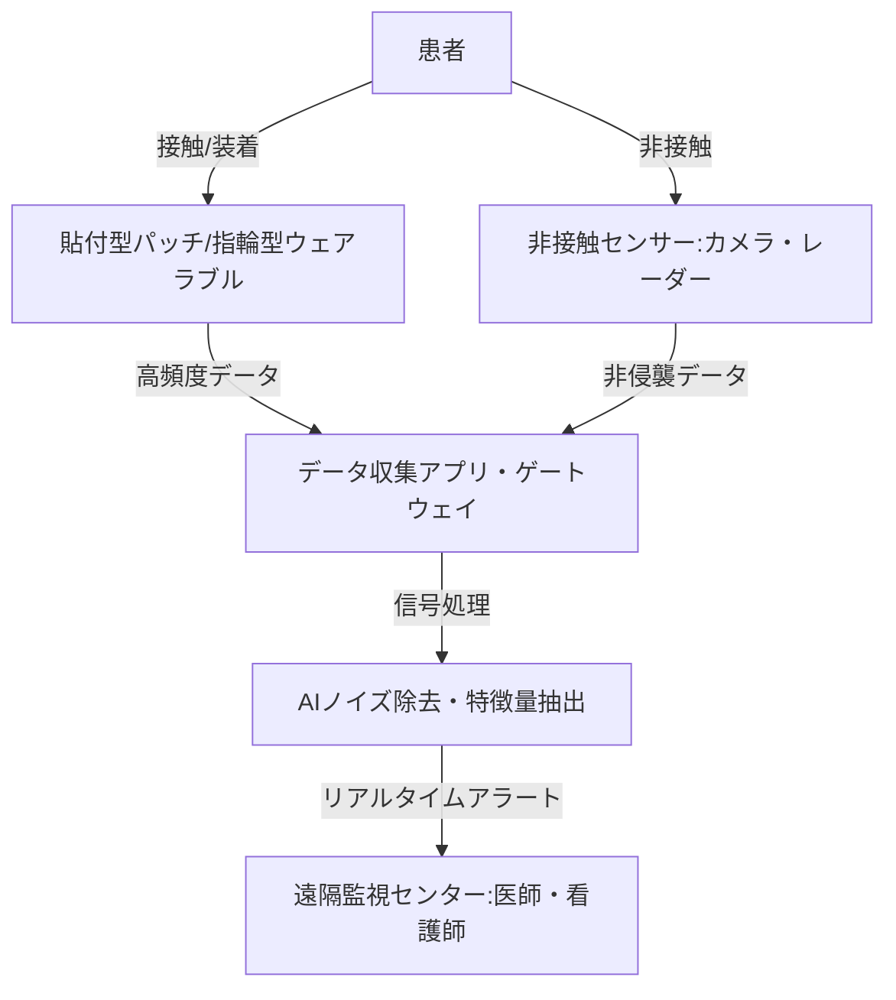

--- 
title: T10-06-02 ウェアラブル・非接触バイタルセンシング
url: https://www.marketresearchfuture.com/ja/reports/wearable-sensors-market-955
date: 2025-11-14
tags:
  - ウェアラブル
  - RPM
  - CGM
  - 非接触センサー
  - バイタルモニタリング
source: テクノロジーロードマップ2026-2035 第2部第10章、Google検索
---

# T10-06-02 ウェアラブル・非接触バイタルセンシング

## Summary（5つの要点）

1.  **市場の急成長**: ウェアラブルセンサー市場はCAGR 46.73%で成長しており、遠隔患者モニタリング（RPM）が主要な推進力となっている。
2.  **連続血糖測定（CGM）の普及**: 糖尿病患者にとっての自己管理ツールとして、針刺し不要または低侵襲の**連続血糖測定センサー**の精度向上と小型化が進み、保険適用も拡大している。
3.  **非接触でのデータ収集**: センサーを皮膚に貼付するのではなく、**ミリ波レーダー**、**高感度カメラ**、**非接触パルスオキシメーター**などにより、患者にストレスを与えることなく心拍、呼吸、睡眠を常時モニタリングする技術が開発されている。
4.  **AIによる信号処理**: ウェアラブルデバイス特有の体動ノイズや環境ノイズを除去し、医療レベルの精度でバイタルデータを抽出するために、**AI信号処理技術**が不可欠となっている。
5.  **デジタル治療への応用**: 収集されたバイタルデータは、Apple HealthKit、Fitbitなどのコンシューマヘルスケアだけでなく、**デジタルセラピューティクス（DTx）**のフィードバックデータとしても活用され、治療効果の検証と最適化に用いられる。

#### 概念図

---

### 技術評価表（定量的な視点）

| 評価項目 | 評価 | 根拠 |
| :--- | :--- | :--- |
| 導入コスト | ⭐⭐⭐⭐☆ | 廉価なコンシューマデバイスの利用拡大で低コスト化が進む一方、医療グレードのパッチ型センサーはコスト高。 |
| 技術成熟度 | ⭐⭐⭐⭐☆ | 心拍、SpO2、活動量の計測は成熟。**非侵襲・非接触血糖値測定**や、高精度の**血圧連続測定**は研究・実証段階。 |
| 日本の競争力 | ⭐⭐⭐☆☆ | センサー部品技術は強いが、プラットフォーム（Apple、Google、Fitbit）や、医療機器承認済みのDTx連携では欧米に後れ。 |
| 市場性 | ⭐⭐⭐⭐⭐ | 慢性疾患患者の増加、遠隔医療の推進により、今後10年間で最も成長が期待される分野の一つ。 |
| 品質保証の重要性 | ⭐⭐⭐⭐⭐ | データ精度が低ければ、診断・治療ミスに直結。特に非接触・非侵襲技術では、環境変化による誤差の保証が課題。 |

---

## 日本の立ち位置・強み弱みのSummary

### 強み

* **高精度な小型部品技術**: TDK、村田製作所などの企業が、高性能で小型のMEMSセンサー、バッテリー、通信モジュール部品で世界的な優位性を持つ。
* **オムロンなど大手医療機器メーカーの参入**: 医療機器メーカーとしての信頼性・ノウハウを活かし、高精度の血圧計や体温計をベースとしたウェアラブルデバイス開発に強みを持つ。
* **非接触センシングの研究**: 大学・研究機関で、ミリ波レーダーやテラヘルツ波を用いた非接触・非侵襲のバイタルセンシング技術の研究が活発。

### 弱み

* **コンシューマヘルスケアプラットフォームの不在**: Apple HealthKitやFitbitのような、データを統合し、ユーザー体験を支配するプラットフォームを国内メーカーが確立できていない。
* **医療機器承認のハードル**: ウェアラブルデバイスを「医療機器」として承認し、保険適用に結びつけるプロセスが海外に比べて長く、市場投入が遅れる傾向がある。
* **AI信号処理の知見不足**: 生体データ解析に必要な高度なAI・機械学習の専門家が、ハードウェア中心の国内メーカー内に不足している。

---

## 技術ロードマップ（短期/中期/長期）

### 短期目標（～2027年）

* 医療機器承認された**パッチ型ECG**や**CGM**の普及率を、主要な慢性疾患患者層で30%に引き上げる。
* ウェアラブルデバイスのデータと電子カルテの連携を、APIを通じて標準化し、データ連携の自動化を完了する。
* **AI信号処理アルゴリズム**を導入し、体動ノイズ耐性を向上させたウェアラブル血圧連続測定技術の実証試験を開始する。

### 中期目標（2028年～2031年）

* **非接触バイタルセンシング**技術（ミリ波レーダー、高感度カメラ）を、病室や高齢者住宅での見守りシステムとして本格導入し、夜間の転倒・急変リスク検知を自動化する。
* **非侵襲血糖値測定技術**（光学式、テラヘルツ波式）の精度を臨床レベルまで引き上げ、医療機器として承認を取得する。
* ウェアラブルデータを用いた**AI予後予測モデル**の信頼性を確立し、医師の治療方針決定支援に活用する。

### 長期目標（2032年～2035年）

* 装着の必要がない**完全非接触型**のホームヘルスモニタリングシステムが標準化され、在宅患者のバイタルデータ収集を意識せずに実施可能とする。
* 複数のウェアラブル・非接触センサーからのデータを統合し、**複合的な健康状態**をAIが診断し、自動で予防的な介入を促すDTx連携システムを確立する。
* 医療データプラットフォームと連携し、個人が許諾したウェアラブルデータを**リアルワールドデータ（RWD）**として活用する基盤を構築する。

### 📚 参照リンク

1.  ウェアラブルセンサーの市場規模、レポート、シェア| 2030年までの業界の成長: [https://www.marketresearchfuture.com/ja/reports/wearable-sensors-market-955](https://www.marketresearchfuture.com/ja/reports/wearable-sensors-market-955)
2.  【2025年最新情報】訪問看護ステーション数が過去最多、“年平均プラス8.8％”の高成長: [https://prtimes.jp/main/html/rd/p/000000077.000026391.html](https://prtimes.jp/main/html/rd/p/000000077.000026391.html)
3.  医療・ヘルスケア分野におけるIoT事例20選: [https://www.kotora.jp/c/itiger-case-330/](https://www.kotora.jp/c/itiger-case-330/)
4.  医療現場で活躍するウェアラブルデバイスとは？種類・機能や活用事例を紹介: [https://www.technology-doctor.com/articles/3id3cyXi](https://www.technology-doctor.com/articles/3id3cyXi)
5.  2024年のウェアラブル医療機器市場のトップ10企業: [https://www.emergenresearch.com/jp/blog/%E3%83%88%E3%83%83%E3%83%9710-%E4%BC%81%E6%A5%AD-%E3%82%A4%E3%83%B3-%E3%82%A6%E3%82%A7%E3%82%A2%E3%83%A9%E3%83%96%E3%83%AB-%E5%8C%BB%E7%99%82-%E3%83%87%E3%83%90%E3%82%A4%E3%82%B9-%E5%B8%82%E5%A0%B4](https://www.emergenresearch.com/jp/blog/%E3%83%88%E3%83%83%E3%83%9710-%E4%BC%81%E6%A5%AD-%E3%82%A4%E3%83%B3-%E3%82%A6%E3%82%A7%E3%82%A2%E3%83%A9%E3%83%96%E3%83%AB-%E5%8C%BB%E7%99%82-%E3%83%87%E3%83%90%E3%82%A4%E3%82%B9-%E5%B8%82%E5%A0%B4)
6.  生体センシング最新技術20選: [https://corp.linkers.net/blog/openwithlinkers/8432/](https://corp.linkers.net/blog/openwithlinkers/8432/)
7.  医薬品開発における IoT活用の現状と課題: [https://www.jpma.or.jp/information/evaluation/results/allotment/lofurc0000005gid-att/iot.pdf](https://www.jpma.or.jp/information/evaluation/results/allotment/lofurc0000005gid-att/iot.pdf)
