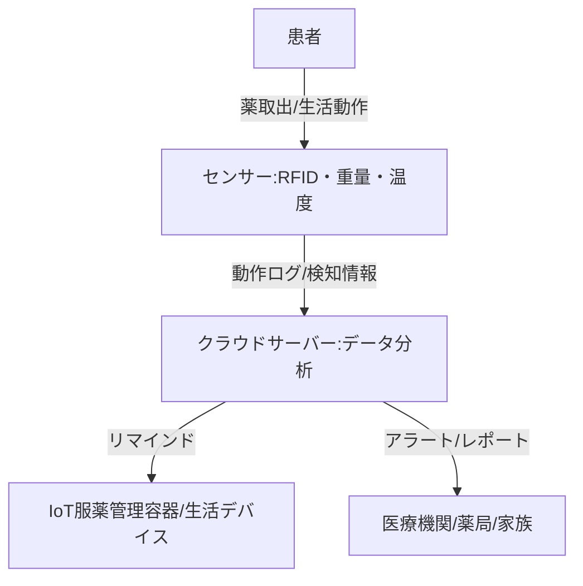

--- 
title: T10-06-03 IoT服薬管理・生活支援デバイス
url: https://www.kotora.jp/c/itiger-case-330/
date: 2025-11-14
tags:
  - 服薬管理
  - IoT
  - 見守り
  - ADL
  - 薬局DX
source: テクノロジーロードマップ2026-2035 第2部第10章、Google検索
---

# T10-06-03 IoT服薬管理・生活支援デバイス

## Summary（5つの要点）

1.  **服薬アドヒアランスの向上**: 飲み忘れ、飲み間違いは在宅医療における最も深刻な課題の一つであり、服薬時間になるとLEDや音声で通知する**IoT服薬支援容器**がその解決策となる。
2.  **リアルタイムの服薬検知**: 容器から薬が取り出されたことをセンサー（例: RFID、重量センサー）が検知し、その情報をサーバーを通じて医療機関や家族にリアルタイムで共有する。
3.  **生活動作の見守り**: 電気ポット（象印「みまもりホットラインi Pot」）やベッドセンサー（パラマウントベッド「離床CATCH」）など、利用者の**日常生活動作（ADL）**のログを収集し、平時との差異から異常や体調悪化の兆候を検知する。
4.  **薬剤師との連携強化**: 服薬検知データが薬剤師に共有されることで、薬剤師が患者の服薬状況を把握し、オンライン服薬指導や残薬管理をより効果的に実施できる。
5.  **患者の自立支援**: IoTデバイスによるリマインドとモニタリングにより、特に高齢者が服薬や日常生活において他者の介入なしに自立して行動できる期間（自立期間）を延長する効果が期待される。

#### 概念図

---

### 技術評価表（定量的な視点）

| 評価項目 | 評価 | 根拠 |
| :--- | :--- | :--- |
| 導入コスト | ⭐⭐⭐⭐☆ | 既存の生活機器を応用した見守りサービスは低コストで普及が進む。専用の服薬管理デバイスはやや高価。 |
| 技術成熟度 | ⭐⭐⭐⭐☆ | 基本的な通知・検知機能は成熟。複数の薬剤・複雑な処方への対応や、薬剤の温度・湿度の厳密な管理機能は高度化段階。 |
| 日本の競争力 | ⭐⭐⭐⭐⭐ | 日本独自の高齢者向け見守り家電（ポット、ベッド）の実績、および大塚製薬・NECなどによる実用化事例があり、生活密着型IoTでは強みを持つ。 |
| 市場性 | ⭐⭐⭐⭐⭐ | 超高齢社会において、服薬管理と安否確認は在宅医療の根幹であり、市場は安定的に拡大する。 |
| 品質保証の重要性 | ⭐⭐⭐⭐⭐ | 服薬検知の誤り（偽陽性/偽陰性）は、医師・薬剤師の判断ミスにつながり、患者の治療に深刻な影響を与える。 |

---

## 日本の立ち位置・強み弱みのSummary

### 強み

* **家電・精密機器メーカーの参入**: 象印、タニタ、オムロンなどのメーカーが、生活機器とIoT技術を組み合わせた見守りソリューションで先行している。
* **薬剤師による指導体制との連携**: 対面・オンラインでの服薬指導（OPE）とIoTデバイスが連携し、指導効果のモニタリングに活用できる法制度が整備されつつある。
* **高齢者・家族の受容性**: 既存の生活機器に近い形態のIoTデバイスは、新しい技術への抵抗感が少なく、高齢者本人や見守る家族に受け入れられやすい。

### 弱み

* **多剤併用・複雑な処方への対応**: 複数の錠剤、液剤、頓服薬など、複雑な処方に対応できる統合的な服薬管理システムが不足している。
* **薬局・病院間のデータ連携の遅れ**: 服薬状況データが、処方箋を発行した医師や薬剤師へスムーズに連携されるための、地域医療連携システム上の標準化が遅れている。
* **データのプライバシー・セキュリティ懸念**: 服薬・生活パターンという機密性の高いデータをクラウドで管理・共有する際の、個人情報保護とサイバーセキュリティ対策が課題。

---

## 技術ロードマップ（短期/中期/長期）

### 短期目標（～2027年）

* **IoT服薬管理容器**のコストを大幅に削減し、主要な薬局チェーンでのレンタル・販売を標準化する。
* **薬局と服薬検知システム**のAPI連携を確立し、薬剤師が複数の患者の服薬状況をダッシュボードで一元管理できる環境を整備する。
* **ベッドセンサー**、**ドア開閉センサー**などの見守りIoTデバイスからのデータを、ケアマネジャーや訪問介護事業所へ自動通知するシステムを構築する。

### 中期目標（2028年～2031年）

* **AI**が服薬検知データとバイタルデータ（T10-06-02）を統合分析し、**服薬アドヒアランスの低下を予兆段階で予測**し、医療従事者に通知する。
* **複雑な多剤併用処方**に対応できる、個別トレイ式・自動分包型のIoTディスペンサーを開発し、病院・薬局への導入を促進する。
* IoT生活ログデータから、**認知機能の低下**や**活動量の急激な変化**を検知し、医療機関に自動でスクリーニング情報を提供する。

### 長期目標（2032年～2035年）

* **服薬管理から残薬管理まで**を完全に自動化する、クローズドループ型のシステムを確立。処方箋の更新、調剤、自宅配送、服薬検知、残薬確認をAIがサポートする。
* 全ての在宅患者宅に、**非接触センシング**と**IoT生活ログ分析**を統合した**スマートホーム・ヘルスケアシステム**を標準装備し、常時見守り体制を実現する。
* IoTデバイスのデータが、治療効果、QOL改善度合いを評価するRWDとして活用され、**医療費の適正化**に貢献する。

### 📚 参照リンク

1.  ウェアラブルセンサーの市場規模、レポート、シェア| 2030年までの業界の成長: [https://www.marketresearchfuture.com/ja/reports/wearable-sensors-market-955](https://www.marketresearchfuture.com/ja/reports/wearable-sensors-market-955)
2.  【2025年最新情報】訪問看護ステーション数が過去最多、“年平均プラス8.8％”の高成長: [https://prtimes.jp/main/html/rd/p/000000077.000026391.html](https://prtimes.jp/main/html/rd/p/000000077.000026391.html)
3.  医療・ヘルスケア分野におけるIoT事例20選: [https://www.kotora.jp/c/itiger-case-330/](https://www.kotora.jp/c/itiger-case-330/)
