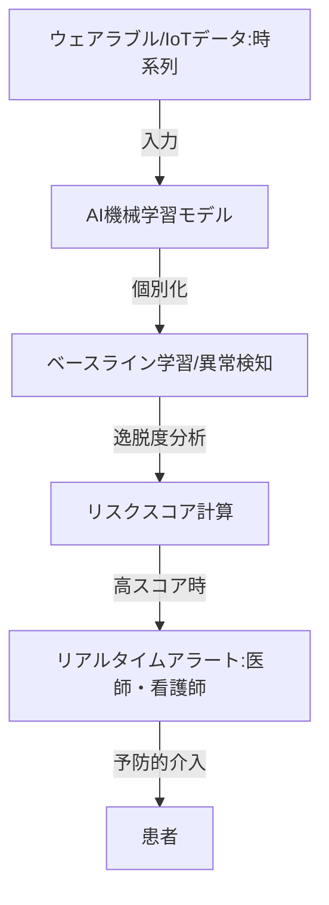

--- 
title: T10-06-04 在宅向けAI異常検知・リスク予測
url: https://www.technology-doctor.com/articles/3id3cyXi
date: 2025-11-14
tags:
  - AI診断
  - 異常検知
  - リスク予測
  - 時系列データ
  - 急変予知
source: テクノロジーロードマップ2026-2035 第2部第10章、Google検索
---

# T10-06-04 在宅向けAI異常検知・リスク予測

## Summary（5つの要点）

1.  **時系列データによる急変予知**: ウェアラブルセンサーから得られる心拍数、呼吸数、睡眠パターンなどの**時系列データ**をAIが継続的に分析し、**心不全増悪**、**肺炎兆候**、**敗血症**などの重篤な状態への進行を未然に予測する。
2.  **個別化されたベースライン設定**: 患者個々の平時のバイタル値や活動量（ベースライン）をAIが学習し、このベースラインから逸脱した微細な変化を検知することで、汎用的な閾値設定による誤検知を減らす。
3.  **転倒・徘徊リスクの早期アラート**: ウェアラブルデバイスや設置型センサーのデータに加え、IoT家電の利用状況（T10-06-03）を統合し、活動量の低下や歩行パターンの変化から、転倒リスクや認知症患者の**徘徊リスク**を早期に検知する。
4.  **予防的介入のトリガー**: AIがリスクを検知した場合、医師や訪問看護師へアラートを送信し、症状が悪化する前に**服薬調整**、**訪問回数の増加**、または**入院勧奨**などの予防的な医療介入を促す。
5.  **教師なし学習の活用**: 異常データを事前に収集することが困難な在宅医療の特性から、正常なパターンを学習させ、それからの逸脱を異常とみなす**教師なし異常検知**（例：オートエンコーダ、One-Class SVM）技術の応用が不可欠となる。

#### 概念図

---

### 技術評価表（定量的な視点）

| 評価項目 | 評価 | 根拠 |
| :--- | :--- | :--- |
| 導入コスト | ⭐⭐☆☆☆ | 高度な機械学習モデルと大規模なデータ統合プラットフォームが必要であり、開発・運用コストが高い。 |
| 技術成熟度 | ⭐⭐⭐☆☆ | 病院内の集中治療室（ICU）では実績があるが、ノイズの多い在宅環境での高精度な異常検知は開発途上。 |
| 日本の競争力 | ⭐⭐⭐☆☆ | 医療AI領域ではGoogle Health、IBM Watsonなどのグローバル企業が先行。国内ではデータ量の確保とモデル開発で追従中。 |
| 市場性 | ⭐⭐⭐⭐⭐ | 救急搬送・入院を回避できれば医療費を大幅に削減できるため、保険者・医療機関双方から高いニーズがある。 |
| 品質保証の重要性 | ⭐⭐⭐⭐⭐ | 偽陰性（見落とし）は患者の生命に関わる。偽陽性（誤報）は医療従事者の疲弊とアラート無視につながるため、精度担保が最重要課題。 |

---

## 日本の立ち位置・強み弱みのSummary

### 強み

* **質の高い臨床データ**: 医療現場での電子カルテ普及率が高く、データクリーニングと匿名化が進めば、AI学習に有用な臨床データが確保できる可能性を持つ。
* **国立研究機関のリード**: 理化学研究所、国立循環器病研究センターなどが、時系列生体データを用いたAI予測モデルの研究開発をリードしている。
* **ヘルスケア企業との連携**: オムロン、タニタなど、コンシューマ向けデバイスのデータ統合プラットフォームをAI解析基盤として活用できる素地がある。

### 弱み

* **医療データのサイロ化**: 病院ごとに電子カルテのベンダーが異なり、データ形式が標準化されていないため、広範囲な学習データの収集・統合に大きな障壁がある。
* **教師なし学習技術者の不足**: 複雑な時系列データから異常を抽出する高度なAI（教師なし学習、深層学習）を開発・運用できる専門家が、医療分野で不足している。
* **法規制と倫理的な課題**: AIによる急変リスク予測が、医師の判断にどの程度影響を与えるか、また、アラートを無視した場合の責任の所在など、法規制・倫理面での整備が追いついていない。

---

## 技術ロードマップ（短期/中期/長期）

### 短期目標（～2027年）

* **特定疾患（心不全、COPD）**に特化したAI異常検知モデルを開発し、大学病院や専門クリニックでの臨床試験を開始する。
* **教師なし異常検知モデル**を導入し、在宅環境で発生するノイズの多いデータに対応可能な基盤技術を確立する。

* 医療機器承認を得るためのAIモデルの**透明性（説明可能性）**と**信頼性評価**の標準ガイドラインを策定する。

### 中期目標（2028年～2031年）

* AI異常検知システムを在宅医療専門クリニックや訪問看護ステーションに導入し、**救急搬送率を10%削減**する効果を実証する。
* ウェアラブルデータ、検査値、服薬履歴など**異種混合データ**を統合処理するAIモデルを開発し、複数の疾患リスクを同時に予測可能にする。
* 患者の**生活ログデータ**（睡眠、食事、活動）をAI予測モデルに組み込み、医療的な異常だけでなく、生活の質の低下も検知可能にする。

### 長期目標（2032年～2035年）

* AIが予測したリスクに基づき、医療従事者の介入なしに、**自動で治療計画を微調整**する（例：遠隔でデバイスの薬剤注入量を調整）**クローズドループシステム**を確立する。
* **全患者の全バイタルデータ**が統合された国家レベルの**リアルタイムリスクモニタリングシステム**を構築し、在宅医療の質を底上げする。
* AIの予測結果が、医療行為における**法的・倫理的な責任**を持つための制度を整備し、AIを臨床判断の「パートナー」として確立する。

### 📚 参照リンク

1.  ウェアラブルセンサーの市場規模、レポート、シェア| 2030年までの業界の成長: [https://www.marketresearchfuture.com/ja/reports/wearable-sensors-market-955](https://www.marketresearchfuture.com/ja/reports/wearable-sensors-market-955)
2.  【2025年最新情報】訪問看護ステーション数が過去最多、“年平均プラス8.8％”の高成長: [https://prtimes.jp/main/html/rd/p/000000077.000026391.html](https://prtimes.jp/main/html/rd/p/000000077.000026391.html)
3.  医療・ヘルスケア分野におけるIoT事例20選: [https://www.kotora.jp/c/itiger-case-330/](https://www.kotora.jp/c/itiger-case-330/)
4.  医療現場で活躍するウェアラブルデバイスとは？種類・機能や活用事例を紹介: [https://www.technology-doctor.com/articles/3id3cyXi](https://www.technology-doctor.com/articles/3id3cyXi)
