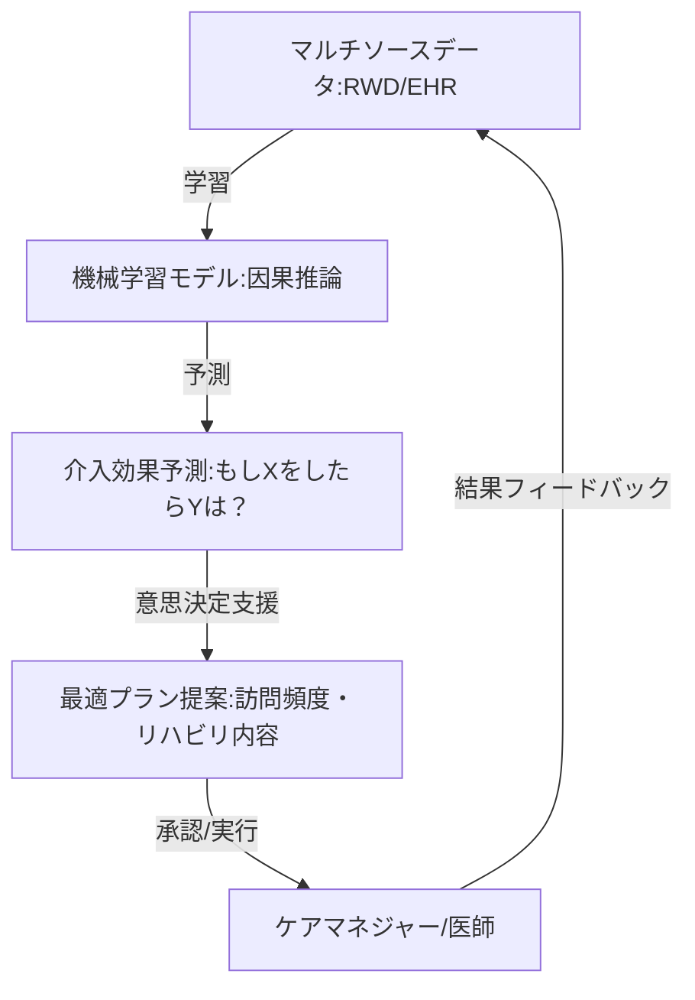

--- 
title: T10-06-05 在宅ケアプランの機械学習最適化
url: https://www.technology-doctor.com/articles/3id3cyXi
date: 2025-11-14
tags:
  - AIケアプラン
  - 機械学習
  - 因果推論
  - 個別化医療
  - 介入効果予測
source: テクノロジーロードマップ2026-2035 第2部第10章、Google検索
---

# T10-06-05 在宅ケアプランの機械学習最適化

## Summary（5つの要点）

1.  **経験則からの脱却**: 従来のケアプラン作成がケアマネジャーや医師の経験に依存しがちであったのに対し、AIが過去の膨大なデータから**最適解**を導き出し、ケアの質と効率を両立させる。
2.  **因果推論による介入効果の予測**: 「訪問看護の回数を増やした場合」「特定のリハビリを行った場合」といった**介入（treatment）**が、患者のアウトカム（ADL改善、入院回避）に与える**真の因果効果**を機械学習（例：Causal Inference）を用いて予測する。
3.  **パーソナライズされたプラン提案**: 患者の遺伝情報、ライフスタイル、バイタル、治療薬、環境要因などの**マルチオミクスデータ**と**リアルワールドデータ（RWD）**を統合し、一人ひとりに最適なケアプランを自動で生成する。
4.  **リソースの最適配分**: 医療機関・介護事業所の限られたリソース（看護師、介護士の訪問時間）を、AIが予測した患者の**リスクスコア**（T10-06-04）に基づいて最適に配分し、全体として最も効率的かつ安全なケア体制を構築する。
5.  **フィードバックループの実現**: 提案されたケアプランの実施結果（アウトカム）を再びAIモデルにフィードバックし、モデルを継続的に学習・改善することで、ケアの品質をスパイラル状に向上させる。

#### 概念図

---

### 技術評価表（定量的な視点）

| 評価項目 | 評価 | 根拠 |
| :--- | :--- | :--- |
| 導入コスト | ⭐⭐☆☆☆ | 因果推論や高度な機械学習の専門知識を持つAIエンジニアと、大規模なデータ基盤が必要であり、コストは極めて高い。 |
| 技術成熟度 | ⭐⭐⭐☆☆ | 統計学的な因果推論は確立されているが、医療・介護分野のRWDを用いた大規模な実証は途上。特に日本の制度に合わせたモデル開発はこれから。 |
| 日本の競争力 | ⭐⭐☆☆☆ | 基礎研究では一定の知見があるものの、実用化・社会実装においては、データ利活用が進む欧米・中国に大きく後れを取っている。 |
| 市場性 | ⭐⭐⭐⭐⭐ | 医療・介護費用増加の抑制と、国民の健康寿命延伸に直結するため、政府・保険者からの導入圧力は最大級に高い。 |
| 品質保証の重要性 | ⭐⭐⭐⭐⭐ | AIが提案したプランが患者に不利益をもたらした場合の責任問題、また、プランの公平性・倫理的な正当性を保証する必要がある。 |

---

## 日本の立ち位置・強み弱みのSummary

### 強み

* **医療・介護保険制度の整備**: 公的な制度下で全患者のデータが一定期間記録されており、データ統合が進めば、高品質なRWDとして活用できるポテンシャルを持つ。
* **産学連携研究**: 医療機関とAIベンチャー企業、大学などが連携し、在宅医療データを用いた予測モデルの共同研究が進んでいる。
* **個別化医療への強いニーズ**: 超高齢化社会において、限られた医療リソースを最も必要とする人に最適配分するための切実なニーズがある。

### 弱み

* **データ統合・標準化の遅延**: 医療・介護・生活データを統合的に利用するための、**データレイク**や**データマート**の構築、およびデータフォーマットの標準化が遅れている。
* **AIモデルのブラックボックス性**: 因果推論モデルの出力する結果が、ケアマネジャーや医師にとって**説明可能**でない場合、現場での導入と信頼獲得が困難になる。
* **因果推論技術者の不足**: 単なる相関関係ではなく、介入による真の因果関係を分析できる高度な機械学習技術を持つ人材が極めて不足している。

---

## 技術ロードマップ（短期/中期/長期）

### 短期目標（～2027年）

* **特定疾患・特定介入**（例：心不全患者への訪問看護頻度）に絞った因果推論モデルを開発し、その予測精度を医師の判断と比較する実証実験を実施する。
* **地域医療連携ネットワーク**内で、匿名化されたケアプラン実行データとアウトカムデータ（入院・退院・死亡）をAI学習用に共有する仕組みを構築する。
* ケアマネジャーや医師がAIの予測結果を直感的に理解できる**AI説明可能性（XAI）インターフェース**のプロトタイプを開発する。

### 中期目標（2028年～2031年）

* **複数の介入**（服薬、リハビリ、訪問看護）を組み合わせた場合の複合的な因果効果を予測できる、**マルチ介入モデル**を確立し、主要な医療機関で導入する。
* AIが提案した最適ケアプランを導入した患者群と、従来プランの患者群を比較する**大規模比較臨床研究**を実施し、医療費削減効果とQOL向上効果を定量的に証明する。
* AI提案プランの**法的・倫理的ガイドライン**を策定し、現場での責任の所在を明確にする。

### 長期目標（2032年～2035年）

* 全国の在宅医療・介護サービスにおいて、AIによる最適ケアプランの提案が**標準ツール**として活用され、リソース配分とケア品質の判断基盤となる。
* ウェアラブル、IoT、電子カルテ、ゲノム情報など、**あらゆるデータ**を統合・分析し、**生命科学的な根拠**に基づいた超個別化医療プランをAIが自動で生成する体制を確立する。
* AIの予測モデルを**医療機器**として認証し、その信頼性と有効性を公的に保証する。

### 📚 参照リンク

1.  ウェアラブルセンサーの市場規模、レポート、シェア| 2030年までの業界の成長: [https://www.marketresearchfuture.com/ja/reports/wearable-sensors-market-955](https://www.marketresearchfuture.com/ja/reports/wearable-sensors-market-955)
2.  【2025年最新情報】訪問看護ステーション数が過去最多、“年平均プラス8.8％”の高成長: [https://prtimes.jp/main/html/rd/p/000000077.000026391.html](https://prtimes.jp/main/html/rd/p/000000077.000026391.html)
3.  医療・ヘルスケア分野におけるIoT事例20選: [https://www.kotora.jp/c/itiger-case-330/](https://www.kotora.jp/c/itiger-case-330/)
4.  医療現場で活躍するウェアラブルデバイスとは？種類・機能や活用事例を紹介: [https://www.technology-doctor.com/articles/3id3cyXi](https://www.technology-doctor.com/articles/3id3cyXi)
