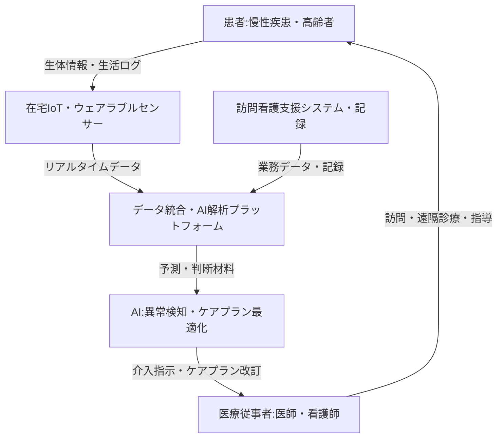

--- 
title: T10-06 在宅医療 必要不可欠テクノロジー
url: https://www.marketresearchfuture.com/ja/reports/wearable-sensors-market-955
date: 2025-11-14
tags:
  - 在宅医療
  - 遠隔患者モニタリング
  - ウェアラブル
  - IoT
  - 訪問看護DX
  - AI医療
source: テクノロジーロードマップ2026-2035 第2部第10章、Google検索
---

# T10-06 在宅医療 必要不可欠テクノロジー

## Summary（5つの要点）

1.  **遠隔患者モニタリング（RPM）の普及**: 高齢化と慢性疾患の増加に伴い、**ウェアラブルセンサー**を用いたリアルタイムのバイタルデータ（心拍、SpO2、血糖値）収集と遠隔監視が在宅医療の効率化に不可欠となっている。
2.  **AIによるケアプラン最適化**: 収集された長期データに基づき、**機械学習**や**因果推論**を用いて在宅ケアプランを個別最適化し、医療アウトカムの改善とコスト削減を目指す。
3.  **訪問看護業務のDX推進**: 訪問看護ステーションの人材不足と小規模経営の課題を解決するため、看護支援システムを通じた記録の自動化、**AIによるスケジュール最適化**、多職種連携（医師、薬剤師、介護士）の強化が急務。
4.  **IoT服薬管理・生活支援**: 服薬時間通知や取り出し検知機能を備えたIoTデバイス（例: 大塚製薬/NECの服薬支援容器）により、飲み忘れを防止し、患者の自立した生活を支援する。
5.  **非侵襲・非接触センシング**: 皮膚に貼付するパッチ型センサーや、ミリ波・光学技術を用いた**非接触**での生体情報（心拍、呼吸、体温）モニタリング技術が、患者のQOL向上とデータ精度の向上を実現する。

#### 概念図

---

### 技術評価表（定量的な視点）

| 評価項目 | 評価 | 根拠 |
| :--- | :--- | :--- |
| 導入コスト | ⭐⭐⭐☆☆ | ウェアラブルは安価だが、統合プラットフォームや高度AIシステムの導入は高額になる傾向がある。 |
| 技術成熟度 | ⭐⭐⭐⭐☆ | 基本のRPM機能、電子カルテ連携は実用化済み。AIによる高度なケアプラン最適化は開発・実証段階。 |
| 日本の競争力 | ⭐⭐⭐☆☆ | センサー・精密機器（オムロン、TDK）は強いが、統合プラットフォームやデジタルセラピューティクス（DTx）では欧米に後れ。 |
| 市場性 | ⭐⭐⭐⭐⭐ | 団塊の世代の後期高齢者入り（2025年問題）、在宅シフト政策により、国内は巨大な潜在市場。 |
| 品質保証の重要性 | ⭐⭐⭐⭐⭐ | データ欠損、誤検知、機器誤作動が患者の生命に直結。医療機器承認プロセスとデータセキュリティが極めて重要。 |

---

## 日本の立ち位置・強み弱みのSummary

### 強み

* **精密センサー・機器製造技術**: オムロン、TDKなどに代表される、小型・高精度なバイタルセンサー、血圧計などの医療機器製造技術が世界的に優位。
* **介護・見守り実績**: 電動ポット（象印）、ベッドセンサー（パラマウントベッド）など、生活家電・介護機器を活用した独自の**見守りシステム**が実用化されており、生活密着型データ収集に強みを持つ。
* **医療・製薬大手によるIT化推進**: 大塚製薬とNECによる服薬支援容器など、大手企業がIoT技術を用いた具体的な在宅支援ソリューションを開発・提供開始している。

### 弱み

* **訪問看護の人材不足とシステムの小規模分散**: 在宅需要の増加に対し、看護師の担い手不足が深刻化。訪問看護ステーションが小規模分散しており、ITシステム導入の標準化・広域展開が遅れがち。
* **規制・データ共有の遅れ**: 医療データの利活用に関する規制が厳しく、多職種間でのシームレスなデータ共有や、AIによる広域的な最適化に必要なデータセット構築が欧米に比べて遅れている。
* **デジタルセラピューティクス（DTx）の遅れ**: 服薬管理アプリや認知行動療法アプリなど、治療効果を持つソフトウェア（DTx）の実用化と保険適用が、米国に比べるとまだ限定的。

---

## 技術ロードマップ（短期/中期/長期）

### 短期目標（～2027年）

* **基本RPMの標準化**: 連続血糖測定（CGM）やパッチ型心電図センサーなど、主要なウェアラブルデバイスの医療機器承認と保険適用を拡大し、在宅患者への普及率を50%以上に向上させる。
* **訪問看護DXツールの全国展開**: 訪問看護支援システムの機能に、AIによる移動ルート最適化機能を標準搭載し、看護師の記録・移動時間を10%削減する。
* **多職種連携プラットフォームの構築**: 地域医療連携ネットワークに、在宅患者のIoTデータを連携するAPIを標準化し、医師・薬剤師・看護師・介護士間のリアルタイム情報共有基盤を整備する。

### 中期目標（2028年～2031年）

* **AIケアプランの臨床適用**: ウェアラブルと電子カルテの統合データを用い、AIが患者の行動変容や介入効果を予測する**因果推論モデル**を確立し、ケアプランの自動提案・最適化を臨床現場で実証する。
* **次世代DTxの開発と承認**: 高血圧、慢性心不全など、在宅医療で頻度の高い慢性疾患を対象とした**デジタル治療アプリ**を開発し、医療機器として承認・保険適用を実現する。
* **非接触センサーの実用化**: ミリ波レーダーや非接触カメラによるバイタルサインモニタリング技術を実用化し、特に認知症患者や重症患者の見守り体制を強化する。

### 長期目標（2032年～2035年）

* **AI駆動型ホームホスピタル実現**: AIが患者の全データを統合し、異常の予測、介入指示、専門医への自動コンサルテーションを行う**完全統合型在宅ケア管理プラットフォーム**を全国で運用する。
* **閉ループ型服薬・生活管理システム**: IoT服薬管理デバイスと生体センサーを連携させ、服薬状況や生体情報に基づき、AIが生活指導や処方調整のサポートを行う**閉ループ**システムの確立。
* **医療従事者の役割再定義**: 在宅AIとロボティクス（配膳、移動支援）の全面導入により、訪問看護師・介護士が記録業務から解放され、**高度な対人スキル**と**臨床判断**に特化した業務へシフトする。

### 📚 参照リンク

1.  ウェアラブルセンサーの市場規模、レポート、シェア| 2030年までの業界の成長: [https://www.marketresearchfuture.com/ja/reports/wearable-sensors-market-955](https://www.marketresearchfuture.com/ja/reports/wearable-sensors-market-955)
2.  【2025年最新情報】訪問看護ステーション数が過去最多、“年平均プラス8.8％”の高成長: [https://prtimes.jp/main/html/rd/p/000000077.000026391.html](https://prtimes.jp/main/html/rd/p/000000077.000026391.html)
3.  医療・ヘルスケア分野におけるIoT事例20選 健康と生命を守る最先端アイテム: [https://www.kotora.jp/c/itiger-case-330/](https://www.kotora.jp/c/itiger-case-330/)
4.  医療現場で活躍するウェアラブルデバイスとは？種類・機能や活用事例を紹介: [https://www.technology-doctor.com/articles/3id3cyXi](https://www.technology-doctor.com/articles/3id3cyXi)
5.  2024年のウェアラブル医療機器市場のトップ10企業: [https://www.emergenresearch.com/jp/blog/%E3%83%88%E3%83%83%E3%83%9710-%E4%BC%81%E6%A5%AD-%E3%82%A4%E3%83%B3-%E3%82%A6%E3%82%A7%E3%82%A2%E3%83%A9%E3%83%96%E3%83%AB-%E5%8C%BB%E7%99%82-%E3%83%87%E3%83%90%E3%82%A4%E3%82%B9-%E5%B8%82%E5%A0%B4](https://www.emergenresearch.com/jp/blog/%E3%83%88%E3%83%83%E3%83%9710-%E4%BC%81%E6%A5%AD-%E3%82%A4%E3%83%B3-%E3%82%A6%E3%82%A7%E3%82%A2%E3%83%A9%E3%83%96%E3%83%AB-%E5%8C%BB%E7%99%82-%E3%83%87%E3%83%90%E3%82%A4%E3%82%B9-%E5%B8%82%E5%A0%B4)
6.  生体センシング最新技術20選: [https://corp.linkers.net/blog/openwithlinkers/8432/](https://corp.linkers.net/blog/openwithlinkers/8432/)
7.  医薬品開発における IoT活用の現状と課題: [https://www.jpma.or.jp/information/evaluation/results/allotment/lofurc0000005gid-att/iot.pdf](https://www.jpma.or.jp/information/evaluation/results/allotment/lofurc0000005gid-att/iot.pdf)
