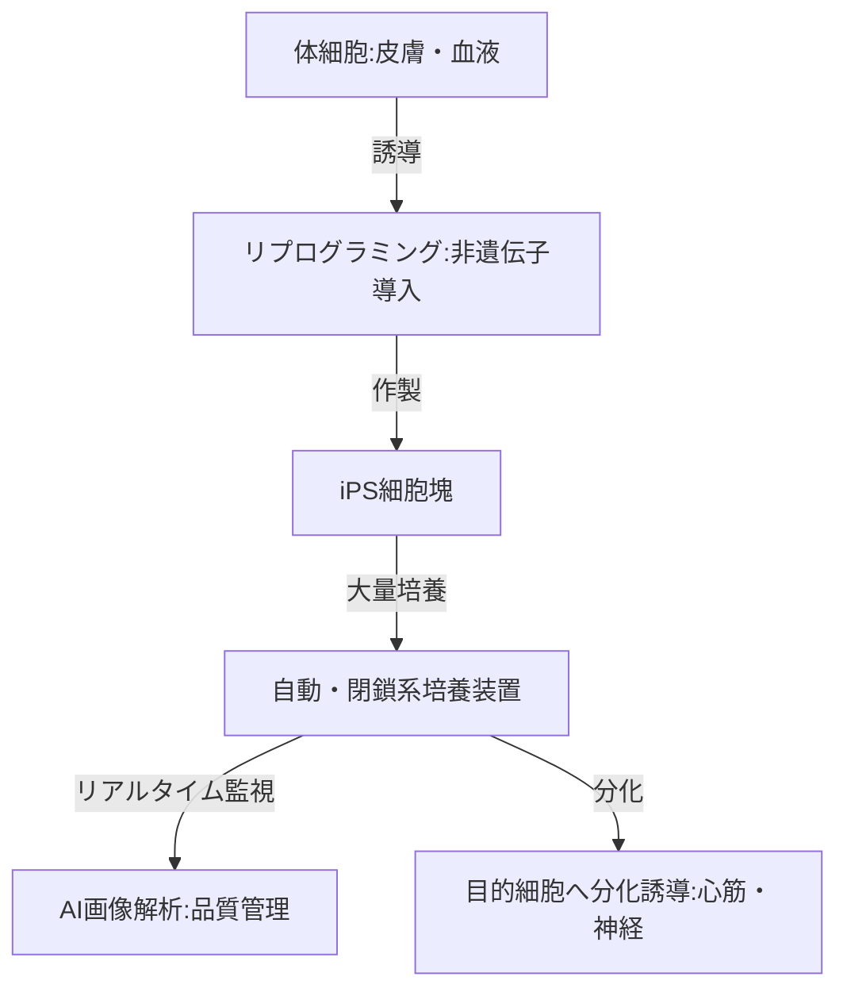

--- 
title: T10-07-01 iPS細胞作製・培養技術
url: https://www.jst.go.jp/pr/report/2021/202102-p03.html
date: 2025-11-14
tags:
  - iPS細胞
  - 再生医療
  - 細胞培養
  - 大量生産
  - 閉鎖系
source: テクノロジーロードマップ2026-2035 第2部第10章、Google検索
---

# T10-07-01 iPS細胞作製・培養技術

## Summary（5つの要点）

1.  **高品質な細胞の安定的供給**: iPS細胞を医療応用するには、個々の研究室レベルから脱却し、**高効率**かつ**均一な品質**を保ったまま**大量**に製造する技術が不可欠。
2.  **自動化・閉鎖系培養システムの導入**: 培養工程（培地交換、継代）を**ロボット**や**自動装置**で代替し、**無菌環境**を維持する**閉鎖系システム**を導入することで、人為的なエラーやコンタミネーションのリスクを排除する。
3.  **新規リプログラミング因子の探求**: 山中因子（Oct4, Sox2, Klf4, c-Myc）に代わる、より安全性が高く、効率的、かつ短期間でiPS細胞を作製できる**新規な低分子化合物や非遺伝子導入**によるリプログラミング技術が研究されている。
4.  **分化誘導の最適化**: iPS細胞を目的とする細胞（心筋細胞、神経細胞、網膜細胞など）へ高純度で分化させるための**培地組成**、**分化因子**、**培養条件**の最適化が、細胞治療製品の有効性を左右する。
5.  **AI・画像解析による品質管理**: 培養途中の細胞の形態、増殖速度、コロニー形状などを**AI**が自動で画像解析し、品質異常を早期に検知することで、製造プロセスのロット間差を最小限に抑える。

#### 概念図

---

### 技術評価表（定量的な視点）

| 評価項目 | 評価 | 根拠 |
| :--- | :--- | :--- |
| 導入コスト | ⭐⭐☆☆☆ | 自動培養装置、CPC（細胞調製施設）の設置・維持に高額な設備投資が必要。 |
| 技術成熟度 | ⭐⭐⭐⭐☆ | iPS細胞の作製技術は確立。大量・自動・閉鎖系培養技術は、実証・初期導入段階にある。 |
| 日本の競争力 | ⭐⭐⭐⭐⭐ | 山中伸弥教授による発明、ストック事業など、iPS細胞作製・初期応用において世界を圧倒的にリード。 |
| 市場性 | ⭐⭐⭐⭐☆ | 難治性疾患の根本治療や創薬スクリーニングへの応用が期待され、市場は非常に大きいが、保険適用と量産コストが課題。 |
| 品質保証の重要性 | ⭐⭐⭐⭐⭐ | 遺伝子変異、未分化細胞混入、汚染は腫瘍形成リスクに直結するため、世界で最も厳しい品質管理が要求される。 |

---

## 日本の立ち位置・強み弱みのSummary

### 強み

* **iPS細胞の独創性**: 技術の発祥地であり、基礎研究レベルでの知見、特許、研究者が豊富。
* **iPS細胞ストック事業**: 京都大学iPS細胞研究所（CiRA）が、拒絶反応の低いiPS細胞をあらかじめ備蓄する事業を世界に先駆けて展開。
* **製造装置メーカーの協力体制**: 富士フイルム、日立製作所など、異業種の大手企業が、自動培養装置や品質管理システム開発で参入し、実用化を推進。

### 弱み

* **コスト高**: 既存の閉鎖系自動培養装置は高額であり、細胞製品の製造コストが非常に高い。これが保険適用や普及の最大の障壁となっている。
* **分化誘導の複雑性**: 目的細胞（特に機能性の高いもの）への分化誘導プロトコルが複雑で、ロットごとの均一性を保つのが難しい。
* **ベンチャーの資金力**: 欧米のバイオベンチャーに比べ、国内の再生医療ベンチャーは資金調達規模が小さく、臨床開発スピードで後れを取る傾向がある。

---

## 技術ロードマップ（短期/中期/長期）

### 短期目標（～2027年）

* **iPS細胞ストック**の備蓄対象をさらに拡大し、様々なヒト白血球型抗原（HLA）型に対応可能なストックを整備する。
* **自動閉鎖系培養装置**の導入コストを現状から30%削減し、大学病院やバイオベンチャーへの普及を促進する。
* AIによる**培養細胞の品質自動評価システム**を医療機器として承認し、実用化する。

### 中期目標（2028年～2031年）

* iPS細胞由来の**心筋シート**、**神経前駆細胞**など主要な細胞製品が複数の疾患で保険適用となり、大量生産体制に移行する。
* 山中因子に頼らない、**非遺伝子導入**かつ**高効率**なリプログラミング技術が確立され、臨床応用における安全性がさらに向上する。
* iPS細胞の分化誘導プロセスを**完全自動化**し、人手を介さない一貫製造ラインを構築する。

### 長期目標（2032年～2035年）

* iPS細胞技術が**全ての難治性疾患**（パーキンソン病、脊髄損傷、心不全など）の治療選択肢の一つとなり、一般的な治療法として普及する。
* 患者の体内で直接目的の細胞へ誘導する**In Vivoリプログラミング**技術の基礎が確立される。
* iPS細胞を用いた創薬スクリーニングが、新薬開発の**標準プロセス**となる。

### 📚 参照リンク

1.  iPS細胞研究の最前線と産業応用への期待（JST）: [https://www.jst.go.jp/pr/report/2021/202102-p03.html](https://www.jst.go.jp/pr/report/2021/202102-p03.html)
2.  再生医療等製品の製造・品質管理（厚生労働省）: [https://www.mhlw.go.jp/stf/seisakunitsuite/bunya/0000109919.html](https://www.mhlw.go.jp/stf/seisakunitsuite/bunya/0000109919.html)
