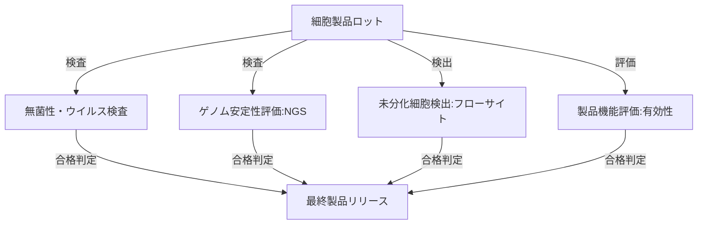

--- 
title: T10-07-02 細胞製品の品質管理・安全性評価
url: https://www.pmda.go.jp/rs-shinsa/saisei/0002.html
date: 2025-11-14
tags:
  - 再生医療
  - 品質管理
  - 安全性評価
  - CMC
  - ゲノム安定性
source: テクノロジーロードマップ2026-2035 第2部第10章、Google検索
---

# T10-07-02 細胞製品の品質管理・安全性評価

## Summary（5つの要点）

1.  **品質の均一性確保（CMC/CTP）**: 細胞はバッチ（ロット）ごとにばらつきやすく、製造プロセスの全段階で**均一な品質**を確保するための**CMC（Chemistry, Manufacturing, and Control）**基準、特に**CTP（Cell and Tissue Product）**基準の確立が不可欠。
2.  **ゲノム安定性評価**: 培養中に細胞のゲノムに異常が生じ、**腫瘍化リスク**を持つ細胞が出現するのを防ぐため、**次世代シーケンサー（NGS）**を用いた**高感度**なゲノム安定性評価技術（染色体異常、変異）を標準化する。
3.  **未分化細胞の検出・除去**: 目的の細胞（例：心筋細胞）に混入した**未分化な幹細胞**は、移植後に腫瘍（テラトーマ）を形成するリスクがあるため、**フローサイトメトリー**や**特異的抗体**を用いた高精度な検出・除去技術を確立する。
4.  **ウイルス・マイコプラズマ等の混入検査**: 培地や製造環境由来の**微生物（ウイルス、細菌、マイコプラズマ）**の混入を迅速かつ高感度に検査する技術（例：**リアルタイムPCR**）を確立し、製品の無菌性を保証する。
5.  **リアルタイムトレーサビリティ**: どのロットの細胞が、どの患者に、いつ、どのように移植されたかという情報を、**ブロックチェーン**などの技術を用いてセキュアかつリアルタイムに追跡できるシステムを構築する。

#### 概念図

---

### 技術評価表（定量的な視点）

| 評価項目 | 評価 | 根拠 |
| :--- | :--- | :--- |
| 導入コスト | ⭐⭐⭐☆☆ | NGSやフローサイトメトリーなど高額な分析機器が必要だが、製造コスト全体に占める割合は適正化が進む。 |
| 技術成熟度 | ⭐⭐⭐⭐☆ | 従来のGMP（医薬品製造管理基準）をベースに、細胞治療特有の評価基準（ゲノム安定性など）が急速に確立中。 |
| 日本の競争力 | ⭐⭐⭐⭐☆ | 薬事承認の迅速化制度（条件・期限付き承認）とPMDAの積極的なガイダンスにより、審査基準の国際標準化をリード。 |
| 市場性 | ⭐⭐⭐⭐⭐ | 細胞治療の普及に必須の技術であり、細胞製造受託機関（CMO）の需要拡大に伴い市場が急成長。 |
| 品質保証の重要性 | ⭐⭐⭐⭐⭐ | 安全性は患者の生命に直結し、品質のばらつきは有効性を損なうため、最優先の課題。 |

---

## 日本の立ち位置・強み弱みのSummary

### 強み

* **規制面の柔軟性**: 世界に先駆けた**「条件及び期限付き承認制度」**により、安全性を確保しつつ早期実用化を促す環境がある。
* **PMDAの取り組み**: 医薬品医療機器総合機構（PMDA）が、再生医療等製品に特化した審査基準やガイダンスを積極的に公表し、開発を支援している。
* **CMOの参入**: 富士フイルムなどの大手企業が、細胞製品の受託製造（CMO）事業に本格参入し、高品質な製造体制の確立を急いでいる。

### 弱み

* **標準化の遅れ**: 細胞製品の評価項目や測定方法について、国際的な標準化（ISO/ICH）がまだ途上であり、国内基準と国際基準の調整に時間がかかる。
* **リアルタイム解析のボトルネック**: 細胞の機能や有効性を移植直前に短時間で評価する**インライン・リアルタイム**な分析技術がまだ未成熟。
* **トレーサビリティの複雑さ**: 製造から移植まで、関わる医療機関や事業者が多く、シームレスでセキュアな情報連携システムの構築に課題が残る。

---

## 技術ロードマップ（短期/中期/長期）

### 短期目標（～2027年）

* **リアルタイムPCR**や**NGS**を用いた**マイコプラズマ・ウイルス検査**を製造ロットリリースの標準試験とし、検査時間を半減する。
* **ゲノム安定性評価**において、ディープラーニングを活用した**画像解析AI**を導入し、細胞の異常な増殖や形態変化を自動検知する。
* 細胞製造施設（CPC）間の**品質管理データ**を共有し、プロセスを標準化するための**デジタルプラットフォーム**の運用を開始する。

### 中期目標（2028年～2031年）

* **未分化細胞**を、特殊な抗体やアプタマーを用いて高感度に検出・**自動除去**するデバイスを開発し、製品の安全性を極限まで高める。
* 製造から移植までの**全工程**における**温度・時間・人為的介入**のログを**ブロックチェーン**に記録し、完全なトレーサビリティを確立する。
* 細胞製品の**有効性**を、**バイオマーカー**の量などで**短時間**に評価する**インライン分析技術**を確立する。

### 長期目標（2032年～2035年）

* **AI**が製造過程の全データを監視し、**品質異常を予測**して工程を自動修正する**クローズドループ型**の自動品質管理システムが実現する。
* 細胞製品の製造・評価プロセスが完全に**国際標準化**され、世界中のどのCMOで製造された製品も同等の品質であることを保証する。
* 細胞治療の**長期的な追跡データ**（RWD）と製造データを連携させ、製造品質が治療アウトカムに与える**因果関係**を解析する。

### 📚 参照リンク

1.  再生医療等製品の製造・品質管理（PMDA）: [https://www.pmda.go.jp/rs-shinsa/saisei/0002.html](https://www.pmda.go.jp/rs-shinsa/saisei/0002.html)
2.  再生医療等の安全性の確保等に関する法律の概要: [https://www.mhlw.go.jp/stf/seisakunitsuite/bunya/0000109919.html](https://www.mhlw.go.jp/stf/seisakunitsuite/bunya/0000109919.html)
