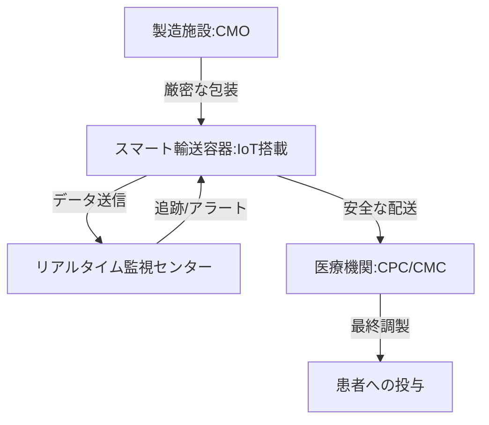

--- 
title: T10-07-03 細胞輸送・保存技術（CPC/CMC）
url: https://www.medipolis-gh.com/regenerative-medicine/column/detail/20211124-1.html
date: 2025-11-14
tags:
  - 細胞輸送
  - CPC
  - CMC
  - 凍結保存
  - コールドチェーン
source: テクノロジーロードマップ2026-2035 第2部第10章、Google検索
---

# T10-07-03 細胞輸送・保存技術（CPC/CMC）

## Summary（5つの要点）

1.  **超低温コールドチェーンの維持**: 再生医療製品、特に自家細胞治療薬の多くは**超低温（-80℃、-196℃）**での厳密な管理が必要であり、製造施設（CMO）から投与施設まで一貫した**コールドチェーン**の維持が極めて重要。
2.  **リアルタイム温度・位置モニタリング**: 輸送容器に**IoTセンサー**を搭載し、温度、湿度、衝撃、GPS位置情報をリアルタイムで記録・監視することで、輸送中の品質異常や紛失リスクを最小化し、トレーサビリティを確保する。
3.  **新規凍結保護剤・ガラス化保存**: 従来のDMSO（ジメチルスルホキシド）などの凍結保護剤は細胞毒性の問題があり、より安全性が高く、**細胞生存率**を向上させる**新規の凍結保護剤**や、氷晶の形成を避ける**ガラス化保存技術**が求められている。
4.  **自動細胞調製センター（CPC/CMC）の効率化**: 医療機関内に設置される**CPC（Cell Processing Center）**または**CMC（Cell Manufacturing Center）**において、細胞の**最終調製**（解凍、洗浄、再懸濁）を、**自動化**された**小型**・**閉鎖系**のデバイスで行い、作業効率と安全性を高める。
5.  **輸送容器のスマート化**: 外部電源なしで長期間安定した温度を維持できる**真空断熱**技術や、**熱電冷却**技術を用いた**スマート輸送容器**が、長距離輸送や医療過疎地への細胞製品の供給を可能にする。

#### 概念図

---

### 技術評価表（定量的な視点）

| 評価項目 | 評価 | 根拠 |
| :--- | :--- | :--- |
| 導入コスト | ⭐⭐⭐☆☆ | 輸送容器、IoTセンサー、CPC維持コストは高いが、輸送・保存ミスによる細胞廃棄のリスクを回避できる。 |
| 技術成熟度 | ⭐⭐⭐⭐☆ | 凍結保存は成熟。IoTによるリアルタイムモニタリング、小型自動CPCの技術は急速に普及中。 |
| 日本の競争力 | ⭐⭐⭐⭐☆ | 輸送・計測機器メーカーがコールドチェーン技術に強み。特に品質保証とトレーサビリティの要求水準が高い。 |
| 市場性 | ⭐⭐⭐⭐⭐ | 再生医療のグローバル展開と病院連携に必須であり、ロジスティクス市場として急拡大している。 |
| 品質保証の重要性 | ⭐⭐⭐⭐⭐ | 温度逸脱や輸送中の事故は、細胞の失活と製品の廃棄、治療機会の喪失に直結する。 |

---

## 日本の立ち位置・強み弱みのSummary

### 強み

* **精密機器・センサー技術**: オムロン、TDKなど、温度センサーやIoTモジュールを小型化・高精度化する技術に優位性がある。
* **物流インフラの信頼性**: 国内の物流企業（ヤマト、佐川など）が医療品輸送サービスを強化しており、高い信頼性と品質保証体制を持つ。
* **新規保護剤の研究**: 大学や製薬企業で、細胞毒性の低い、新規の凍結保護剤や保存液の研究開発が活発。

### 弱み

* **グローバルなコールドチェーン**: 欧米と比較し、アジア地域全体をカバーする国際的な再生医療コールドチェーンの構築で、オペレーションノウハウが不足している。
* **標準化の遅れ**: CPC/CMCにおける細胞調製プロトコルが病院ごとに異なり、効率的な自動化システムの普及を妨げている。
* **コスト構造**: 特に自家細胞治療の場合、少量多品種の輸送・管理となり、物流コストが治療費全体を圧迫している。

---

## 技術ロードマップ（短期/中期/長期）

### 短期目標（～2027年）

* 主要な細胞製品の輸送で、**IoTリアルタイムモニタリング機能**を標準装備した輸送容器の利用率を90%以上にする。
* 新規の**凍結保護剤**や**ガラス化保存プロトコル**を確立し、細胞生存率を現状から5%向上させる。
* 医療機関内のCPC/CMCにおける**細胞最終調製プロセス**の標準化を推進する。

### 中期目標（2028年～2031年）

* 電源不要で**1週間以上**、超低温を維持可能な**スマート輸送容器**を実用化し、長距離・へき地への輸送を可能にする。
* CPC/CMCでの細胞調製作業を完全に自動化する**小型デスクトップデバイス**を開発し、医療機関への設置を拡大する。
* **AI**が過去の輸送データから、最適な輸送ルート、梱包方法、輸送業者をレコメンドするシステムを導入する。

### 長期目標（2032年～2035年）

* 細胞製品の**輸送インシデント率**をゼロに近づけるため、AIとIoTによる**完全クローズドループ型**の細胞ロジスティクスシステムを構築する。
* 細胞の品質を損なわない、**液体窒素を使用しない**新しい保存技術（例：安定化乾燥技術）を確立し、保存・輸送コストを大幅に削減する。
* 国内外の医療機関、CMO、物流業者間で、細胞のトレーサビリティ情報を共有する**グローバルプラットフォーム**を運用する。

### 📚 参照リンク

1.  再生医療の細胞加工に必要な細胞調製施設（CPC）とは: [https://www.medipolis-gh.com/regenerative-medicine/column/detail/20211124-1.html](https://www.medipolis-gh.com/regenerative-medicine/column/detail/20211124-1.html)
2.  再生医療等製品の製造・品質管理（厚生労働省）: [https://www.mhlw.go.jp/stf/seisakunitsuite/bunya/0000109919.html](https://www.mhlw.go.jp/stf/seisakunitsuite/bunya/0000109919.html)
