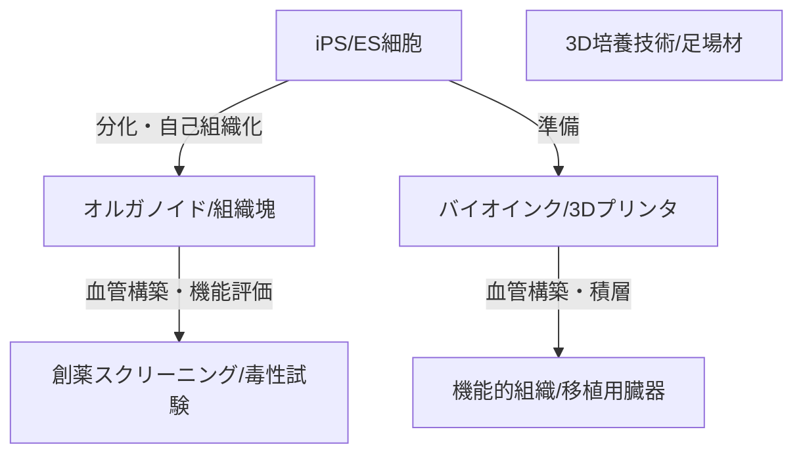

--- 
title: T10-07-04 体外組織・臓器構築技術（オルガノイド、バイオプリンティング）
url: https://www.amed.go.jp/news/release_20240325.html
date: 2025-11-14
tags:
  - オルガノイド
  - バイオプリンティング
  - 3D培養
  - 血管構築
  - ドラッグスクリーニング
source: テクノロジーロードマップ2026-2035 第2部第10章、Google検索
---

# T10-07-04 体外組織・臓器構築技術（オルガノイド、バイオプリンティング）

## Summary（5つの要点）

1.  **オルガノイド（ミニ臓器）の活用**: iPS細胞やES細胞から自己組織化能を利用して作製される**ミニ臓器**（脳、腸、肝臓など）は、動物実験に代わる**ドラッグスクリーニング**や**病態モデル**として利用され、創薬開発の効率を飛躍的に向上させる。
2.  **3Dバイオプリンティング**: 細胞をインク（バイオインク）として扱い、**3Dプリンタ**で設計図通りに積層することで、**複雑な立体構造**を持つ組織や臓器を人工的に構築する。特に、複雑な血管網の構築が課題。
3.  **血管構築技術のブレイクスルー**: 厚みのある組織（臓器）を体外で生存させるためには、細胞全体に栄養と酸素を供給する**微細な血管構造**の構築が不可欠であり、マイクロ流路技術やバイオプリンティング技術を組み合わせて開発が進む。
4.  **疾患モデルの高精度化**: 患者由来のiPS細胞から作製したオルガノイドは、その患者特有の**疾患の病態**を体外で再現できるため、**個別化された治療薬**の探索や毒性試験に利用される。
5.  **臓器移植への応用（将来）**: 免疫拒絶反応のない**自己由来**の細胞を用いた機能的な臓器（腎臓、膵臓など）を構築し、移植医療のドナー不足を解消することが究極の目標。

#### 概念図

---

### 技術評価表（定量的な視点）

| 評価項目 | 評価 | 根拠 |
| :--- | :--- | :--- |
| 導入コスト | ⭐⭐☆☆☆ | 3Dバイオプリンタ、専用の培養装置、高価なバイオインクが必要であり、研究コストが高い。 |
| 技術成熟度 | ⭐⭐⭐☆☆ | オルガノイド作製は研究レベルで確立。血管構築や、実用的な大きさの臓器作製はブレイクスルー待ち。 |
| 日本の競争力 | ⭐⭐⭐⭐☆ | iPS細胞技術に加え、オルガノイド研究、バイオマテリアル開発で世界的な研究成果が多数ある。 |
| 市場性 | ⭐⭐⭐⭐⭐ | 創薬スクリーニングの効率化（動物実験の代替）、新薬の個別化、将来的な臓器移植への応用で巨大市場。 |
| 品質保証の重要性 | ⭐⭐⭐⭐☆ | 創薬モデルとしての再現性、移植臓器としての機能性と安全性（免疫拒絶、感染）の保証が不可欠。 |

---

## 日本の立ち位置・強み弱みのSummary

### 強み

* **オルガノイド研究の優位性**: 東京医科歯科大学、理化学研究所などで、脳、腎臓、腸などの高機能なオルガノイド作製技術の研究が世界をリード。
* **バイオマテリアル技術**: ハイドロゲル、生体吸収性ポリマーなど、細胞の足場となる**バイオインク**や**スキャフォールド**の開発で高い技術力を持つ。
* **iPS細胞とのシナジー**: iPS細胞技術（T10-07-01）との連携により、患者由来のオルガノイドを容易に作製できる。

### 弱み

* **バイオプリンティング装置開発の遅れ**: 高速・高精度で細胞生存率の高い3Dバイオプリンタ本体の開発・産業化で、米国、欧州に後れを取っている。
* **血管構築の壁**: 1mm以上の厚みを持つ組織を生体外で機能させるために不可欠な、自律的な血管網を構築する技術がまだ実用化できていない。
* **規制面の課題**: 構築した組織を再生医療等製品として承認する際の、評価基準や長期的な安全性の保証に関する規制整備が途上である。

---

## 技術ロードマップ（短期/中期/長期）

### 短期目標（～2027年）

* **オルガノイド**を用いた**がん治療薬**の有効性・毒性評価を目的とした**創薬スクリーニング**への利用を標準化する。
* **3Dバイオプリンタ**の積層精度と細胞生存率を向上させ、**薄い皮膚組織**や**軟骨**など、比較的単純な組織の構築を可能にする。
* オルガノイドを疾患モデルとして利用する際の**品質評価・標準化ガイドライン**を策定する。

### 中期目標（2028年～2031年）

* **マイクロ流路技術**や**自己組織化能**を応用し、**複雑な微細血管構造**を持つ**肝臓**や**腎臓**のオルガノイドモデルを構築する。
* **3Dバイオプリンティング**により作製した**機能性組織**（例：膵島細胞塊）の**臨床試験**を開始する。
* 複数のオルガノイドを接続し、**全身の薬物動態**を体外でシミュレーションする**Body-on-a-Chip**技術を確立する。

### 長期目標（2032年～2035年）

* 患者自身の細胞から作製した、拒絶反応のない**大型の機能的な臓器**（腎臓、心臓）を**バイオプリンティング**により構築し、移植に成功する。
* 体外組織構築技術が、**全ての創薬開発**の初期段階で必須のステップとなり、動物実験を大幅に代替する。
* ヒトの臓器を再現したオルガノイドが、**個別化医療**のシミュレーションツールとして標準化される。

### 📚 参照リンク

1.  日本におけるオルガノイド研究の最前線と今後の展望（AMED）: [https://www.amed.go.jp/news/release_20240325.html](https://www.amed.go.jp/news/release_20240325.html)
2.  再生医療等製品の製造・品質管理（厚生労働省）: [https://www.mhlw.go.jp/stf/seisakunitsuite/bunya/0000109919.html](https://www.mhlw.go.jp/stf/seisakunitsuite/bunya/0000109919.html)
