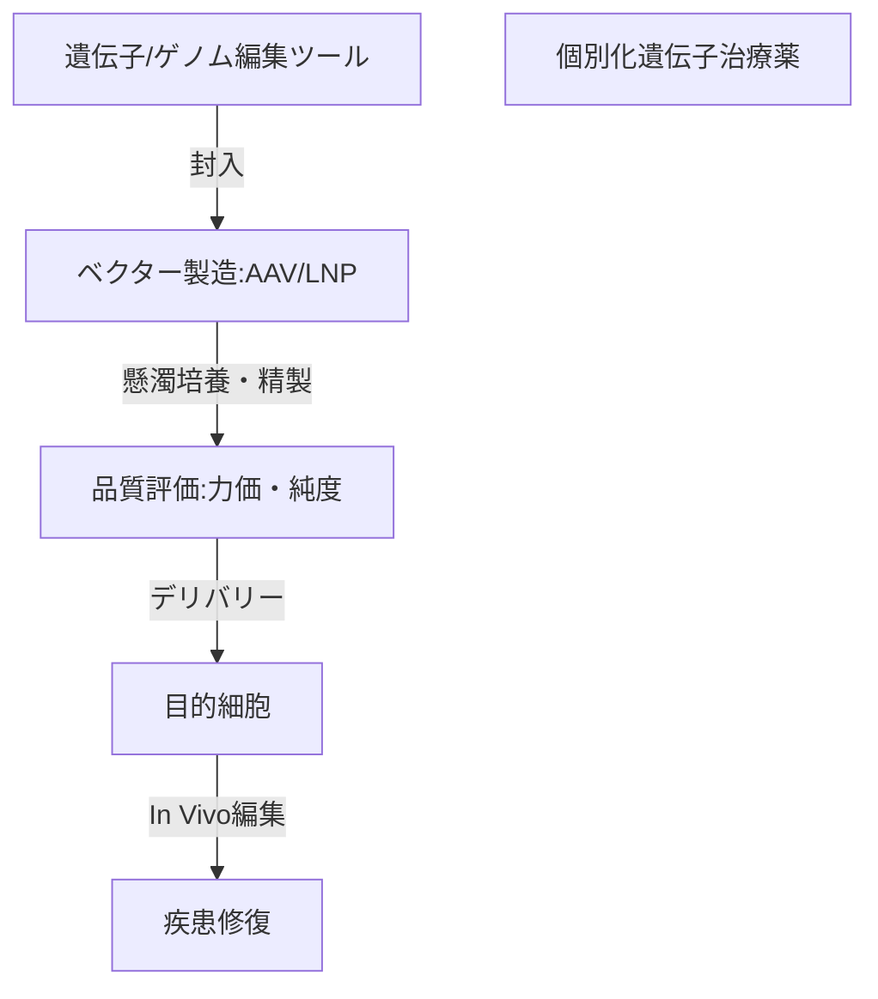

--- 
title: T10-07-05 遺伝子治療ベクター開発・製造技術
url: https://www.nibiohn.go.jp/part/news/2023/11/4.html
date: 2025-11-14
tags:
  - 遺伝子治療
  - AAVベクター
  - LNP
  - CRISPR
  - 製造技術
source: テクノロジーロードマップ2026-2035 第2部第10章、Google検索
---

# T10-07-05 遺伝子治療ベクター開発・製造技術

## Summary（5つの要点）

1.  **AAVベクターの最適化**: 遺伝子治療で最も広く使用される**アデノ随伴ウイルス（AAV）ベクター**について、特定の臓器や細胞種に効率よく遺伝子を導入できる**新規血清型（カプシド）**の設計・開発が重要となる。
2.  **LNP製剤化技術の進化**: mRNAワクチンで実用化された**脂質ナノ粒子（LNP）**は、ウイルスの代わりに遺伝子編集ツール（CRISPR-Cas9など）やmRNA/siRNAを体内の目的細胞へ届ける**非ウイルスベクター**として開発が加速している。
3.  **ベクターの大量製造とコスト削減**: 遺伝子治療薬は高価であり、治療コストの最大の要因の一つが**ベクター製造コスト**である。**懸濁培養**や**持続灌流培養**などの大規模・高効率な製造技術を確立し、コストを大幅に削減する必要がある。
4.  **In Vivoゲノム編集の実現**: CRISPR/Cas9などのゲノム編集ツールを、LNPやAAVを用いて**生体内の患部細胞**に直接デリバリーし、遺伝子異常をその場で修復する**In Vivo（体内）ゲノム編集治療**の実用化を目指す。
5.  **高精度な品質評価**: 製造されたベクターが**正確な量の遺伝子**を含み、**不純物（空カプシド、凝集体）**が少なく、狙った細胞に**高効率**で導入できることを保証するための、高精度な**分析・品質評価技術**が不可欠。

#### 概念図

---

### 技術評価表（定量的な視点）

| 評価項目 | 評価 | 根拠 |
| :--- | :--- | :--- |
| 導入コスト | ⭐⭐☆☆☆ | 製造設備（バイオリアクター）、精製設備が極めて高額であり、少量多品種生産になりがち。 |
| 技術成熟度 | ⭐⭐⭐⭐☆ | AAV、LNPはワクチンや一部疾患で実用化。LNPを用いたゲノム編集デリバリー技術は急速に進化中。 |
| 日本の競争力 | ⭐⭐⭐☆☆ | 基礎研究は活発だが、ベクターのCMO（受託製造）市場は米国、欧州が先行。LNP技術は国内メーカーも注力。 |
| 市場性 | ⭐⭐⭐⭐⭐ | 難病やがん治療の究極的な解決策であり、市場規模は爆発的に拡大すると予測されている。 |
| 品質保証の重要性 | ⭐⭐⭐⭐⭐ | ベクターの免疫原性、非標的細胞への導入、製造ロット間のばらつきが安全性・有効性に直結する。 |

---

## 日本の立ち位置・強み弱みのSummary

### 強み

* **LNP技術の蓄積**: mRNAワクチン開発でLNP（脂質ナノ粒子）の製剤化技術、特に製造・品質管理のノウハウが蓄積されつつある。
* **AAV基礎研究**: 遺伝子治療ベクターの基礎研究、特に神経疾患へのAAV応用研究で世界的な知見を持つ研究者がいる。
* **製造技術**: バイオ医薬品の製造技術に強みを持つ国内企業が、遺伝子治療用ベクターの受託製造（CMO）市場に参入を始めている。

### 弱み

* **ベクター製造のキャパシティ不足**: 高品質なGMP（適正製造規範）準拠のAAV/LNP製造施設が不足しており、特に初期臨床開発段階でのボトルネックとなっている。
* **ベクター設計のノウハウ不足**: 標的細胞への導入効率が高く、副作用の少ない**新規ベクター（カプシド）**の設計・開発に関する競争力で、欧米の専門ベンチャーに後れを取っている。
* **規制面の課題**: In Vivoゲノム編集や次世代ベクターに対する規制の整備や承認プロセスが、技術の急速な進化に追いついていない。

---

## 技術ロードマップ（短期/中期/長期）

### 短期目標（～2027年）

* AAVおよびLNPベクターの**製造コスト**を現状から30%削減する、**懸濁培養**・**自動精製**システムをCMO施設に導入する。
* LNPを用いた**CRISPR/Cas9**ゲノム編集ツールの**非臨床**での**In Vivoデリバリー**効果を実証する。
* ベクターの力価（有効性）と空カプシド混入率を正確に評価する**ハイスループット分析技術**を確立する。

### 中期目標（2028年～2031年）

* **新規カプシド（AAV）**や**LNP組成**を開発し、特定の臓器（肝臓、脳、筋肉など）へ**90%以上の効率**で遺伝子を導入可能にする。
* LNPベクターを用いた**In Vivoゲノム編集治療薬**の**初期臨床試験**（First-in-Human）を開始し、安全性を確認する。
* 遺伝子治療用ベクターの**大規模な受託製造（CMO）基盤**を国内に確立し、安定供給体制を構築する。

### 長期目標（2032年～2035年）

* 遺伝性疾患の治療において、**In Vivoゲノム編集**が**標準的な治療法**の一つとなり、患者への負担が大幅に軽減される。
* **AI**が患者の遺伝子情報に基づき、最適な**個別化ベクター**の設計を自動で行い、**オンデマンド**で製造するシステムが実現する。
* ゲノム編集の**オフターゲット効果（非特異的な場所の編集）**を完全に排除する**超高精度な編集技術**を実用化する。

### 📚 参照リンク

1.  核酸医薬の開発を加速するLNP技術（医薬基盤・健康・栄養研究所）: [https://www.nibiohn.go.jp/part/news/2023/11/4.html](https://www.nibiohn.go.jp/part/news/2023/11/4.html)
2.  再生医療等製品の製造・品質管理（厚生労働省）: [https://www.mhlw.go.jp/stf/seisakunitsuite/bunya/0000109919.html](https://www.mhlw.go.jp/stf/seisakunitsuite/bunya/0000109919.html)
