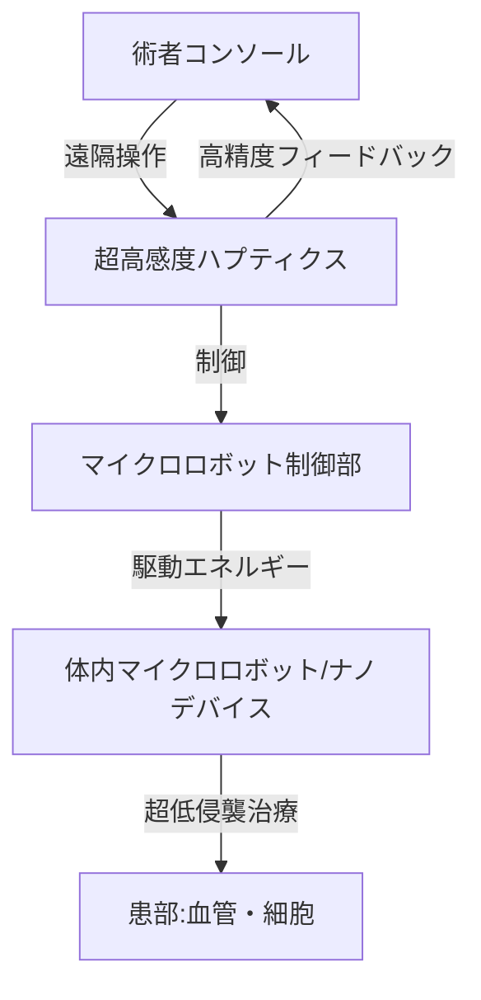

--- 
title: T10-08-01 マイクロ・ナノ手術ロボット
url: https://www.jst.go.jp/pr/report/2022/202206-p03.html
date: 2025-11-14
tags:
  - 手術ロボット
  - 低侵襲手術
  - ナノテクノロジー
  - 遠隔操作
  - 精密医療
source: テクノロジーロードマップ2026-2035 第2部第10章、Google検索
---

# T10-08-01 マイクロ・ナノ手術ロボット

## Summary（5つの要点）

1.  **極限的な低侵襲性**: 既存のロボット手術（ダヴィンチなど）をさらに進化させ、ミリ単位以下のスケールで**血管内**や**臓器の深部**に到達し、**細胞レベル**の操作を行うことで、患者の**身体的負担**を最小限にする。
2.  **ナノマニピュレーション技術**: 磁力、超音波、光などの外部エネルギーを用いて、体内を自律的に移動・駆動する**数μm～数mm**の**小型ロボット**または**デバイス**を開発し、患部への薬剤送達や微小な組織の切除を行う。
3.  **触覚・力覚フィードバックの強化**: マイクロスケールでの繊細な操作を可能にするため、術者に**リアルタイム**で**超高感度**な**力覚情報**を伝える**ハプティクス技術**を開発し、手技の精度を担保する。
4.  **AIによる自律制御**: 熟練医の経験に基づいた動作パターンを**AI**に学習させ、術者の指示を補佐するだけでなく、微細な操作や緊急時の回避行動を**半自律的**または**全自律的**に行うシステムを導入する。
5.  **生体適合性材料の開発**: 体内での**長期使用**や**生体吸収性**を前提とした**ナノマテリアル**や**ソフトアクチュエータ**を開発し、移植や治療後のデバイス除去の必要性をなくす。

#### 概念図

---

### 技術評価表（定量的な視点）

| 評価項目 | 評価 | 根拠 |
| :--- | :--- | :--- |
| 導入コスト | ⭐⭐☆☆☆ | 研究開発および製造コストは高額。既存病院インフラへの導入にも新たな設備が必要。 |
| 技術成熟度 | ⭐⭐⭐☆☆ | ナノデバイスの基礎研究は進展。実用化は、体内駆動・制御・イメージングのブレイクスルー待ち。 |
| 日本の競争力 | ⭐⭐⭐⭐☆ | 精密機械、センシング、ナノ材料分野に強み。東京大学、東北大学などによる世界的な研究成果多数。 |
| 市場性 | ⭐⭐⭐⭐☆ | がんの標的治療、脳神経外科手術など、既存技術では到達困難な領域で革新的な治療法を提供できる。 |
| 品質保証の重要性 | ⭐⭐⭐⭐⭐ | デバイスの破損、体内での迷走、制御不能は重篤な合併症に直結するため、極めて高い安全性が要求される。 |

---

## 日本の立ち位置・強み弱みのSummary

### 強み

* **精密機器製造技術**: マイクロ・ナノスケールの精密部品加工、センサー、アクチュエータ開発で世界的な優位性。
* **ナノテクノロジー研究**: ナノ粒子、ナノマテリアルの開発、特にドラッグデリバリーシステム（DDS）への応用研究が活発。
* **医療機器メーカーの参入**: オリンパス、富士フイルムなどの内視鏡技術が、体内イメージングと結合可能。

### 弱み

* **規制・承認プロセス**: 新規性の高いデバイスの承認基準が未整備であり、実用化までの期間が長期化する傾向。
* **全身イメージング**: 体内のマイクロロボットの位置、状態、動作をリアルタイムで高解像度にトラッキングする技術が未成熟。
* **制御のエネルギー供給**: 体内を移動・駆動するためのエネルギー（バッテリーまたは外部からの非接触供給）の小型化・効率化が課題。

---

## 技術ロードマップ（短期/中期/長期）

### 短期目標（～2027年）

* **数mmスケールのマイクロ手術ロボット**が、大動物モデルで**血管内**の**カテーテル操作支援**を成功させる。
* AIを用いた**手術時の力覚フィードバック**の精度を向上させ、既存のロボット手術の安全性向上に寄与する。
* **生体適合性**と**磁性**を両立させた**ナノ粒子**を用いた**標的DDS**（ドラッグデリバリーシステム）の臨床研究を開始する。

### 中期目標（2028年～2031年）

* **μmスケール**の**自律駆動型ナノデバイス**を開発し、**脳内**や**眼底**など微小な患部への**局所的な治療**を可能にする。
* AIによる**半自律的な動作支援機能**（例：自動で微小血管の縫合を行う）を搭載した次世代手術ロボットが実用化される。
* 磁場、超音波、光による**体内トラッキング技術**の精度が向上し、**リアルタイム**での**ナノデバイスの位置把握**が可能となる。

### 長期目標（2032年～2035年）

* マイクロ・ナノロボットが、**ほとんど全ての外科治療**において**超低侵襲**な標準治療の一つとなり、**在宅での治療**を可能にする。
* 患者の体内を巡り、病変を自動的にスキャン・診断・治療する**診断・治療一体型**の**巡回型ナノロボット**が実用化される。
* 外科医が遠隔地から**五感を超える精度**で手術を遂行できる**没入型遠隔手術システム**が構築される。

### 📚 参照リンク

1.  ナノテクノロジーが拓く再生医療と手術技術（JST）: [https://www.jst.go.jp/pr/report/2022/202206-p03.html](https://www.jst.go.jp/pr/report/2022/202206-p03.html)
2.  医療機器審査迅速化への取り組み（PMDA）: [https://www.pmda.go.jp/rs-shinsa/saisei/0002.html](https://www.pmda.go.jp/rs-shinsa/saisei/0002.html)
