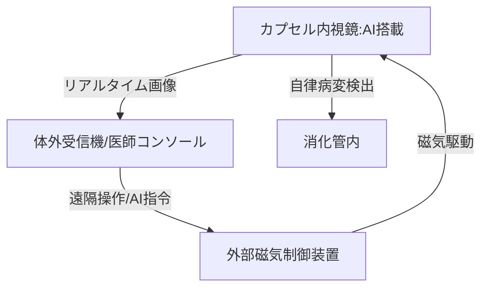

--- 
title: T10-08-02 カプセル内視鏡と自律走行技術
url: https://www.fujifilm.com/jp/ja/rd/life-science/capsule-endoscopy
date: 2025-11-14
tags:
  - カプセル内視鏡
  - 自律走行
  - 非侵襲診断
  - AI診断
  - 低遅延制御
source: テクノロジーロードマップ2026-2035 第2部第10章、Google検索
---

# T10-08-02 カプセル内視鏡と自律走行技術

## Summary（5つの要点）

1.  **能動的な駆動と制御**: 従来の消化管の蠕動運動に頼る受動的なカプセル内視鏡から、**磁気**や**外部エネルギー**を用いて体内で**医師が自由**に**カプセルを駆動**・**制御**できる**能動型カプセル内視鏡**への進化。
2.  **AIによる自律的な病変探索**: カプセル内蔵の**AI**が画像から**病変（がん、ポリープ、炎症）**を**リアルタイム**で認識し、自動的にその場で**体位を調整**、**停止**、**詳細撮影**を行う**自律走行・診断支援技術**。
3.  **診断から治療への拡張**: 診断機能に加え、**生検（組織採取）**、**薬剤の局所注入**、**止血**などの**簡単な治療機能**をカプセルに組み込み、一貫した低侵襲医療を実現する。
4.  **超小型・高解像度イメージング**: より多くの機能を搭載しつつ、カプセルの**サイズ**を**さらに小型化**し、同時に**撮影画質（解像度、色再現性）**を向上させることで、微細な病変も見逃さないようにする。
5.  **低遅延・高信頼性の体外通信**: カプセルからの**大容量の画像データ**を、体内から体外へ**高速**かつ**低遅延**で送信するための**高周波通信技術**や**超音波通信技術**を開発し、遠隔操作の応答性を確保する。

#### 概念図

---

### 技術評価表（定量的な視点）

| 評価項目 | 評価 | 根拠 |
| :--- | :--- | :--- |
| 導入コスト | ⭐⭐⭐☆☆ | デバイス自体は使い捨てだが、外部の磁気制御装置やAI解析システムが必要。 |
| 技術成熟度 | ⭐⭐⭐☆☆ | 受動型カプセル内視鏡は実用化済み。能動型・自律走行型は、研究開発および臨床試験の初期段階。 |
| 日本の競争力 | ⭐⭐⭐⭐⭐ | オリンパス、富士フイルムなど、内視鏡分野で世界を圧倒的にリード。この技術の応用にも強み。 |
| 市場性 | ⭐⭐⭐⭐⭐ | 従来の苦痛を伴う内視鏡検査の代替となり、胃がん、大腸がんなどのスクリーニング市場で爆発的な需要が見込まれる。 |
| 品質保証の重要性 | ⭐⭐⭐⭐☆ | 誤診、カプセルの体内での滞留、通信エラーによる検査中断を避けるための高い信頼性が要求される。 |

---

## 日本の立ち位置・強み弱みのSummary

### 強み

* **内視鏡技術**: オリンパス、富士フイルムが世界の硬性・軟性内視鏡市場の大部分を占め、**超小型イメージセンサー**と**画像処理技術**に優位性。
* **AI画像診断**: 医療画像診断AI（T10-01-01）の研究開発が活発であり、カプセル内視鏡画像への応用が加速。
* **磁気制御技術**: 医療用磁気駆動デバイス、MRIなどの技術を応用した、カプセル駆動の研究実績が豊富。

### 弱み

* **治療機能の複合化**: 診断機能に加え、生検・止血といった**治療用マイクロマニピュレータ**の小型化・信頼性確保に課題が残る。
* **駆動のエネルギー効率**: 長時間の検査に耐えうる**小型高性能バッテリー**または**外部からのエネルギー供給効率**の改善が必要。
* **標準化と規制**: 自律走行AIの診断精度保証と、それに伴う薬事承認プロセスの標準化が未整備。

---

## 技術ロードマップ（短期/中期/長期）

### 短期目標（～2027年）

* **AI**による**画像解析**で、**消化管のポリープ**や**潰瘍**を**95%以上**の精度で自動検知するカプセル内視鏡システムを実用化する。
* **能動型カプセル内視鏡**が、**体外からの磁気制御**により、胃や大腸の**特定の病変部位**へ**正確に誘導**できることを臨床で実証する。
* 検査時間の短縮と画質向上を実現するため、**データ転送速度**を現状から**2倍**にする**体外通信プロトコル**を開発する。

### 中期目標（2028年～2031年）

* **自律走行・自律撮影機能**を搭載したカプセル内視鏡が、**医師の介入なし**に**全消化管**の**完全な検査**を可能にする。
* カプセルに**生検（組織採取）機能**を搭載し、診断と簡単な治療を同検査内で完結できる**診断・治療一体型**カプセルの臨床導入を開始する。
* 検査データのクラウド上での管理と、AIによる**所見レポートの自動生成**を標準化する。

### 長期目標（2032年～2035年）

* カプセル内視鏡が、**胃がん・大腸がん**の**一次スクリーニング**の**標準的な手法**となり、**定期検査の受診率**を大幅に向上させる。
* **薬剤充填型カプセル**が、特定の疾患部位へ**自動的に到達**し、**オンデマンド**で**薬剤を放出**する**スマートドラッグデリバリーシステム**を実現する。
* カプセル内視鏡とAIを組み合わせた**在宅での精密検診**システムが普及し、医療費の削減に貢献する。

### 📚 参照リンク

1.  富士フイルムのカプセル内視鏡技術: [https://www.fujifilm.com/jp/ja/rd/life-science/capsule-endoscopy](https://www.fujifilm.com/jp/ja/rd/life-science/capsule-endoscopy)
2.  内視鏡技術の進歩と将来展望（オリンパス）: [https://www.olympus.co.jp/solution/endoscope/index.html](https://www.olympus.co.jp/solution/endoscope/index.html)
