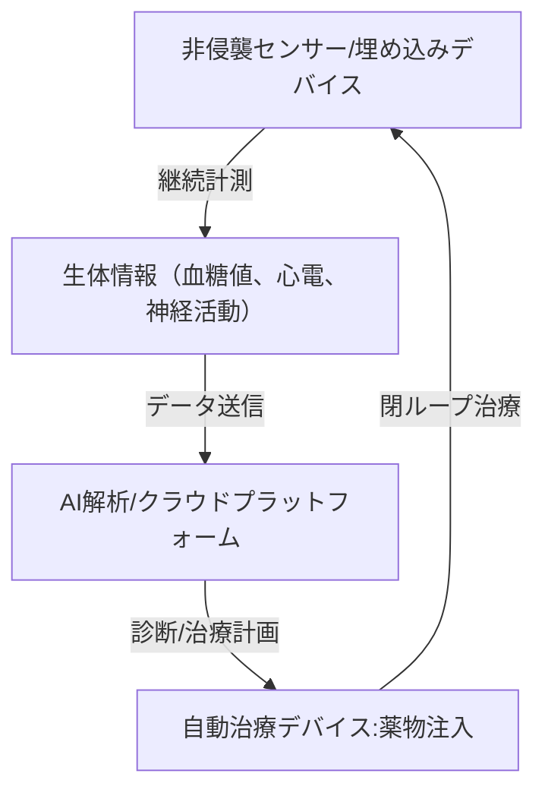

--- 
title: T10-08-03 医療用ウェアラブル・生体埋め込みデバイス
url: https://www.amed.go.jp/koubo/01/01/20210730_kettei_2.html
date: 2025-11-14
tags:
  - ウェアラブルデバイス
  - 生体埋め込み
  - 継続的モニタリング
  - 非侵襲センサー
  - ヘルステック
source: テクノロジーロードマップ2026-2035 第2部第10章、Google検索
---

# T10-08-03 医療用ウェアラブル・生体埋め込みデバイス

## Summary（5つの要点）

1.  **連続的生体情報モニタリング**: パッチ、指輪、スマートウォッチなどの**ウェアラブルデバイス**を用いて、心拍、血圧、体温、睡眠、活動量に加え、**非侵襲**で**血糖値**や**乳酸値**などの**生化学情報**を**継続的**に計測する。
2.  **生体埋め込み型センサー**: 体内に留置し、**脳波**、**神経活動**、**体液中のバイオマーカー**などを長期的に高精度に計測する**小型の埋め込みデバイス**。特に、ペースメーカーや人工内耳のさらなる高機能化と低侵襲化が進む。
3.  **閉ループ型治療デバイス（人工膵臓など）**: センサーが計測した生体情報（例：血糖値）に基づき、AIが**自動で薬物投与量**を決定し、**自動注入**までを行う**閉ループ**（Closed-Loop）**システム**を実現する。
4.  **バッテリーレス・ワイヤレス給電**: 埋め込みデバイスの**バッテリー交換**の**手術リスク**を排除するため、**体外からワイヤレス**で**エネルギー**を**供給**する技術（**ワイヤレス給電**）や、**生体エネルギー**を**利用**する技術を開発する。
5.  **データセキュリティと医療連携**: 収集された**機密性の高い医療データ**を**セキュア**に保管し、**AI**が解析した結果を医師や患者に**リアルタイム**でフィードバックする**医療情報プラットフォーム**を構築する。

#### 概念図

---

### 技術評価表（定量的な視点）

| 評価項目 | 評価 | 根拠 |
| :--- | :--- | :--- |
| 導入コスト | ⭐⭐⭐☆☆ | ウェアラブルデバイスは比較的安価。埋め込みデバイスは高額だが、治療効果とQOL向上で費用対効果が高い。 |
| 技術成熟度 | ⭐⭐⭐⭐☆ | 活動量計、心拍計は成熟。非侵襲血糖測定、閉ループ型埋め込みデバイスは臨床段階。 |
| 日本の競争力 | ⭐⭐⭐☆☆ | センサー・電子部品技術は強み。最終製品（ウェアラブル）市場はApple、Googleなどの海外勢がリード。 |
| 市場性 | ⭐⭐⭐⭐⭐ | 慢性疾患管理、予防医療、高齢者見守り市場において、膨大な需要と市場拡大が見込まれる。 |
| 品質保証の重要性 | ⭐⭐⭐⭐⭐ | 誤作動やデータ漏洩は治療効果の低下、個人情報の侵害に直結するため、極めて高い信頼性が必要。 |

---

## 日本の立ち位置・強み弱みのSummary

### 強み

* **センサー技術**: 村田製作所、ロームなどの電子部品メーカーが、**小型**・**高感度**の**生体センサー**開発で世界的な優位性。
* **低電力無線技術**: 低消費電力のBluetooth/Wi-Fi通信技術やワイヤレス給電技術の研究開発が進んでいる。
* **医療データ活用**: **レセプトデータ**、**電子カルテデータ**の匿名化・二次利用に関する議論が進み、AI解析基盤の整備が期待される。

### 弱み

* **最終製品のブランド力**: ウェアラブルデバイスの消費者市場において、国内メーカーのブランド力やエコシステム構築が海外勢に後れを取っている。
* **非侵襲血糖測定の精度**: 採血に匹敵する**非侵襲**での**血糖値測定精度**の実現に技術的なブレイクスルーが依然として必要。
* **医療機器としての承認の複雑さ**: 健康機器（ウェルネス）から医療機器への移行における**薬事承認**のプロセスが複雑で時間がかかる。

---

## 技術ロードマップ（短期/中期/長期）

### 短期目標（～2027年）

* スマートウォッチ等で計測された**心拍変動**や**活動量**データに基づき、**生活習慣病リスク**を**AI**が**90%以上**の精度で予測するシステムの社会実装。
* 医療機関向けの**遠隔患者モニタリング（RPM）**システムにおいて、ウェアラブルセンサーの**データ連携**と**セキュリティ**の標準化を確立する。
* **ワイヤレス給電**を搭載した**体外式治療デバイス**（例：インスリンポンプ）の安全基準を策定する。

### 中期目標（2028年～2031年）

* **非侵襲で採血と同等**の精度を持つ**連続血糖測定（CGM）**ウェアラブルデバイスを実用化し、糖尿病患者のQOLを大幅に改善する。
* センサーと注入ポンプが連携する**完全閉ループ型**の**人工膵臓**などの埋め込み治療デバイスが、複数の疾患で保険適用となる。
* 埋め込みデバイスが**ワイヤレス給電**または**生体エネルギー**で**半永久的に動作**することを可能にする技術を確立する。

### 長期目標（2032年～2035年）

* ウェアラブルデバイスが、**全ての健常者**の**健康管理**の**標準ツール**となり、**病気になる前**に**介入**する**先制医療**社会を実現する。
* **AI**が埋め込みデバイスからの神経活動データに基づき、**パーキンソン病**や**てんかん**などの**症状**を**予測**し、**自動で神経刺激**を行う**スマート治療**が普及する。
* 医療用デバイスのデータが**ブロックチェーン**等で保護され、患者自身が**データ主権**を持つ**DFFT（Data Free Flow with Trust）**の医療モデルが確立される。

### 📚 参照リンク

1.  ムーンショット型研究開発事業（生体システム制御技術）：[https://www.amed.go.jp/koubo/01/01/20210730_kettei_2.html](https://www.amed.go.jp/koubo/01/01/20210730_kettei_2.html)
2.  健康・医療分野のAI開発加速化（厚生労働省）：[https://www.mhlw.go.jp/stf/shingi/0000105315_00007.html](https://www.mhlw.go.jp/stf/shingi/0000105315_00007.html)
