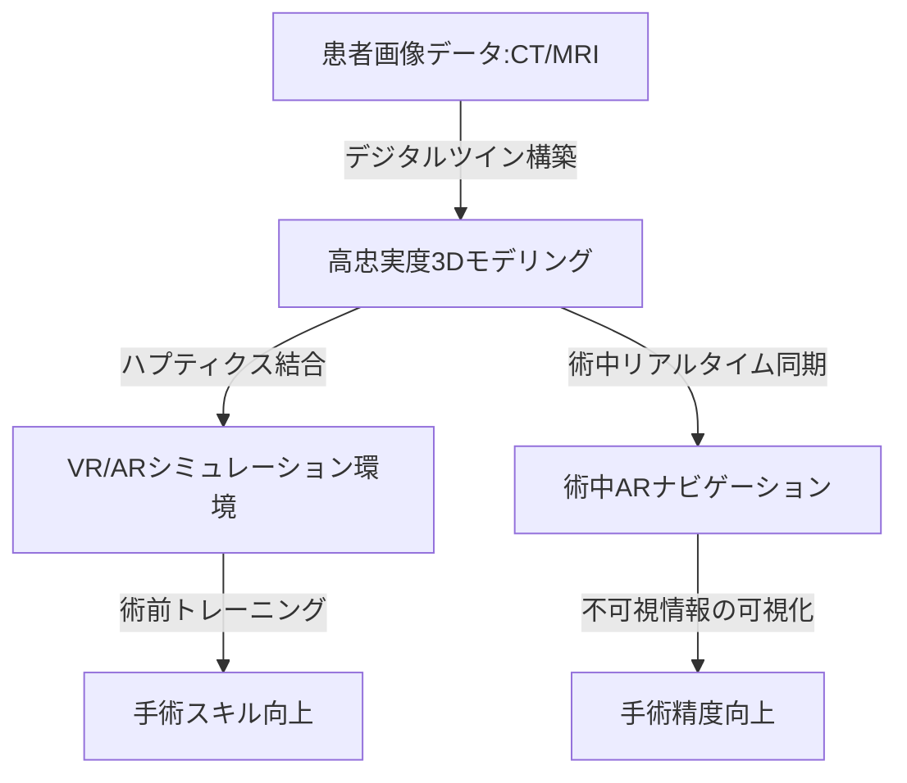

--- 
title: T10-08-04 手術シミュレーション・VR/ARナビゲーション
url: https://www.jstage.jst.go.jp/article/jsmbr/40/3/40_3_188/_pdf
date: 2025-11-14
tags:
  - 手術シミュレーション
  - VR/AR
  - 医療トレーニング
  - 術中ナビゲーション
  - デジタルツイン
source: テクノロジーロードマップ2026-2035 第2部第10章、Google検索
---

# T10-08-04 手術シミュレーション・VR/ARナビゲーション

## Summary（5つの要点）

1.  **高忠実度手術シミュレーション**: 患者個人の**CT/MRI画像**から**高精細な3Dモデル**を作成し、**物理法則**と**生体力学**に基づいた**リアリスティックな手術シミュレーション**をVR/AR空間で実現する。これにより術前の**リスク評価**と**手技トレーニング**が可能になる。
2.  **デジタルツインの構築**: 患者の臓器や血管、病変を**術前の画像**と**術中のリアルタイム情報**で統合した**デジタルツイン**として構築し、**最適な手術手順**を**AI**が**予測**し、術者に提示する。
3.  **術中ARナビゲーション**: 術野に**HoloLens**などの**ARデバイス**を介して、**血管**、**神経**、**腫瘍の境界線**などの**不可視の情報**を**オーバーレイ**表示し、**高精度**な**手術ガイド**を行う。
4.  **ハプティクスによる触覚再現**: 研修医や手術計画において、メスや鉗子の**操作感**、**組織**の**硬さ**、**抵抗**などを**力覚デバイス**で**正確に再現**し、実臨床に近い環境での**没入型トレーニング**を可能にする。

5.  **遠隔指導・トレーニングプラットフォーム**: 5G/ローカル5Gなどの**超低遅延通信**を利用し、熟練医が**遠隔地**から**VR/AR空間**を共有しながら、**研修医**に**リアルタイム**で**手術指導**を行うシステムを構築する。

#### 概念図

---

### 技術評価表（定量的な視点）

| 評価項目 | 評価 | 根拠 |
| :--- | :--- | :--- |
| 導入コスト | ⭐⭐⭐☆☆ | VR/ARヘッドセット、高性能GPU、ハプティクスデバイス、専用ソフトウェアが高額。 |
| 技術成熟度 | ⭐⭐⭐☆☆ | VRトレーニング、術中ナビゲーションは一部実用化。ハプティクス、デジタルツインは研究段階。 |
| 日本の競争力 | ⭐⭐⭐⭐☆ | 医療画像処理、ロボット、VR/AR技術の融合において、大学・メーカーの連携が強く優位性がある。 |
| 市場性 | ⭐⭐⭐⭐⭐ | 医師のトレーニングコスト削減、手術ミスの低減による医療安全向上、個別化手術計画で高い市場性が期待。 |
| 品質保証の重要性 | ⭐⭐⭐⭐⭐ | ナビゲーションの精度誤差、シミュレーションの忠実度不足は、術中の判断ミス、予後不良に直結する。 |

---

## 日本の立ち位置・強み弱みのSummary

### 強み

* **医療画像処理技術**: 国内の医療機器メーカーが、CT/MRIなどの**医用画像処理**で高い技術力を持ち、3Dモデリングの基礎技術が充実。
* **VR/ARハードウェア**: ソニー、キヤノンなどの企業が、高解像度VR/ARヘッドセット、プロジェクション技術の開発を推進。
* **ハプティクス研究**: 大学や研究機関で、**力覚フィードバック**や**遠隔操作**に関する先進的な研究が行われている。

### 弱み

* **ソフトウェア開発人材**: 医療分野の専門知識と**物理シミュレーション**、**VR/AR開発**のスキルを兼ね備えたエンジニアの絶対数が不足している。
* **生体力学モデルの精度**: 組織の切開、縫合、変形を**リアルタイム**で**高精度**に再現するための**生体力学シミュレーションモデル**の完成度が課題。
* **保険適用と標準化**: VR/ARトレーニングやシミュレーションが、公式な医師のスキル評価や教育課程に組み込まれるための**標準化**と**制度設計**が遅れている。

---

## 技術ロードマップ（短期/中期/長期）

### 短期目標（～2027年）

* **VR/AR**を用いた**手術前の計画**（切除範囲、アプローチ）を**全手術の30%以上**で実施し、術前検討の標準化を図る。
* **高忠実度シミュレータ**を**若手医師**の**専門医取得**における**必須トレーニング**として導入する。
* **5G**を介した**遠隔手術指導**において、**ARでの注釈**や**指示**を**リアルタイム**で行うシステムを実用化する。

### 中期目標（2028年～2031年）

* **患者のデジタルツイン**が、術中の**リアルタイムな生体情報（出血、臓器の動き）**と同期し、**AI**が**予期せぬリスク**や**最適な次の手技**を予測・提案する。

* **ハプティクス機能**を組み込んだVRシミュレータが、手術の**熟練度**を**客観的**かつ**定量的**に評価し、フィードバックを行うシステムを確立する。
* 手術室内の**全医療機器**のデータを統合し、**ARゴーグル**に**一元的に表示**する**スマートオペレーションシステム**を構築する。

### 長期目標（2032年～2035年）

* **手術シミュレーション**が**術前の必須プロセス**となり、**手術ミス率**を**50%以上削減**する。
* **デジタルツイン**と**AI**が、手術中に発生する**全ての状況変化**を予測し、**ロボット手術**と連携して**自動で修正**を行う**完全自律型手術支援システム**の基礎が確立される。
* 医療現場で生成された**手術データ（画像、操作ログ、生体情報）**が**標準化**され、**全病院**で**手術スキル**の**共有・学習**が可能になる。

### 📚 参照リンク

1.  AR/VR技術を活用した手術シミュレーションの現状と展望（生体医工学）：[https://www.jstage.jst.go.jp/article/jsmbr/40/3/40_3_188/_pdf](https://www.jstage.jst.go.jp/article/jsmbr/40/3/40_3_188/_pdf)
2.  医療分野におけるAI開発の加速化（厚生労働省）：[https://www.mhlw.go.jp/stf/shingi/0000105315_00007.html](https://www.mhlw.go.jp/stf/shingi/0000105315_00007.html)
