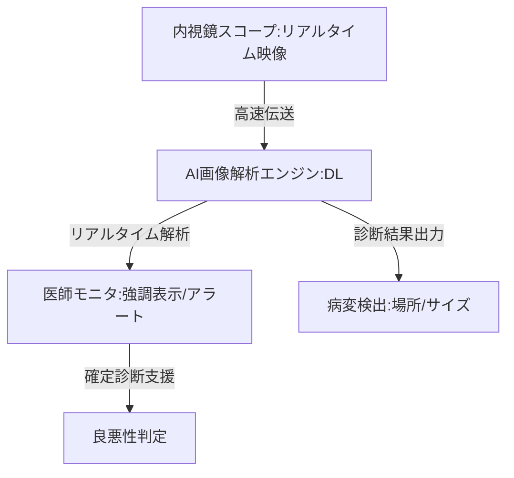

--- 
title: T10-08-05 AI画像解析による内視鏡診断支援
url: https://www.jstage.jst.go.jp/article/jjpn/73/1/73_51/_pdf
date: 2025-11-14
tags:
  - 内視鏡AI
  - 画像診断支援
  - CAD
  - ディープラーニング
  - リアルタイム診断
source: テクノロジーロードマップ2026-2035 第2部第10章、Google検索
---

# T10-08-05 AI画像解析による内視鏡診断支援

## Summary（5つの要点）

1.  **リアルタイム病変検出・強調表示**: 内視鏡が撮影する**動画**に対し、**AI**が**ディープラーニング**を用いて**リアルタイム**で**ポリープ**や**早期がん**などの**病変**を**検出**し、医師の画面上に**アラート**や**強調表示**を行う**CAD（Computer-Aided Diagnosis）**技術。
2.  **確定診断の支援（良悪性判定）**: 検出された病変について、**微細な血管パターン**や**粘膜の構造**を高精度に解析し、**良性**か**悪性**かを**AI**が**判定**し、**診断精度**の**標準化**と**向上**に貢献する。
3.  **見落としリスクの低減**: 検査中に見逃しやすい**小さな病変**や、**解剖学的に観察が困難**な部位をAIが自動で検出し、医師の**見落としリスク**を**最小限**に抑える。
4.  **検査の自動品質管理**: AIが**内視鏡の挿入深度**、**観察速度**、**粘膜の展開状態**などを監視し、**検査が不十分**な場合に**警告**を発することで、**検査の質**を**均一化・標準化**する。
5.  **次世代イメージングとの融合**: NBI（狭帯域光観察）や分光イメージングといった**特殊光観察技術**のデータと**AI**を組み合わせることで、**肉眼では困難**な**組織の性状**の**詳細解析**を可能にする。

#### 概念図

---

### 技術評価表（定量的な視点）

| 評価項目 | 評価 | 根拠 |
| :--- | :--- | :--- |
| 導入コスト | ⭐⭐⭐☆☆ | AIソフトウェア自体は比較的安価だが、高性能GPUを搭載した内視鏡システムが必要。 |
| 技術成熟度 | ⭐⭐⭐⭐☆ | 早期胃がん、大腸ポリープなどの検出支援AIは既に薬事承認され、初期普及段階にある。 |
| 日本の競争力 | ⭐⭐⭐⭐⭐ | 内視鏡ハードウェアとAI技術の双方で、オリンパス、富士フイルムなどのメーカーが世界を圧倒的にリード。 |
| 市場性 | ⭐⭐⭐⭐⭐ | がんの早期発見率向上は医療の質と予後を決定づけ、世界中の内視鏡検査市場で不可欠な技術となる。 |
| 品質保証の重要性 | ⭐⭐⭐⭐⭐ | 偽陽性（誤検出）は不要な生検を招き、偽陰性（見落とし）はがんの進行につながるため、精度保証が最も重要。 |

---

## 日本の立ち位置・強み弱みのSummary

### 強み

* **内視鏡技術**: **オリンパス**、**富士フイルム**が世界の**内視鏡システム**市場でトップシェアを誇り、AI搭載型システムの開発を主導。
* **臨床データ**: 長年の内視鏡検査実績に基づいた**高品質**な**病変画像データ**が豊富に蓄積されており、AI学習の基盤が強固。
* **規制対応**: 早期から内視鏡AIの**薬事承認**が進められており、医療機器としての**実用化・普及**のスピードが速い。

### 弱み

* **海外展開**: 内視鏡AIの国際的な標準化や、海外市場への迅速な展開における規制対応（FDA、CEマーク）のノウハウで課題が残る。
* **診断以外の支援**: AIの活用が**診断支援**に偏りがちであり、**治療（切除術など）**における**術中支援**への応用展開が遅れている。
* **学習データのバイアス**: 収集データが特定の疾患、特定の施設、特定の人種に偏ると、AIの**汎用性**が低下するリスクがある。

---

## 技術ロードマップ（短期/中期/長期）

### 短期目標（～2027年）

* **AI**による**大腸ポリープ**、**早期胃がん**の**検出支援機能**が**全ての医療機関**の**内視鏡検査**で**標準搭載**される。
* 検出支援AIが、**リアルタイム**で病変の**良悪性を判定**し、**診断確定率**を**90%以上**に向上させる。
* 検査中の**粘膜観察範囲**や**観察時間**を**AI**が自動評価し、**検査の質の客観的指標**を確立する。

### 中期目標（2028年～2031年）

* **AI**が内視鏡画像から**病変の種類**や**進行度**を**自動分類**し、**治療方針（切除か経過観察か）**の**決定支援**を可能にする。
* **分光解析**や**光音響イメージング**など**次世代イメージング技術**とAIが統合され、**組織の深部**や**分子レベル**での**病変解析**を実現する。
* 内視鏡AIが、検査中に**不十分な観察**を検知した場合、**内視鏡操作ロボット**と連携して**自動で修正**を行うシステムが実用化される。

### 長期目標（2032年～2035年）

* **内視鏡AI**が**全ての消化器がん**の**早期診断**において**医師の能力を凌駕**し、**診断ミスを根絶**する。
* **AI**が内視鏡画像、病理画像、ゲノム情報など**マルチオミクスデータ**を統合解析し、**超個別化された治療戦略**を自動で提案する。
* **カプセル内視鏡**（T10-08-02）と**AI**を組み合わせた**在宅での高精度スクリーニング**が、**がん検診の主流**となる。

### 📚 参照リンク

1.  内視鏡AIの現状と将来展望（日本消化器病学会）：[https://www.jstage.jst.go.jp/article/jjpn/73/1/73_51/_pdf](https://www.jstage.jst.go.jp/article/jjpn/73/1/73_51/_pdf)
2.  医療分野におけるAI開発の加速化（厚生労働省）：[https://www.mhlw.go.jp/stf/shingi/0000105315_00007.html](https://www.mhlw.go.jp/stf/shingi/0000105315_00007.html)
