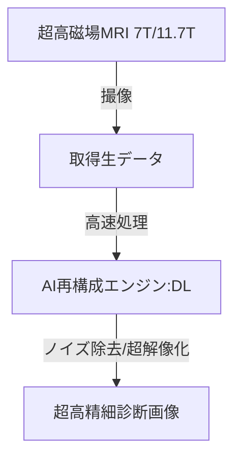

--- 
title: T10-09-01 超高精細MRI・AI画像再構成技術
url: https://www.qst.go.jp/site/qst-magazine/3103.html
date: 2025-11-14
tags:
  - MRI
  - 超高磁場
  - AI画像処理
  - 高速撮像
  - 神経科学
source: テクノロジーロードマップ2026-2035 第2部第10章、Google検索
---

# T10-09-01 超高精細MRI・AI画像再構成技術

## Summary（5つの要点）

1.  **超高磁場MRI（7T以上）**: 既存の3T-MRIを凌駕する**7テスラ（7T）**や**11.7テスラ**といった**超高磁場**を利用し、**脳**や**脊髄**の**微細な構造**や**機能**を**超高精細**に可視化する。

2.  **AIによる画像再構成**: MRIの撮像時に生じる**ノイズ**や**画質の劣化**を、**ディープラーニング**を用いた**画像再構成アルゴリズム**で**リアルタイム**に**補正**し、低磁場装置でも高画質を実現する。

3.  **高速・短時間撮像**: AIを活用して**必要なデータ量**を**大幅に削減**することで、MRI検査の**撮像時間**を**半減**させ、患者の**負担軽減**と**検査効率の向上**を図る。

4.  **機能的MRI (fMRI) の高度化**: **脳機能**の**活動パターン**を**高精度**に捉え、**認知症**、**精神疾患**、**発達障害**などの**神経疾患**の**早期診断**や**病態解明**に貢献する。

5.  **多角的データ統合**: MRIで得られた構造・機能画像データと、PET/SPECT、ゲノム情報などを**AI**で**統合解析**し、**個別化された診断**や**治療効果予測**を行う。

#### 概念図

---

### 技術評価表（定量的な視点）

| 評価項目 | 評価 | 根拠 |
| :--- | :--- | :--- |
| 導入コスト | ⭐☆☆☆☆ | 研究開発および製造コストは高額。既存病院インフラへの導入にも新たな設備が必要。 |
| 技術成熟度 | ⭐⭐⭐☆☆ | 7Tは臨床研究段階。AI再構成は実用化されつつあるが、超高解像度への適用は途上。 |
| 日本の競争力 | ⭐⭐⭐⭐☆ | QSTを中心に7Tの研究開発で国際的優位性。日立、キヤノンなどの医療機器メーカーもAIで積極投資。 |
| 市場性 | ⭐⭐⭐⭐☆ | 脳神経疾患や難病の診断精度向上に不可欠であり、専門医療機関での需要が高い。 |
| 品質保証の重要性 | ⭐⭐⭐⭐⭐ | 画像の偽陽性・偽陰性による誤診を避けるため、AI再構成の信頼性・検証が極めて重要。 |

---

## 日本の立ち位置・強み弱みのSummary

### 強み

* **超伝導技術と高磁場**: QST（量子科学技術研究開発機構）などが**超高磁場MRI**の開発で国際的な優位性を保持。

* **AI開発**: 医療画像診断AI（T10-01-01）の研究が活発であり、再構成アルゴリズムへの応用が進んでいる。

* **臨床研究**: 脳科学研究におけるMRIの応用研究が世界トップレベル。

### 弱み

* **装置の普及**: 超高磁場MRIは非常に高価で大型のため、**設置場所**や**運用**に関する**病院インフラ**の整備が遅れている。

* **撮像コイル**: 高感度な撮像コイルの開発において、海外メーカーに依存する部分がある。

* **磁場安全性**: 7Tを超える磁場環境下での**生体安全性**に関する臨床データがまだ不足している。

---

## 技術ロードマップ（短期/中期/長期）

### 短期目標（～2027年）

* **AI画像再構成技術**が、通常の1.5T・3T-MRIにおいて**検査時間**を**20%以上削減**し、臨床で標準利用される。

* **7T-MRI**が、認知症や多発性硬化症などの**特定神経疾患**の**精密診断**で、**一部保険適用**を開始する。

* AIを用いた**動き補正**（モーションアーチファクト除去）技術を確立し、小児や高齢者へのMRI適用範囲を拡大する。

### 中期目標（2028年～2031年）

* **AI**が**画像データ**だけでなく**臨床データ**と統合され、**超高精細画像**から**治療効果**や**予後**を**自動で予測**するシステムが実用化される。

* **7T-MRI**が脳血管障害や脳腫瘍などの**診断**において**標準的**な**ツール**の一つとして普及する。

* **低コスト**かつ**小型化**した**AI搭載型**の**高分解能MRI**が開発され、地域の中核病院に導入される。

### 長期目標（2032年～2035年）

* **超高精細MRI**が、**健康診断**レベルで**脳**の**超早期微細病変**を検出し、**先制医療**の中核となる。

* **11.7T-MRI**などの**次世代超高磁場装置**が、脳の**神経回路**や**分子動態**を**非侵襲**で**リアルタイム**に計測し、**脳科学研究**を革新する。

* MRI、PET、CTなどの**全画像診断装置**が**AI**で**自動制御**され、**完全自動化された検査環境**が実現する。

### 📚 参照リンク

1.  超高磁場MRIが拓く脳科学と診断医療（QST）: [https://www.qst.go.jp/site/qst-magazine/3103.html]

2.  医療画像AIの現状と展望（PMDA）: [https://www.pmda.go.jp/rs-shinsa/saisei/0002.html]
