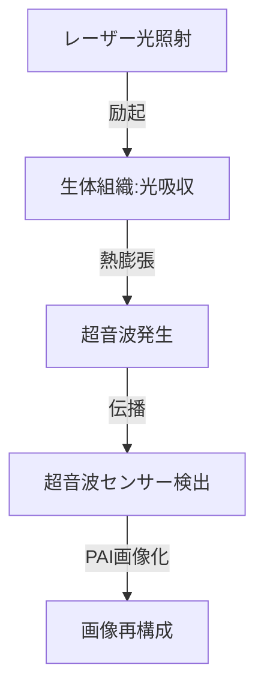

--- 
title: T10-09-02 光音響イメージング・テラヘルツ波計測
url: https://www.jstage.jst.go.jp/article/jsmeb/1/2/1_190/_pdf
date: 2025-11-14
tags:
  - 光音響
  - テラヘルツ
  - 非侵襲
  - 早期がん診断
  - カテーテル
source: テクノロジーロードマップ2026-2035 第2部第10章、Google検索
---

# T10-09-02 光音響イメージング・テラヘルツ波計測

## Summary（5つの要点）

1.  **光音響イメージング（PAI）**: **光**を照射して発生する**超音波**を検出することで、**生体組織**の**光吸収特性**（ヘモグロビンなど）を画像化する技術。**血管**や**がん組織**の**高コントラスト**な可視化が可能。

2.  **テラヘルツ波（THz）計測**: **テラヘルツ波**（ミリ波と光の中間の周波数）は**水分子**に**敏感**に反応する特性を利用し、**皮膚がん**や**歯の病変**など、**水分量**の変化を伴う**表層**の**非侵襲診断**を行う。

3.  **非電離放射線**: PAIとTHz計測は、X線やCTのような**電離放射線**を**使用しない**ため、**安全性**が高く、**繰り返しの検査**に適している。

4.  **内視鏡・カテーテルへの応用**: PAI技術を**内視鏡**や**血管内カテーテル**に統合し、**消化管**や**冠動脈**の**深部**にある**微小な病変**（例：アテローム性動脈硬化）を**リアルタイム**で診断する。

5.  **診断と治療の融合（サーモグラフィ）**: PAIは光吸収に伴う**発熱**も検出できるため、**光熱療法（PTT）**などの**局所的ながん治療**における**温度変化**を**リアルタイム**でモニタリングする技術（**サーモグラフィ**）に利用される。

#### 概念図

---

### 技術評価表（定量的な視点）

| 評価項目 | 評価 | 根拠 |
| :--- | :--- | :--- |
| 導入コスト | ⭐⭐⭐☆☆ | 装置は既存の超音波機器に比べて高価だが、MRIやPETよりは安価になる見込み。 |
| 技術成熟度 | ⭐⭐⭐☆☆ | 基礎研究は進展。臨床応用は、乳がん、皮膚がん、血管内イメージングで初期段階。 |
| 日本の競争力 | ⭐⭐⭐⭐☆ | 光学、レーザー、超音波技術は強み。内視鏡技術（T10-08-05）との融合に大きな優位性。 |
| 市場性 | ⭐⭐⭐⭐☆ | 非侵襲で早期がん診断、血管内診断の精度向上を実現し、予防医療分野で高い潜在需要。 |
| 品質保証の重要性 | ⭐⭐⭐⭐☆ | 生体深部におけるPAIの空間分解能、THzの水分感度を臨床的に保証する必要がある。 |

---

## 日本の立ち位置・強み弱みのSummary

### 強み

* **光学・レーザー技術**: 高品質な**レーザー光源**、**光ファイバー**、**光学部品**の製造技術で世界トップクラス。

* **超音波技術**: **超音波診断装置**のメーカー（キヤノン、富士フイルムなど）が世界シェアを持ち、PAIへの応用が進展。

* **内視鏡との融合**: オリンパスなどの**内視鏡技術**と組み合わせることで、**体腔内PAI**での実用化が先行。

### 弱み

* **生体深部への到達**: 光の散乱により、PAIの**画像深度**は**数cm程度**に限られ、深部臓器への適用が困難。

* **THzの水分吸収**: テラヘルツ波は水に極めて強く吸収されるため、**生体深部のイメージング**には向かない。

* **装置の小型化**: PAI用の**パルスレーザー**、THz用の**光源**・**検出器**の**小型化**と**低コスト化**が課題。

---

## 技術ロードマップ（短期/中期/長期）

### 短期目標（～2027年）

* **PAI**が、**乳がん**や**皮膚がん**の**表層診断**において、**既存の超音波診断**を**補完**する形で臨床導入される。

* **THz波計測デバイス**が、**非侵襲**の**血糖値測定**や**歯科領域**での**虫歯診断**の補助として実証される。

* **AI画像処理**が、PAIの**ノイズ除去**と**画像コントラスト向上**に貢献し、診断精度を高める。

### 中期目標（2028年～2031年）

* **PAI**を搭載した**カテーテル内視鏡**が、**冠動脈**の**プラーク**（アテローム）の**性状**を**リアルタイム**で診断し、**治療方針決定**に利用される。

* **THz波技術**を応用した**手術支援デバイス**が、**がん組織**の**切除境界線**を**リアルタイム**で**識別**する。

* **PAI**と**分子トレーサー**（T10-09-03）を組み合わせ、**分子レベル**での**がん検出**を可能にする。

### 長期目標（2032年～2035年）

* **PAI**が、**早期がん診断**の**標準的なスクリーニング**ツールの一つとなり、**被ばくのない**精密検査環境を構築する。

* **テラヘルツ技術**が、**在宅**での**非侵襲**かつ**高精度**な**健康モニタリング**の**基盤技術**となる。

* **診断と治療を統合**した**オールインワン**の**PAI治療システム**（テラノスティクス）が普及する。

### 📚 参照リンク

1.  光音響イメージング技術の動向と展望（日本機械学会）: [https://www.jstage.jst.go.jp/article/jsmeb/1/2/1_190/_pdf]

2.  テラヘルツ光によるがん診断（理化学研究所）: [https://www.riken.jp/press/2018/20180424_1/]
