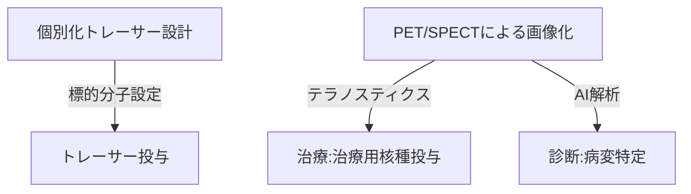

--- 
title: T10-09-03 分子イメージング・トレーサー技術
url: https://www.qst.go.jp/site/qst-magazine/3120.html
date: 2025-11-14
tags:
  - 分子イメージング
  - PET
  - SPECT
  - テラノスティクス
  - 個別化治療
source: テクノロジーロードマップ2026-2035 第2部第10章、Google検索
---

# T10-09-03 分子イメージング・トレーサー技術

## Summary（5つの要点）

1.  **分子レベルの診断**: **PET**（陽電子放出断層撮影）や**SPECT**（単光子放出断層撮影）を用い、体内に投与された**微量のトレーサー（放射性薬剤）**の挙動を追跡することで、**細胞**の**代謝**、**受容体**、**遺伝子発現**などの**分子機能**を**非侵襲**で画像化する。

2.  **超高感度トレーサー開発**: 疾患特有の**特定の分子**（例：アミロイドβ、特定の癌細胞マーカー）に**選択的**に結合する**新規放射性トレーサー**を開発し、病変の**超早期**かつ**高精度**な検出を実現する。

3.  **テラノスティクス（Theranostics）**: 診断（Diagnosis）と治療（Therapy）を融合した概念。**同じ分子構造**で、**診断用**（画像化）と**治療用**（高線量放射線放出）の**核種**を付け替えた薬剤を開発し、**診断された標的**を**そのまま治療**する**個別化治療**を実現する。

4.  **AIによる自動解析**: PET/SPECT画像とトレーサーの動態を**AI**で**定量解析**し、**診断**や**治療効果**の**予測**を**客観的**かつ**自動**で行う**診断支援システム**を構築する。

5.  **診断薬製造の迅速化**: 必要な時に必要な量のトレーサーを迅速に製造・供給するため、**小型サイクロトロン**、**自動合成装置**、**物流システム**を連携させ、**製造プロセス**を**効率化**する。

#### 概念図

---

### 技術評価表（定量的な視点）

| 評価項目 | 評価 | 根拠 |
| :--- | :--- | :--- |
| 導入コスト | ⭐⭐☆☆☆ | PET/SPECT装置が高額。トレーサーは短半減期でサイクロトロンなど専用製造施設が必要。 |
| 技術成熟度 | ⭐⭐⭐⭐☆ | PET/SPECTは実用化済み。新規トレーサー開発とテラノスティクスが急成長中。 |
| 日本の競争力 | ⭐⭐⭐⭐☆ | QSTを中心にトレーサー開発、核医学研究で国際的に優位。がん、認知症分野で実績。 |
| 市場性 | ⭐⭐⭐⭐⭐ | 癌、認知症、心疾患など、主要な疾患の早期診断・治療効果判定に不可欠であり市場は拡大。 |
| 品質保証の重要性 | ⭐⭐⭐⭐⭐ | 放射性薬剤の品質管理、線量計算、標的精度が患者の安全性と治療効果に直結する。 |

---

## 日本の立ち位置・強み弱みのSummary

### 強み

* **核医学研究**: QST、理化学研究所などが中心となり、**F-18**や**C-11**などの**短半減期核種**を用いた**新規トレーサー**開発で国際的に著名。

* **認知症診断**: **アミロイドPET検査薬**の開発・承認が先行し、**認知症**の**早期診断**分野で強み。

* **化学合成技術**: **放射性薬剤**の**標識化**や**自動合成**に関する**化学合成技術**が高い水準にある。

### 弱み

* **テラノスティクスの規制**: 診断薬と治療薬を一体で開発・承認する**テラノスティクス**の**薬事規制**や**保険適用**の整備が海外に比べて遅れている。

* **核種供給の制約**: **サイクロトロン**などの**製造施設**を持つ医療機関が限られており、トレーサーの**安定供給**と**迅速性**に課題。

* **人材育成**: 核医学専門医、トレーサー開発研究者の**絶対数**が不足している。

---

## 技術ロードマップ（短期/中期/長期）

### 短期目標（～2027年）

* **PET/SPECT検査**が、**がん**や**認知症**において、**より多くの疾患**で**保険適用**の対象となり、**標準的**な診断プロセスに組み込まれる。

* **AI**による**トレーサー動態**の**自動定量解析**システムが臨床導入され、**客観的な診断**を支援する。

* **Lu-177**などの**治療用核種**を用いた**テラノスティクス製剤**が**特定のがん**で**治験**を完了する。

### 中期目標（2028年～2031年）

* **テラノスティクス**が、**難治性のがん**治療において**標準的な個別化治療法**の一つとして広く普及する。

* **AI**が**患者個々人**の**ゲノム情報**に基づき、**最適なトレーサー分子**を**自動で設計・提案**するシステムが開発される。

* **ポータブル**な**小型PET/SPECT装置**が開発され、**地域医療**や**在宅医療**での分子イメージング利用が進む。

### 長期目標（2032年～2035年）

* **分子イメージング**が、**すべての疾患**の**超早期診断**と**病態の動的モニタリング**の**基盤技術**となる。

* **AI創薬**（T10-01-02）と**分子イメージング**が完全に統合され、**診断から治療薬の選定・効果検証**までが**完全に自動化**された**個別化医療**が確立される。

* **非放射性**で**分子機能**を可視化する**次世代のイメージング技術**（例：非侵襲的な分子MRI）が実用化される。

### 📚 参照リンク

1.  放射性医薬品・トレーサー開発の最前線（QST）: [https://www.qst.go.jp/site/qst-magazine/3120.html]

2.  核医学治療（テラノスティクス）の最新動向（日本核医学会）: [https://www.jsnm.org/]
