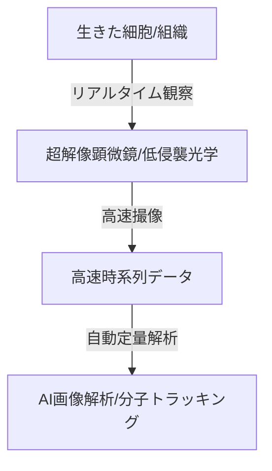

--- 
title: T10-09-04 高速・超解像ライブセルイメージング
url: https://www.ims.u-tokyo.ac.jp/imsut/jp/research/topic/202103_2.html
date: 2025-11-14
tags:
  - ライブセルイメージング
  - 超解像顕微鏡
  - 創薬
  - 細胞動態
  - 分子トラッキング
source: テクノロジーロードマップ2026-2035 第2部第10章、Google検索
---

# T10-09-04 高速・超解像ライブセルイメージング

## Summary（5つの要点）

1.  **超解像度観察**: **光学顕微鏡**の**解像度限界（約200nm）**を超える**数10nm**の分解能で、**細胞内**の**タンパク質**や**オルガネラ**（細胞内小器官）の**微細構造**を観察する（例：STED、STORM、SIM）。

2.  **高速ライブセルイメージング**: 生きた細胞を**長時間**にわたり**高速**（ミリ秒オーダー）で**連続撮影**し、**細胞分裂**、**分子の輸送**、**細胞間のシグナル伝達**といった**動的プロセス**を**リアルタイム**で追跡する。

3.  **光毒性の低減**: 細胞への**ダメージ**を最小限に抑えるため、**低侵襲**な**光シート照明**や**適応光学**などの技術を開発し、細胞の**生理的状態**を維持したまま観察を可能にする。

4.  **AIによる自動解析**: 取得された**超大容量**の**時系列画像データ**を**AI**が自動で**画像セグメンテーション**、**分子トラッキング**、**動態解析**し、研究者の**解析負荷**を軽減し、**定量的な知見**を導き出す。

5.  **創薬スクリーニングへの応用**: 新薬候補化合物の**作用メカニズム**を**分子レベル**で**可視化**し、**薬効**の**予測**や**副作用**の**評価**を**高効率**で行う**ハイスループットスクリーニング**（HTS）システムに組み込む。

#### 概念図

---

### 技術評価表（定量的な視点）

| 評価項目 | 評価 | 根拠 |
| :--- | :--- | :--- |
| 導入コスト | ⭐⭐☆☆☆ | 超解像顕微鏡装置は非常に高価。専用のハイスペックな画像解析システムも必要。 |
| 技術成熟度 | ⭐⭐⭐⭐☆ | 超解像技術は確立。高速化、低光毒性化、AI解析との融合が進行中。 |
| 日本の競争力 | ⭐⭐⭐⭐⭐ | ニコン、オリンパスなど**顕微鏡メーカー**が世界をリード。基礎研究も非常に強力。 |
| 市場性 | ⭐⭐⭐⭐☆ | **製薬企業**、**バイオテック企業**、**大学**など、基礎研究から創薬まで幅広い分野で需要。 |
| 品質保証の重要性 | ⭐⭐⭐⭐☆ | 観察による細胞へのダメージ（光毒性）が実験結果に影響を与えるため、低侵襲性の保証が重要。 |

---

## 日本の立ち位置・強み弱みのSummary

### 強み

* **顕微鏡ハードウェア**: **ニコン**、**オリンパス**といったメーカーが、**高性能な対物レンズ**や**光学系**で世界を牽引。

* **基礎研究**: **理化学研究所**、**東京大学**などで**超解像技術**や**光毒性低減技術**に関する世界トップレベルの研究が進んでいる。

* **iPS細胞研究との連携**: **iPS細胞**の**分化誘導**や**機能評価**における**動態観察**で、この技術が不可欠。

### 弱み

* **AI解析ソフトウェア**: **超大容量データ**の**高速処理**を担う**AI解析ソフトウェア**の開発において、海外の専門ベンダーに後れを取る分野がある。

* **データ共有**: 膨大な量の**顕微鏡画像データ**の**標準化**と**共有プラットフォーム**の整備が遅れている。

* **非侵襲in vivoイメージング**: 生きた**生体内部**での**高解像度**かつ**長時間**の観察技術がまだ未成熟。

---

## 技術ロードマップ（短期/中期/長期）

### 短期目標（～2027年）

* **超解像顕微鏡**が**製薬企業**の**基礎研究**部門で**標準ツール**となり、**分子動態**の**定量評価**が必須となる。

* **AI**による**画像セグメンテーション**と**分子トラッキング**の**精度**が**95%以上**に向上し、**研究者の作業時間**を**半減**させる。

* **低光毒性**を保証した**光シート顕微鏡**が、**三次元細胞培養**（オルガノイド）の観察に広く利用される。

### 中期目標（2028年～2031年）

* **細胞内**の**複数分子**を**同時に**、**超解像度**で**リアルタイム**に追跡する**マルチカラー・マルチスケールイメージング**を実現する。

* **超解像ライブセルイメージング**のデータを**AI創薬システム**（T10-01-02）に**直接入力**し、**薬効の予測精度**を飛躍的に向上させる。

* **非侵襲**の**in vivo**（生体内）**超解像観察**技術が**小動物モデル**で確立され、**疾患モデル**の**病態動態**を解析可能にする。

### 長期目標（2032年～2035年）

* **人間の生体組織**を**非侵襲**で**分子レベル**まで**可視化**し、**疾患**の**超早期診断**や**治療効果**の**リアルタイム判定**を可能にする。

* **AI**が**細胞**の**動態**から**将来の挙動**を**予測**し、**疾患発症リスク**を**定量的に評価**する**デジタル細胞診断システム**が確立される。

### 📚 参照リンク

1.  生命科学研究のフロンティア：高速・超解像イメージング（東京大学医科学研究所）: [https://www.ims.u-tokyo.ac.jp/imsut/jp/research/topic/202103_2.html]
